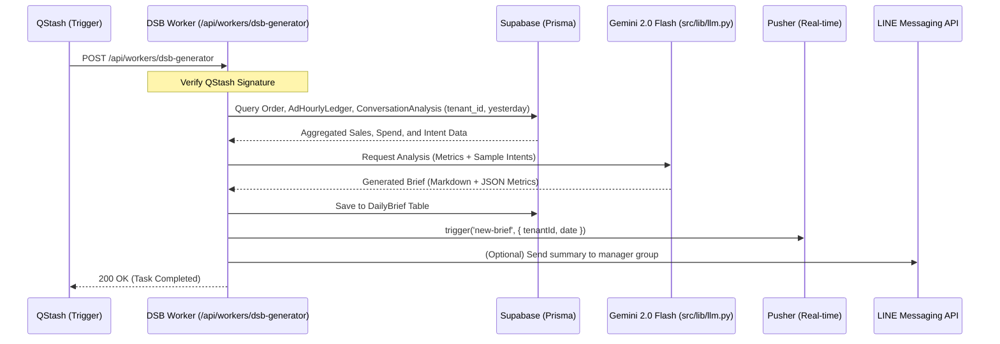

# Daily Sales Brief

Phase: spec
Date: 2026-03-29T06:32:04.901153
---


## pm_spec

# Feature Spec: Daily Sales Brief (DSB)

**Version:** 1.0.0
**Date:** 2026-03-29
**Status:** DRAFT
**Author:** PM Agent

---

## 1. Overview
The Daily Sales Brief (DSB) is an AI-powered executive summary generated every midnight using Gemini 2.0 Flash. It synthesizes sales performance, Meta/LINE ad spend, and customer intent from chat histories to provide owners and managers with actionable insights without manually auditing multiple dashboards.

## 2. User Stories
- As an **OWNER/MANAGER**, I want to receive a concise summary of yesterday's performance every morning, so I can understand the business health in 30 seconds.
- As a **MARKETING** user, I want to see the correlation between ad spend and customer inquiries/sales in the brief, so I can optimize campaign budgets.
- As a **SYSTEM**, I want to automatically trigger the AI analysis at 00:01 UTC+7 via QStash, so the data is ready before the staff starts their shift.

## 3. Acceptance Criteria
- [ ] Automated generation at 00:01 AM daily for every active tenant.
- [ ] Brief must include 4 core metrics: Total Revenue, Total Ad Spend, ROAS, and New Leads.
- [ ] AI-generated "Top Customer Intents" based on `ConversationAnalysis` records.
- [ ] Actionable "Manager's Insight" (e.g., "High interest in Omakase course but low conversion; check follow-up speed").
- [ ] Briefs must be stored in the database and accessible via the Executive Dashboard.
- [ ] Multi-tenant isolation: A brief for `tenant_id` A must never include data from `tenant_id` B.
- [ ] NFR2 Compliance: Brief data must be cached in Redis for fast dashboard loading.

## 4. Data Flow
1. **Trigger:** Upstash QStash sends a scheduled `POST` request to `/api/workers/dsb-generator`.
2. **Data Aggregation:** The worker queries `Order`, `AdHourlyLedger`, and `ConversationAnalysis` for the previous day, filtered by `tenant_id`.
3. **AI Processing:** Aggregated data is sent to `Google Gemini 2.0 Flash` via `src/lib/llm.py` with a specific DSB prompt.
4. **Storage:** The resulting JSON/Markdown is saved to the `DailyBrief` table in the `dsb.prisma` schema.
5. **Real-time:** A Pusher event is triggered to notify active `MGR` users.
6. **Distribution:** (Optional) The brief is formatted and sent via LINE Messaging API to the manager's group.

## 5. API Endpoints Required
| Method | Path | Auth | Roles | Description |
|--------|------|------|-------|-------------|
| POST   | /api/workers/dsb-generator | QStash Signature | SYSTEM | Triggers daily brief generation |
| GET    | /api/ai/daily-brief | JWT | DEV, MGR, MKT, ACC | Fetches list of historical briefs |
| GET    | /api/ai/daily-brief/latest | JWT | DEV, MGR, MKT, ACC | Fetches the most recent brief (cached) |
| GET    | /api/ai/daily-brief/[id] | JWT | DEV, MGR, MKT, ACC | Fetches a specific brief by ID |

## 6. Database Changes
**Schema:** `prisma/schema/dsb.prisma`
- New table `DailyBrief`:
  - `id`: UUID (PK)
  - `tenantId`: UUID (FK to Tenant)
  - `date`: DateTime (Unique per tenant/date)
  - `metrics`: JSONB (Store totalRevenue, adSpend, leadsCount, roas)
  - `content`: Text (Markdown generated by AI)
  - `status`: Enum (PENDING, COMPLETED, FAILED)
- Modified table `ConversationAnalysis`:
  - Ensure `intent` and `sentiment` fields are populated during daily processing if not done in real-time.

## 7. Roles & Permissions
| Action | Allowed Roles |
|--------|--------------|
| View Daily Briefs | DEV, TEC, MGR, MKT, ACC |
| Manually Re-trigger Generation | DEV, MGR |
| Delete Historical Briefs | DEV |

## 8. UI Components Required
- `DailyBriefCard.jsx` — Summary view for the main dashboard (Location: `src/modules/core/ai/components/`)
- `DailyBriefDetailView.jsx` — Full-page view with charts and AI insights (Location: `src/modules/core/ai/components/`)
- Integration into `src/components/ExecutiveAnalytics.js` as the primary "Headline" component.

## 9. Tech Notes & Gotchas
- **Gemini Context Window:** When summarizing conversations, do not send full raw logs. Send `ConversationAnalysis` summaries or sampled snippets to stay within token limits and reduce costs.
- **Timezone Alignment:** Ensure the "Previous Day" logic uses `Asia/Bangkok` (UTC+7) regardless of where the server/worker is hosted.
- **Data Completeness:** If `AdHourlyLedger` sync is delayed, the brief may report inaccurate ROAS. The worker should verify sync completion before generating.

## 10. Out of Scope
- Real-time "Hourly" briefs (Daily only).
- Manual editing of AI-generated content by users.
- Predictive forecasting for future months (handled by a separate `Forecasting` spec).
- Customer-facing reports (Internal management only).


## docs

### File: docs/product/features/DSB.md

```markdown
# Feature Spec: Daily Sales Brief (DSB)

**Version:** 1.0.0
**Date:** 2026-03-29
**Status:** DRAFT
**Author:** PM Agent

---

## 1. Overview
The Daily Sales Brief (DSB) is an AI-powered executive summary generated every midnight using Gemini 2.0 Flash. It synthesizes sales performance, Meta/LINE ad spend, and customer intent from chat histories to provide owners and managers with actionable insights without manually auditing multiple dashboards.

## 2. User Stories
- As an **OWNER/MANAGER**, I want to receive a concise summary of yesterday's performance every morning, so I can understand the business health in 30 seconds.
- As a **MARKETING** user, I want to see the correlation between ad spend and customer inquiries/sales in the brief, so I can optimize campaign budgets.
- As a **SYSTEM**, I want to automatically trigger the AI analysis at 00:01 UTC+7 via QStash, so the data is ready before the staff starts their shift.

## 3. Data Flow Diagram



## 4. Acceptance Criteria
- [ ] Automated generation at 00:01 AM daily for every active tenant.
- [ ] Brief must include 4 core metrics: Total Revenue, Total Ad Spend, ROAS, and New Leads.
- [ ] AI-generated "Top Customer Intents" based on `ConversationAnalysis` records.
- [ ] Actionable "Manager's Insight" (e.g., "High interest in Omakase course but low conversion; check follow-up speed").
- [ ] Briefs must be stored in the database and accessible via the Executive Dashboard.
- [ ] Multi-tenant isolation: A brief for `tenant_id` A must never include data from `tenant_id` B.
- [ ] NFR2 Compliance: Brief data must be cached in Redis for fast dashboard loading.

## 5. API Endpoints Required
| Method | Path | Auth | Roles | Description |
|--------|------|------|-------|-------------|
| POST   | /api/workers/dsb-generator | QStash Signature | SYSTEM | Triggers daily brief generation |
| GET    | /api/ai/daily-brief | JWT | DEV, MGR, MKT, ACC | Fetches list of historical briefs |
| GET    | /api/ai/daily-brief/latest | JWT | DEV, MGR, MKT, ACC | Fetches the most recent brief (cached) |
| GET    | /api/ai/daily-brief/[id] | JWT | DEV, MGR, MKT, ACC | Fetches a specific brief by ID |

## 6. Database Changes
**Schema:** `prisma/schema/dsb.prisma`
- New table `DailyBrief`:
  - `id`: UUID (PK)
  - `tenantId`: UUID (FK to Tenant)
  - `date`: DateTime (Unique per tenant/date)
  - `metrics`: JSONB (Store totalRevenue, adSpend, leadsCount, roas)
  - `content`: Text (Markdown generated by AI)
  - `status`: Enum (PENDING, COMPLETED, FAILED)
```

### Updated: CONTEXT_INDEX.yaml

```yaml
domain_context:
  dsb:
    - path: docs/product/features/DSB.md
      description: "AI-powered daily sales performance and customer intent summary"
      modules: [ai, marketing, analytics]
      updated: 2026-03-29
    - path: docs/gotchas/ai-agent.md
```
