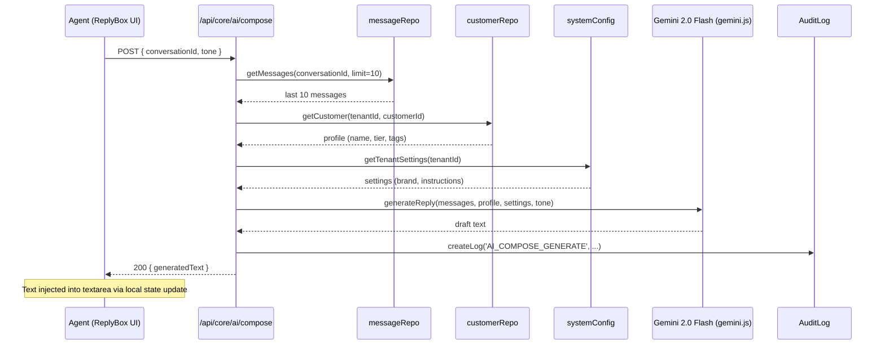

# AI Compose Reply

Phase: doc

Date: 2026-03-29T05:25:48.938269

---


## pm_spec

# Feature Spec: AI Compose Reply

**Version:** 1.0.0
**Date:** 2026-03-29
**Status:** DRAFT
**Author:** PM Agent

---

## 1. Overview
AI Compose Reply provides agents with an AI-generated draft response based on the current conversation history, customer profile, and brand tone. It leverages Gemini 2.0 Flash to reduce response latency and ensure consistent communication across Facebook and LINE channels.

## 2. User Stories
- As an **Agent (SLS/AGT)**, I want the AI to suggest a reply based on the customer's last question, so I can respond faster without manual typing.
- As a **Manager (MGR)**, I want the AI to use a professional and polite tone, so that our brand image remains consistent regardless of which agent is replying.
- As a **Developer (DEV)**, I want the AI prompt to include the customer's CRM data (tags, tier), so the generated reply is personalized (e.g., "Hello Gold Member").

## 3. Acceptance Criteria
- [ ] UI must display an "AI Suggest" button within the `ReplyBox` of the Unified Inbox.
- [ ] The AI must process the last 10 messages in the conversation to maintain context.
- [ ] Generation of the draft reply must complete in < 3 seconds (NFR: Gemini 2.0 Flash).
- [ ] Agents must be able to select from at least 3 tones: Professional, Friendly, and Concise.
- [ ] The generated draft must be editable by the agent before clicking "Send".
- [ ] Prompt must be isolated by `tenant_id` to prevent cross-tenant data leakage.

## 4. Data Flow
1. **User Action:** Agent clicks "AI Suggest" in `src/modules/core/inbox/components/ReplyBox.jsx`.
2. **Request:** Client sends `conversationId` and selected `tone` to `/api/core/ai/compose`.
3. **Context Retrieval:** API fetches:
    - Last 10 `Message` records from `messageRepo`.
    - `Customer` profile (name, tier, tags) from `customerRepo`.
    - `Tenant` settings (brand name, specific instructions) from `systemConfig`.
4. **AI Processing:** Server calls `src/modules/core/ai/lib/gemini.js` with a structured prompt.
5. **Response:** API returns the generated text string.
6. **UI Update:** The string is injected into the `ReplyBox` textarea via a local state update.

## 5. API Endpoints Required
| Method | Path | Auth | Roles | Description |
|--------|------|------|-------|-------------|
| POST   | `/api/core/ai/compose` | JWT | SLS, AGT, MGR | Generates a draft reply based on conversation context. |

## 6. Database Changes
- **New tables:** None.
- **Modified tables:** None.
- **Schema notes:** This feature is stateless at the DB level, but usage should be logged in `AuditLog` with action `AI_COMPOSE_GENERATE` for billing/quota tracking.

## 7. Roles & Permissions
| Action | Allowed Roles |
|--------|--------------|
| Trigger AI Compose | SLS, AGT, MGR, DEV, TEC |
| Configure AI Prompts | DEV, MGR |

## 8. UI Components Required
- `AIComposeAssistant.jsx` — Floating trigger button and tone selector inside `src/modules/core/inbox/components/`.
- `ToneSelector.jsx` — Dropdown/Popover for choosing reply style.
- `src/app/(dashboard)/inbox/page.jsx` — Integration point within the Unified Inbox layout.

## 9. Tech Notes & Gotchas
- **Context Window:** If the conversation is extremely long, only send the most recent 10-15 messages to stay within Gemini's low-latency performance tier.
- **Identity Resolution:** Ensure the AI knows who the "Responder" is (the Agent) vs the "Customer" to avoid generating "Self-replies".
- **Token Usage:** Implement a rate limit per `tenant_id` to prevent API cost spikes (refer to `ADR-048: AI Rate Limiting`).

## 10. Out of Scope
- Auto-sending messages (Human-in-the-loop is mandatory).
- Bulk AI replies to multiple customers.
- Image or voice message analysis (Text-only for v1.0).


## cto_review

[ERROR] claude CLI not found


## docs

I will start by listing the contents of the root directory to locate the documentation and configuration folders.

I will search for the `CONTEXT_INDEX.yaml` file to determine its correct location within the workspace.

I will list the parent directory `E:\CO\.dev` to see if the documentation and configuration folders are located there.

I will perform a broader search for all Markdown and YAML files in the repository to locate the documentation and configuration files.

I will list all files, including hidden ones, in the root directory to see if the `.dev` folder is present.

I will generate the documentation and Mermaid diagram for the "AI Compose Reply" feature, and then provide the update for the `CONTEXT_INDEX.yaml` file.

### File: docs/product/features/ai-compose-reply.md
```markdown
# Feature Spec: AI Compose Reply

**Version:** 1.0.0
**Date:** 2026-03-29
**Status:** DRAFT
**Author:** PM Agent

---

## 1. Overview
AI Compose Reply provides agents with an AI-generated draft response based on the current conversation history, customer profile, and brand tone. It leverages Gemini 2.0 Flash to reduce response latency and ensure consistent communication across Facebook and LINE channels.

## 2. User Stories
- As an **Agent (SLS/AGT)**, I want the AI to suggest a reply based on the customer's last question, so I can respond faster without manual typing.
- As a **Manager (MGR)**, I want the AI to use a professional and polite tone, so that our brand image remains consistent regardless of which agent is replying.
- As a **Developer (DEV)**, I want the AI prompt to include the customer's CRM data (tags, tier), so the generated reply is personalized (e.g., "Hello Gold Member").

## 3. Acceptance Criteria
- [ ] UI must display an "AI Suggest" button within the `ReplyBox` of the Unified Inbox.
- [ ] The AI must process the last 10 messages in the conversation to maintain context.
- [ ] Generation of the draft reply must complete in < 3 seconds (NFR: Gemini 2.0 Flash).
- [ ] Agents must be able to select from at least 3 tones: Professional, Friendly, and Concise.
- [ ] The generated draft must be editable by the agent before clicking "Send".
- [ ] Prompt must be isolated by `tenant_id` to prevent cross-tenant data leakage.

## 4. Data Flow


## 5. API Endpoints Required
| Method | Path | Auth | Roles | Description |
|--------|------|------|-------|-------------|
| POST   | `/api/core/ai/compose` | JWT | SLS, AGT, MGR | Generates a draft reply based on conversation context. |

## 6. Database Changes
- **New tables:** None.
- **Modified tables:** None.
- **Schema notes:** This feature is stateless at the DB level, but usage should be logged in `AuditLog` with action `AI_COMPOSE_GENERATE` for billing/quota tracking.

## 7. Roles & Permissions
| Action | Allowed Roles |
|--------|--------------|
| Trigger AI Compose | SLS, AGT, MGR, DEV, TEC |
| Configure AI Prompts | DEV, MGR |

## 8. UI Components Required
- `AIComposeAssistant.jsx` — Floating trigger button and tone selector inside `src/modules/core/inbox/components/`.
- `ToneSelector.jsx` — Dropdown/Popover for choosing reply style.
- `src/app/(dashboard)/inbox/page.jsx` — Integration point within the Unified Inbox layout.

## 9. Tech Notes & Gotchas
- **Context Window:** If the conversation is extremely long, only send the most recent 10-15 messages to stay within Gemini's low-latency performance tier.
- **Identity Resolution:** Ensure the AI knows who the "Responder" is (the Agent) vs the "Customer" to avoid generating "Self-replies".
- **Token Usage:** Implement a rate limit per `tenant_id` to prevent API cost spikes (refer to `ADR-048: AI Rate Limiting`).

## 10. Out of Scope
- Auto-sending messages (Human-in-the-loop is mandatory).
- Bulk AI replies to multiple customers.
- Image or voice message analysis (Text-only for v1.0).
```

### Updated: CONTEXT_INDEX.yaml
```yaml
domain_context:
  inbox:
    - docs/product/features/INBOX.md
    - docs/product/features/ai-compose-reply.md
    - docs/gotchas/webhook-serverless.md
    - docs/gotchas/database-identity.md

docs:
  features:
    - path: docs/product/features/ai-compose-reply.md
      description: "AI-generated draft response using Gemini 2.0 Flash for Unified Inbox."
      modules: [inbox, ai]
      updated: 2026-03-29
```
