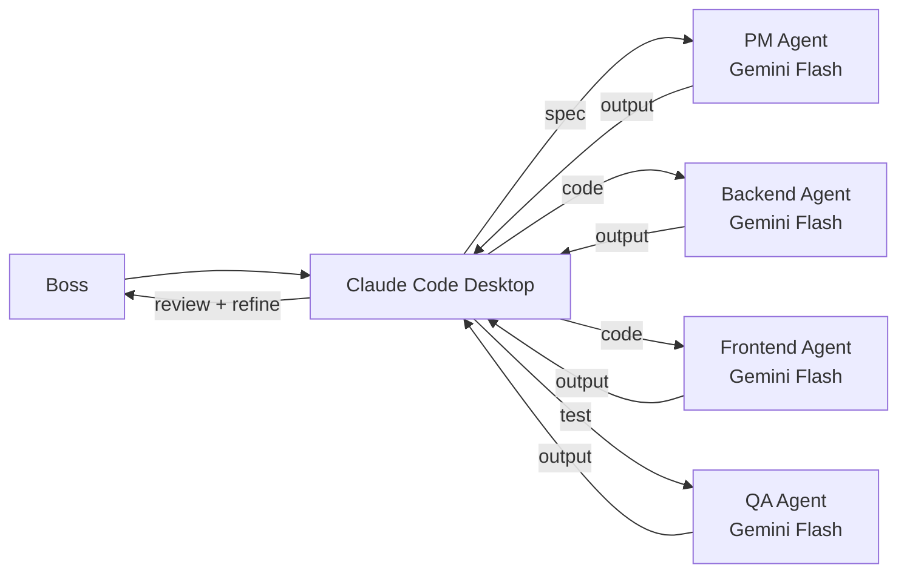
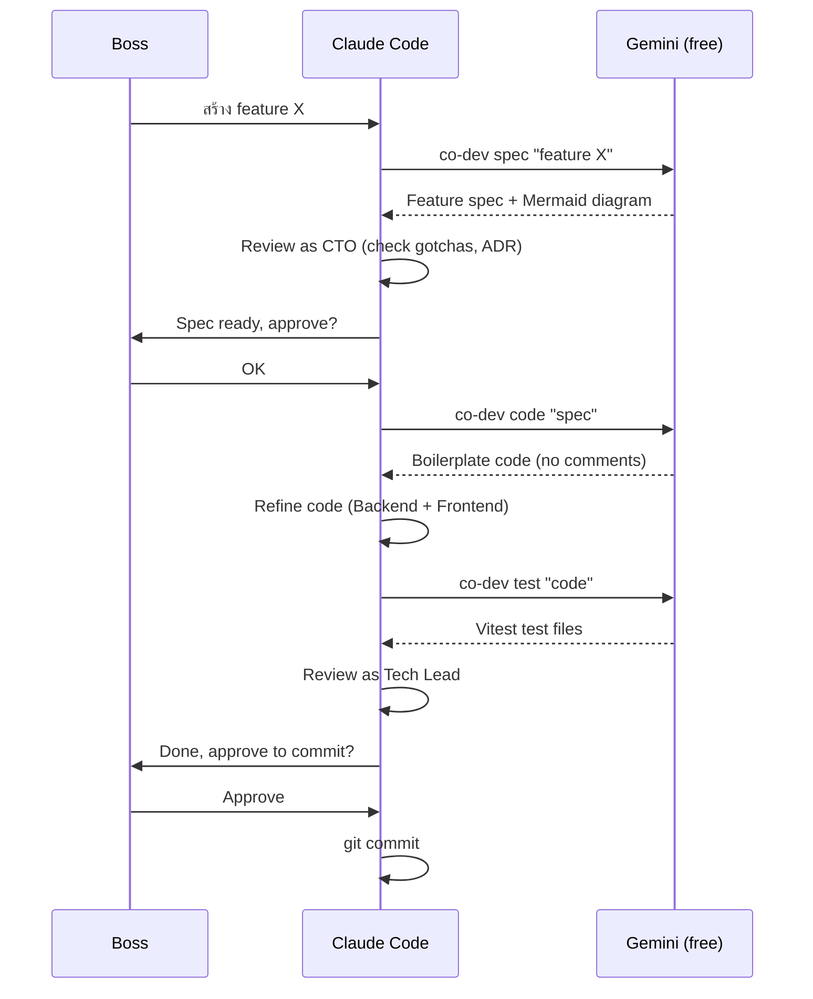

# co-dev — Multi-Agent Dev Tool

> Claude Code extension ที่ dispatch งานฟรีไป Gemini

## What is co-dev?

co-dev เป็น tool ที่ทำงานร่วมกับ Claude Code — ไม่ใช่ standalone system
- **Gemini (ฟรี)** → สร้าง spec, boilerplate code, tests
- **Claude Code** → CTO review, refine code, Tech Lead review

## Architecture



## Commands

| Command | What it does | Who runs |
|---------|-------------|----------|
| `spec "feature"` | PM + Doc Writer สร้าง feature spec | Gemini (free) |
| `code "spec"` | Backend + Frontend สร้าง boilerplate | Gemini (free) |
| `test "code"` | QA สร้าง Vitest tests | Gemini (free) |
| `review` | แสดง output ล่าสุด | local |

## Workflow



## Agent Roster

| Agent | Model | Role | Cost |
|-------|-------|------|------|
| PM | Gemini Flash | Feature specs | FREE |
| Doc Writer | Gemini Flash | Mermaid diagrams, docs | FREE |
| Backend | Gemini Flash | Boilerplate routes + repos | FREE |
| Frontend | Gemini Flash | Boilerplate pages + components | FREE |
| QA | Gemini Flash | Vitest tests | FREE |
| CTO | Claude Code (session) | Architecture review | IN SESSION |
| Tech Lead | Claude Code (session) | Code review | IN SESSION |
| Backend (refine) | Claude Code (session) | Complex code | IN SESSION |
| Frontend (refine) | Claude Code (session) | Complex code | IN SESSION |

## File Location

```
.dev/co-dev/
  cli.py              <- entry point
  core/
    pipeline.py        <- orchestrator
    llm.py             <- Gemini CLI routing
    state.py           <- task state + history
    gates.py           <- human approval gates
  config/
    agents.yaml        <- 9 agents + domain ownership
    router.yaml        <- model routing
    prompts/           <- 8 system prompts
  outputs/             <- task results
```

## Origin

ชื่อ "co-dev" มาจาก:
- **CO** = ชื่อ project เดิม + co-development
- **dev** = development tool
- เป็น extension ของ Claude Code ไม่ใช่ standalone

---

Related: [[workflow|Development Workflow]] | [[../product/PRD|PRD]]

#devtools #co-dev #agents
