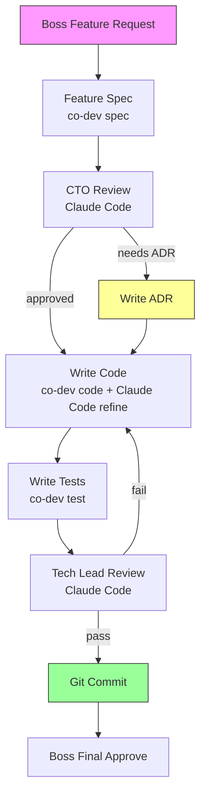

# Development Workflow

> DOC TO CODE — ไม่มี spec ไม่มี code

## Principle

ทุก feature ต้องผ่าน flow นี้ ไม่มีข้ามขั้น:



## Step-by-Step

### 1. Feature Request
Boss สั่งใน Claude Code:
> "สร้าง feature Daily Sales Brief"

### 2. Spec Generation (Gemini FREE)
Claude Code รัน:
```
co-dev spec "Daily Sales Brief"
```
- PM agent สร้าง 10-section feature spec
- Doc Writer สร้าง Mermaid sequence diagram

### 3. CTO Review (Claude Code)
Claude Code อ่าน output แล้ว:
- Check [[../gotchas/README|gotchas]] ที่เกี่ยวข้อง
- ตัดสินใจต้อง ADR ไหม
- Approve / request revision

### 4. Code Generation (Gemini FREE + Claude Code)
Claude Code รัน:
```
co-dev code "outputs/SPEC-*.md"
```
- Gemini สร้าง boilerplate (no comments)
- Claude Code refine ส่วนซับซ้อน

### 5. Test Generation (Gemini FREE)
Claude Code รัน:
```
co-dev test "feature description"
```
- QA agent สร้าง Vitest tests
- Mock Prisma, test tenantId isolation

### 6. Tech Lead Review (Claude Code)
Claude Code ตรวจ:
- [ ] Repository pattern compliance
- [ ] tenantId ทุก query
- [ ] NFR compliance (webhook < 200ms, cache < 500ms)
- [ ] No silent catches
- [ ] RBAC checks

### 7. Commit
Boss approve → Claude Code commits

## What Requires ADR?

- New database table
- New npm dependency (non-trivial)
- New external service/API
- Auth mechanism change
- Deployment strategy change

See [[../decisions/log|Decision Log]]

---

Related: [[co-dev|co-dev Tool]] | [[../gotchas/README|Gotchas]]

#devtools #workflow #doc-to-code
