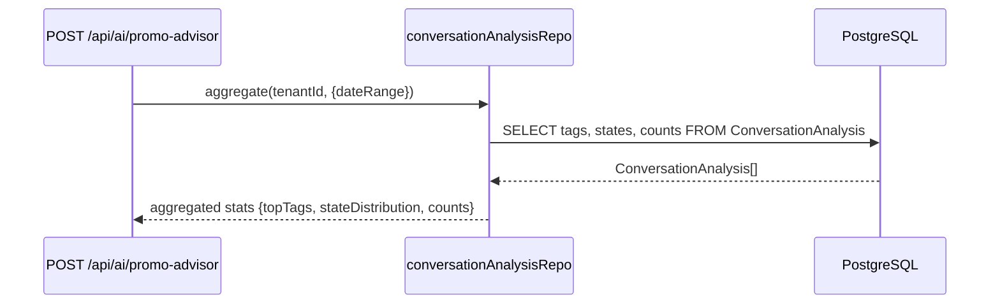
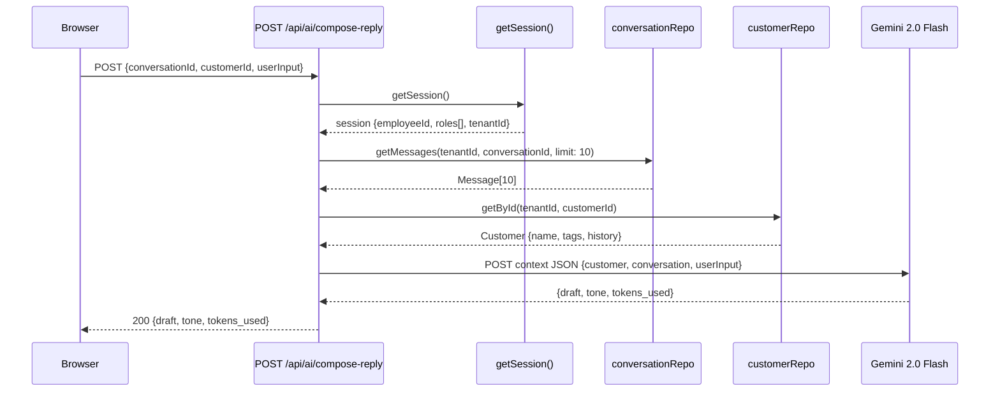
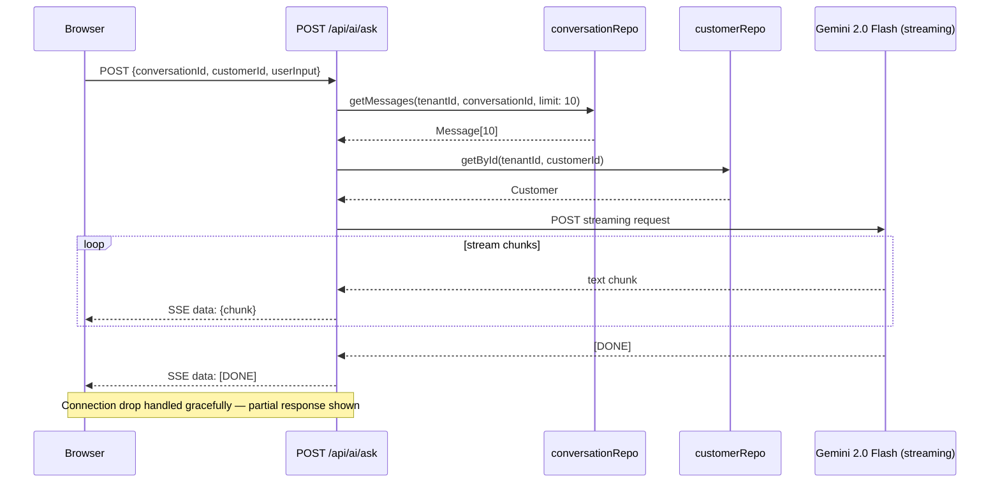
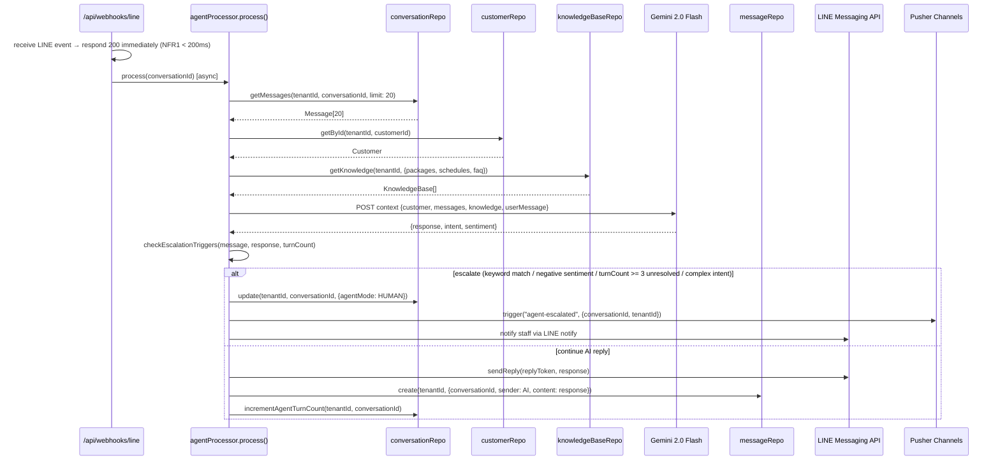
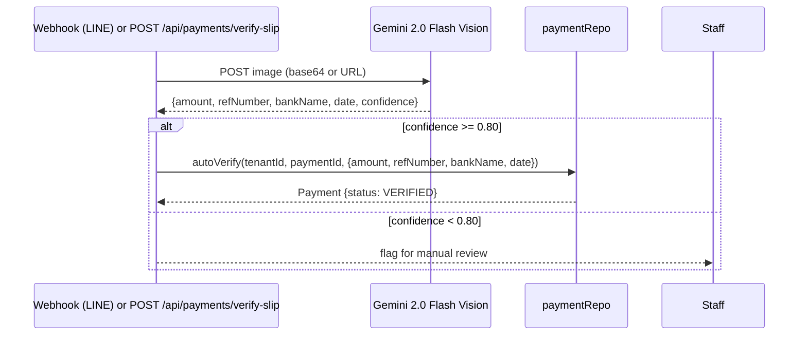
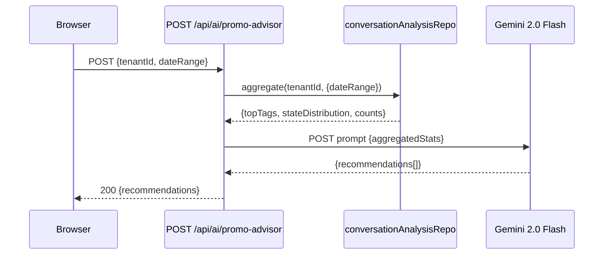
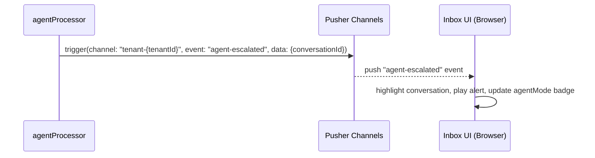

# Data Flow — AI (Gemini 2.0 Flash)

## 1. Read Flows

### Context Assembly (shared by all AI flows)

All AI endpoints begin with the same context-building pattern before calling Gemini:

1. `getSession()` → verify auth + RBAC
2. `conversationRepo.getMessages(tenantId, conversationId, limit)` → recent messages
3. `customerRepo.getById(tenantId, customerId)` → customer profile
4. Assemble context JSON → call Gemini

### Promo Advisor — Read Aggregation

## 2. Write Flows

### Compose Reply

### Ask AI (Streaming via SSE)

### LINE Agent Auto-Reply (triggered from webhook)

**Escalation Triggers (any one sufficient):**
- Keyword match: configured escalation keywords (e.g., "ผู้จัดการ", "คืนเงิน", "complain")
- Negative sentiment detected by Gemini
- `turnCount >= 3` AND conversation state is still unresolved
- Complex intent: discount request, refund, formal complaint

### Slip OCR (Payment Verification)

### Promo Advisor

## 3. External Integration Flows

### Gemini 2.0 Flash API

- Called via Google AI SDK (server-side only — API key never exposed to client)
- All requests originate from Next.js API routes or QStash workers
- Streaming: uses `generateContentStream()` for Ask AI — chunks forwarded as SSE
- Vision: uses `generateContent()` with inline image data for Slip OCR

## 4. Realtime Flows

### Agent Escalation → Pusher

## 5. Cache Strategy

| Data | Cache | TTL | Notes |
|---|---|---|---|
| AI responses | None | — | Every response is unique; caching would be misleading |
| Gemini model config | None | — | Passed inline per request |
| Knowledge base (KB) | Consider Redis | 10 min | KB changes infrequently; high read frequency for LINE Agent |
| ConversationAnalysis aggregation | Consider Redis | 1 hour | Promo Advisor aggregation is expensive; data is near-realtime acceptable |

## 6. Cross-Module Dependencies

| This module reads from | Data needed |
|---|---|
| **Inbox** (conversationRepo, messageRepo) | Conversation history for context building |
| **CRM** (customerRepo) | Customer profile (name, tags, tier, history) |
| **DSB** (ConversationAnalysis) | Aggregated tags/states for Promo Advisor |
| **Auth** | Session + RBAC for all API route entry points |
| **Multi-Tenant** | tenantId injected by middleware for all repo calls |
