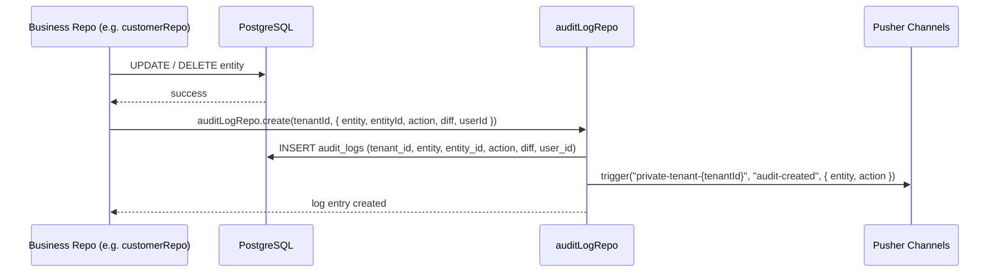
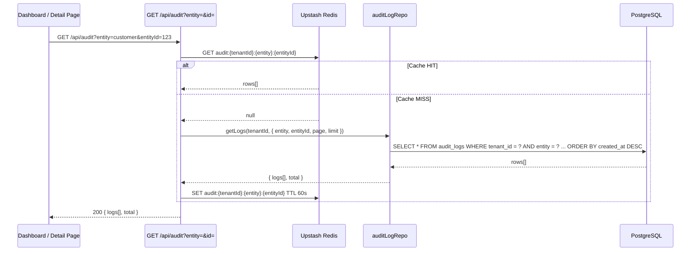

# Data Flow — Audit Log (Shared Module)

The Audit module provides a "Single Source of Truth" (SSOT) for tracking all critical system activities across every tenant.

---

## 1. Write Flows

### 1.1 Activity Logging (Repository Layer)

Nearly all core modules invoke `auditLogRepo.create` as part of their write operations (PATCH, POST, DELETE).

---

## 2. Read Flows

### 2.1 Audit Timeline (Global / Entity-specific)

Used in the "Activity" tab of detail pages (CRM, Kitchen) or the global system log.

---

## 3. Realtime Flows

| Event | Channel | Trigger |
|---|---|---|
| `audit-created` | `private-tenant-{tenantId}` | Any successful `auditLogRepo.create` |

---

## 4. Cache Strategy

| Cache Key | TTL | Invalidation |
|---|---|---|
| `audit:{tenantId}:*` | 60s | Any new audit entry (DEL pattern) |

---

## 5. Security & Isolation

- **Tenant Isolation:** Every query on `audit_logs` MUST include `tenant_id = ?`.
- **RBAC:** Only `MANAGER` and `OWNER` roles can view the global audit log. `STAFF` can see entity-specific history (e.g. customer history) if they have read access to that entity.
