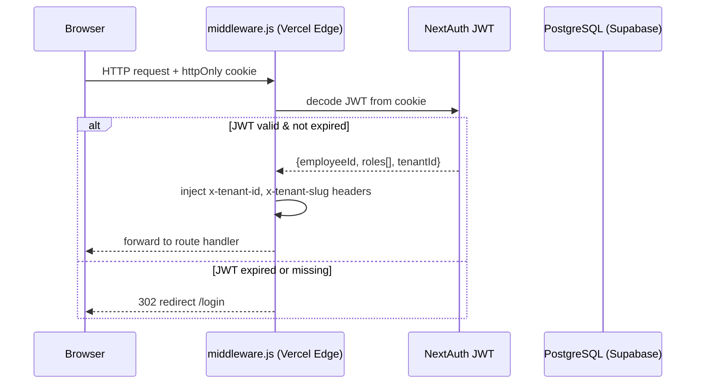
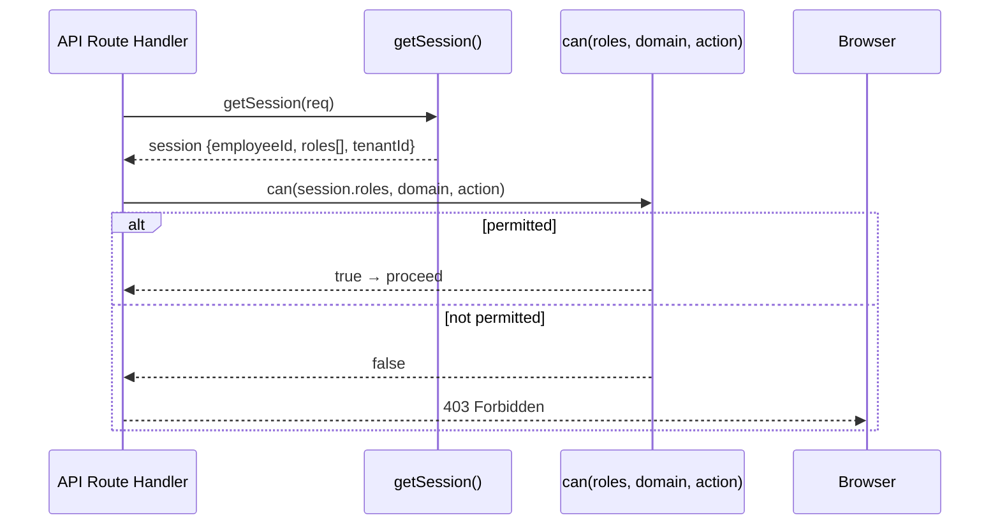
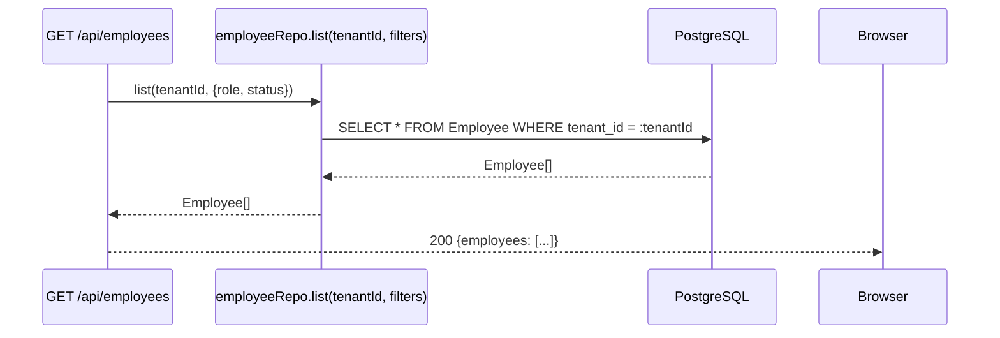
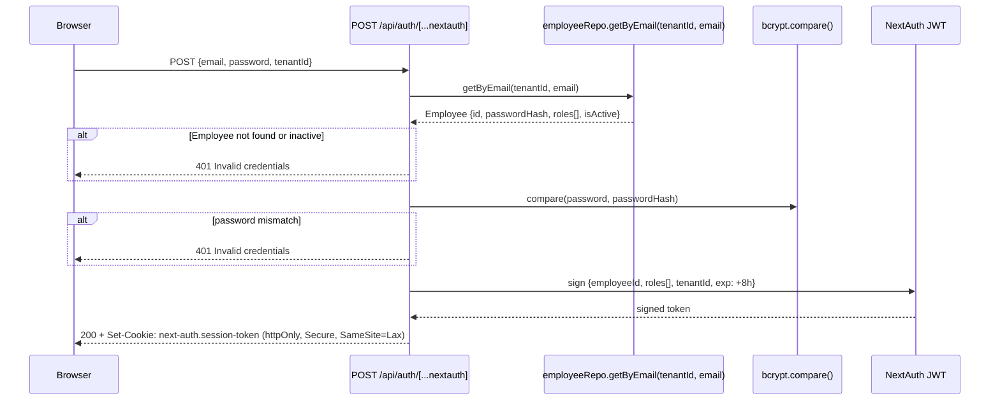
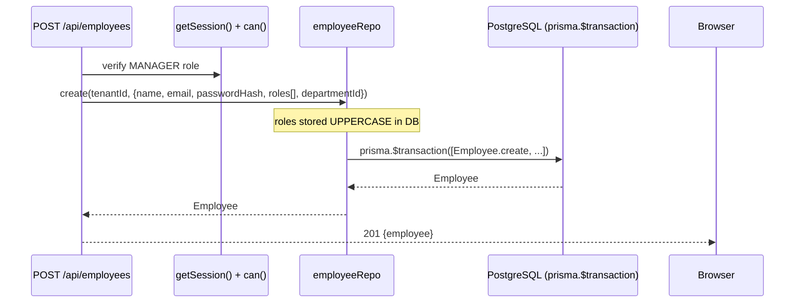
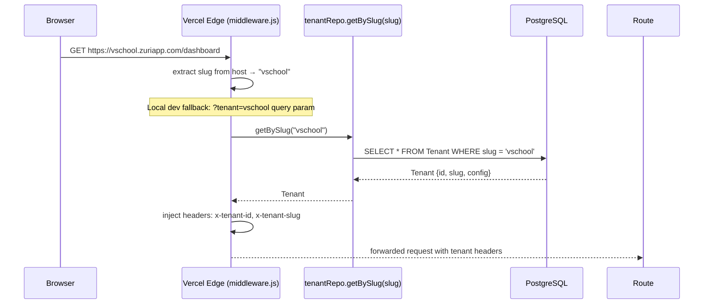

# Data Flow — Auth & Identity

## 1. Read Flows

### Session Validation (every request)



### Permission Check (per API route)



### Employee List Read



## 2. Write Flows

### Login (Credentials)



### Employee Create / Update



### Logout

```mermaid
sequenceDiagram
    participant Browser
    participant NextAuth as POST /api/auth/signout

    Browser->>NextAuth: POST /api/auth/signout
    NextAuth-->>Browser: 200 + Set-Cookie: next-auth.session-token=; Max-Age=0
    Browser->>Browser: clear local state, redirect /login
```

## 3. External Integration Flows

### Tenant Slug Resolution (subdomain → tenant)



## 4. Realtime Flows

Auth does not push realtime events. Session state is stateless (JWT). If an employee's roles are changed, the new roles take effect on next JWT refresh (next login or NextAuth session update call).

## 5. Cache Strategy

| Data | Cache | TTL | Notes |
|---|---|---|---|
| JWT session | httpOnly cookie | 8 hours | No server-side session store — stateless JWT |
| Employee list | None | — | Low traffic; read directly from DB |
| Tenant slug lookup | Per-request in-memory | Request lifetime | Middleware resolves once per request; tenantId already in JWT |
| Permission matrix | Module-level (in-process) | Process lifetime | `permissionMatrix.js` loaded once at startup — no DB round-trip |

## 6. Cross-Module Dependencies

- **Every module** calls `getSession()` to obtain `{employeeId, roles[], tenantId}` before any repo call.
- **Every module** calls `can(session.roles, domain, action)` before mutating data.
- **Multi-Tenant module** depends on Auth for tenant injection — middleware runs before any route handler.
- **CRM, Inbox, Tasks, POS, Enrollment, Kitchen Ops** all reference `employeeId` as `assigneeId` / `createdBy` / `updatedBy`.
- `src/lib/permissionMatrix.js` is the single source of truth for role-action mapping; roles must match `system_config.yaml` UPPERCASE values.
