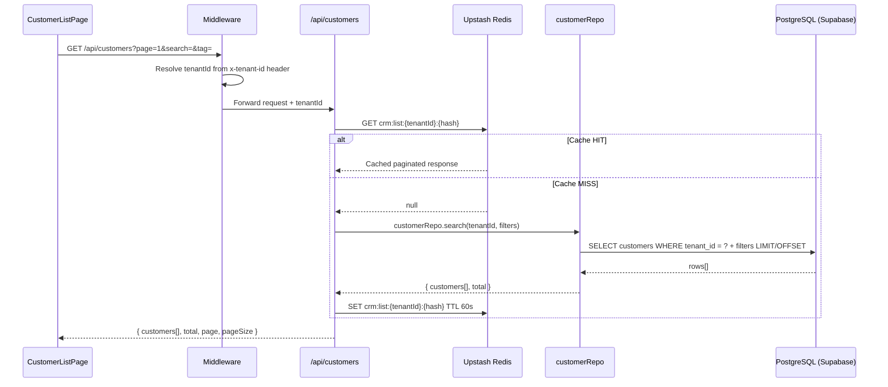
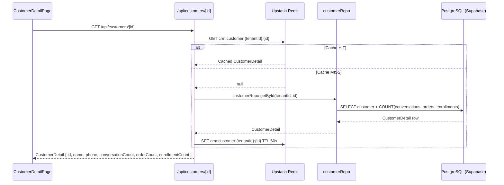
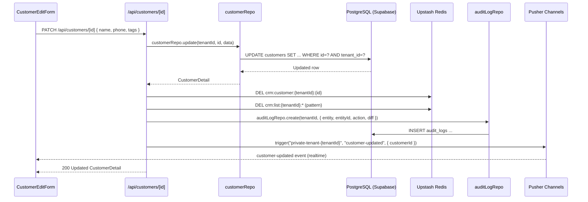
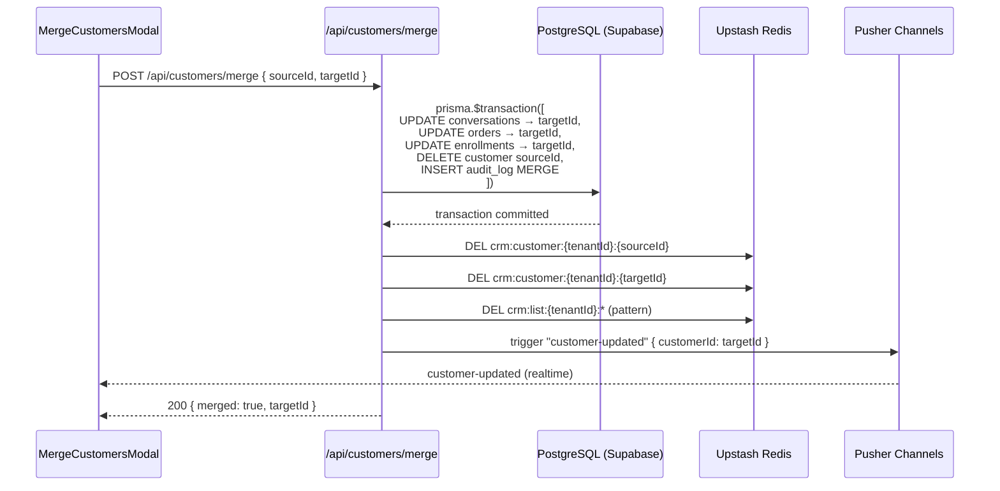
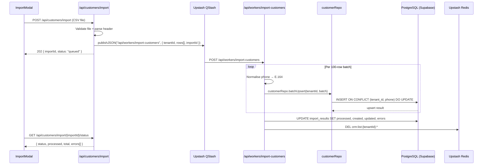

# Data Flow — CRM
> Module: CRM | Group: core

---

## 1. Read Flows

### 1.1 Customer List

```
UI (CustomerListPage)
  → GET /api/customers?page=1&search=&tag=
  → middleware: resolves tenantId from x-tenant-id header
  → api/customers/route.js
      → Redis.get("crm:list:{tenantId}:{hash}")
          HIT  → return cached paginated response
          MISS → customerRepo.search(tenantId, { search, tag, page, limit })
                   → SELECT * FROM customers WHERE tenant_id = ? ... LIMIT ? OFFSET ?
               → Redis.set("crm:list:{tenantId}:{hash}", result, TTL 60s)
               → return { customers[], total, page, pageSize }
```



### 1.2 Customer Detail

```
UI (CustomerDetailPage)
  → GET /api/customers/[id]
  → api/customers/[id]/route.js
      → Redis.get("crm:customer:{tenantId}:{id}")
          HIT  → return cached detail
          MISS → customerRepo.getById(tenantId, id)
                   → SELECT customer + aggregates:
                       COUNT(conversations) as conversationCount
                       COUNT(orders) as orderCount
                       COUNT(enrollments) as enrollmentCount
               → Redis.set("crm:customer:{tenantId}:{id}", result, TTL 60s)
               → return CustomerDetail
```



### 1.3 CSV Export

```
UI (ExportButton)
  → GET /api/customers/export?filters...
  → api/customers/export/route.js
      → customerRepo.search(tenantId, filters, { stream: true })
          → DB cursor / paginated query (no Redis — stream bypasses cache)
      → Response.body (ReadableStream)
          → pipe CSV rows as they arrive
      → Content-Disposition: attachment; filename="customers.csv"
```

---

## 2. Write Flows

### 2.1 Customer Update

```
UI (CustomerEditForm)
  → PATCH /api/customers/[id] { name, phone, tags, ... }
  → customerRepo.update(tenantId, id, data)
      → UPDATE customers SET ... WHERE id = ? AND tenant_id = ?
  → Redis.del("crm:customer:{tenantId}:{id}")
  → Redis.del("crm:list:{tenantId}:*")   ← pattern delete
  → auditLogRepo.create(tenantId, { entity: "customer", entityId: id, action: "UPDATE", diff })
  → Pusher.trigger("private-tenant-{tenantId}", "customer-updated", { customerId: id })
  → return updated CustomerDetail
```



### 2.2 Identity Resolution (Merge)

```
UI (MergeCustomersModal)
  → POST /api/customers/merge { sourceId, targetId }
  → api/customers/merge/route.js
      → prisma.$transaction([
            UPDATE conversations SET customer_id = targetId WHERE customer_id = sourceId AND tenant_id = ?
            UPDATE orders        SET customer_id = targetId WHERE customer_id = sourceId AND tenant_id = ?
            UPDATE enrollments   SET customer_id = targetId WHERE customer_id = sourceId AND tenant_id = ?
            DELETE FROM customers WHERE id = sourceId AND tenant_id = ?
            INSERT audit_logs (entity: customer, action: MERGE, meta: { sourceId, targetId })
        ])
  → Redis.del("crm:customer:{tenantId}:{sourceId}")
  → Redis.del("crm:customer:{tenantId}:{targetId}")
  → Redis.del("crm:list:{tenantId}:*")
  → Pusher.trigger("private-tenant-{tenantId}", "customer-updated", { customerId: targetId })
  → return { merged: true, targetId }
```



### 2.3 CSV Import (QStash Background)

```
UI (ImportModal)
  → POST /api/customers/import (multipart CSV)
  → api/customers/import/route.js
      → validate file size, mime type
      → parse first 5 rows for preview / header check
      → QStash.publishJSON("/api/workers/import-customers", { tenantId, rows[], importId })
      → return 202 { importId, status: "queued" }

[QStash Worker — /api/workers/import-customers]
  → receive { tenantId, rows[], importId }
  → for each row batch (100 rows):
      → normalise phone to E.164 (+66XXXXXXXXX)
      → customerRepo.batchUpsert(tenantId, batch)
          → INSERT INTO customers ON CONFLICT (tenant_id, phone) DO UPDATE SET ...
  → importResultRepo.update(importId, { processed, created, updated, errors[] })
  → Redis.del("crm:list:{tenantId}:*")

UI polls: GET /api/customers/import/[importId]/status
  → return { status, processed, total, errors[] }
```



---

## 3. External Integration Flows

No direct external API calls from CRM. External identity data (Facebook, LINE) flows in via the **Inbox webhook** and is linked through `customerRepo.upsertByFacebookId` / `customerRepo.upsertByLineId`.

---

## 4. Realtime Flows

| Event | Channel | Payload | Trigger |
|---|---|---|---|
| `customer-updated` | `private-tenant-{tenantId}` | `{ customerId }` | PATCH update, merge |

```
Pusher.trigger("private-tenant-{tenantId}", "customer-updated", { customerId })
  → Inbox ProfilePanel re-fetches customerRepo.getById(...)
  → CustomerListPage invalidates local state and re-fetches list
```

---

## 5. Cache Strategy

| Redis Key | TTL | Populated By | Invalidated By |
|---|---|---|---|
| `crm:list:{tenantId}:{hash}` | 60s | GET /api/customers | PATCH update, merge, import worker |
| `crm:customer:{tenantId}:{id}` | 60s | GET /api/customers/[id] | PATCH update, merge |

Hash for list key is a deterministic hash of all query parameters (search, tag, page, limit, sort).

Pattern: `getOrSet(key, () => repo.fn(), TTL)` — always write-through on cache miss.

Cache is invalidated explicitly (not TTL-expired) on any write to ensure consistency for low-latency dashboards.

---

## 6. Cross-Module Dependencies

### Modules that call CRM repos

| Caller Module | Repo Function | Purpose |
|---|---|---|
| Inbox | `customerRepo.upsertByFacebookId(tenantId, fbUserId, profile)` | Identity resolution on FB webhook |
| Inbox | `customerRepo.upsertByLineId(tenantId, lineUserId, profile)` | Identity resolution on LINE webhook |
| Inbox | `customerRepo.getById(tenantId, id)` | Profile panel in conversation view |
| POS | `customerRepo.getById(tenantId, id)` | Link customer to order at checkout |
| Enrollment | `customerRepo.getById(tenantId, id)` | Link student record to customer |

### Modules CRM calls

| Target Module | Reason |
|---|---|
| Audit Log (shared) | `auditLogRepo.create(...)` on every write |
| Import Results (shared) | `importResultRepo.update(...)` from QStash worker |
