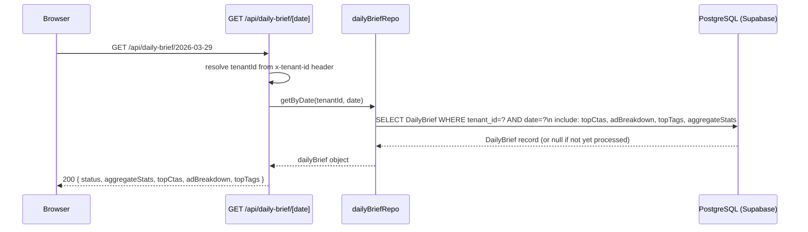
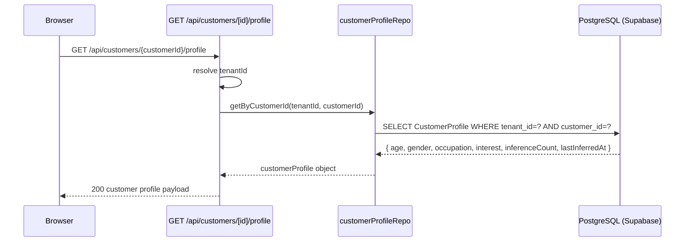
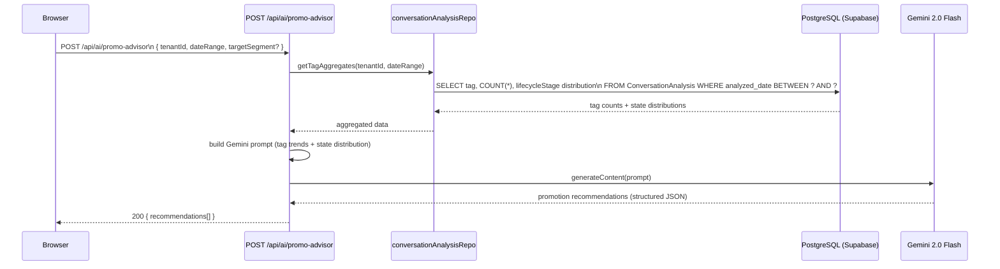
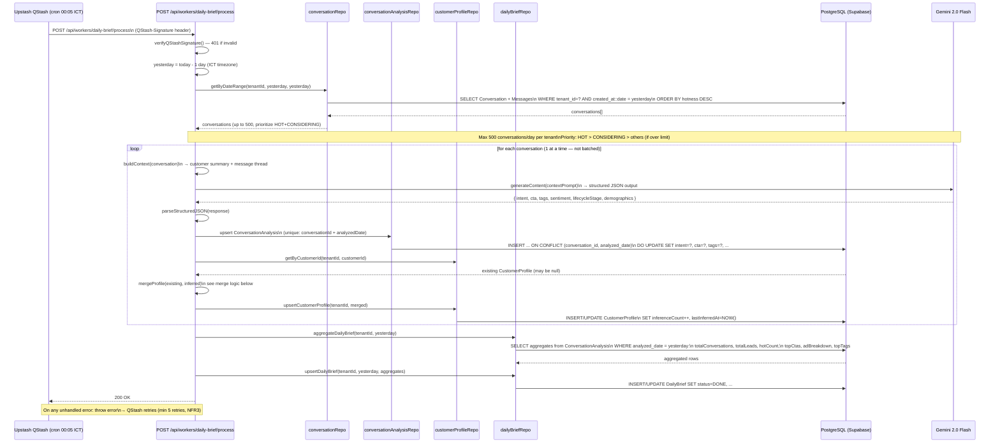
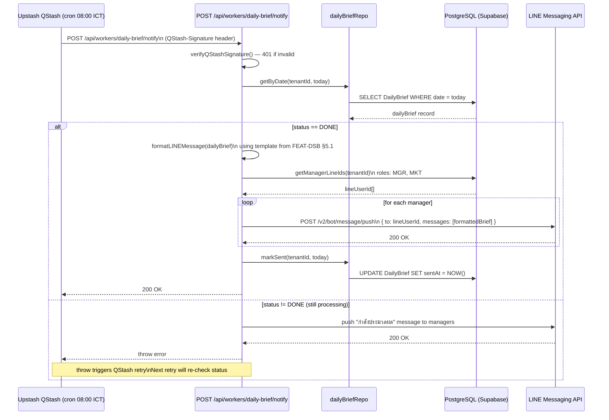

# Data Flow — Daily Sales Brief (DSB)

## 1. Read Flows

### 1.1 Dashboard Read — Daily Brief by Date



### 1.2 Customer Profile Read



### 1.3 Promo Advisor Read



---

## 2. Write Flows

### 2.1 Process Worker (00:05 ICT — QStash cron)



**CustomerProfile merge logic (never downgrade):**

For each inferred field (age, gender, occupation, interest, etc.):
- If `inferred value != UNKNOWN` AND (`existing value is null` OR `existing value == UNKNOWN`) → **update field**
- If `existing value` is already a known value → **keep existing** (never overwrite known with UNKNOWN or different inference)
- Always: `inferenceCount++`, `lastInferredAt = NOW()`

### 2.2 Notify Worker (08:00 ICT — QStash cron)



---

## 3. External Integration Flows

### 3.1 Gemini 2.0 Flash

| Usage | API call pattern | Notes |
|---|---|---|
| Conversation analysis | `generateContent(conversationContextPrompt)` | 1 conversation per call — no batching |
| Promo advisor | `generateContent(aggregateTrendPrompt)` | Called on-demand from `/api/ai/promo-advisor` |

- Model: `gemini-2.0-flash`
- Daily cap: **500 conversations per tenant** for the process worker
- Priority order when over cap: HOT → CONSIDERING → remaining lifecycle stages
- Structured JSON output is parsed and validated before DB upsert; malformed responses are logged and skipped (conversation marked as `ANALYSIS_FAILED`)

### 3.2 LINE Messaging API

- Used exclusively by the notify worker (`/api/workers/daily-brief/notify`)
- Sends push messages to individual LINE user IDs (MGR, MKT role holders with linked LINE accounts)
- Message template defined in `FEAT-DSB.md §5.1`
- LINE channel access token stored per-tenant in credentials store

---

## 4. Realtime Flows

Daily Sales Brief has **no Pusher realtime events**. The brief is a static daily snapshot:

- Process worker writes the `DailyBrief` record at ~00:05 ICT
- Notify worker sends LINE messages at 08:00 ICT
- UI dashboard reads on-demand via `GET /api/daily-brief/[date]`

If a manager opens the dashboard before processing completes, the API returns `{ status: "PROCESSING" }` and the UI shows a loading state. The browser can poll (e.g., every 30s) or wait for the LINE notification.

---

## 5. Cache Strategy

**No Redis cache for DSB.** Rationale:

- DailyBrief data changes once per day (written at 00:05, immutable after `status=DONE`)
- Dashboard reads are infrequent (once or a few times per day per manager)
- Redis cache would provide negligible benefit and would add invalidation complexity

All reads go directly to PostgreSQL via `dailyBriefRepo` and `customerProfileRepo`.

---

## 6. Cross-Module Dependencies

| Dependency | Direction | Data used |
|---|---|---|
| **Inbox (Unified Inbox)** | DSB reads from Inbox | `Conversation` records + `Message` threads for the analysis window (yesterday) |
| **CRM** | DSB reads from + writes to CRM | Reads `Customer.lifecycleStage` for context; writes inferred `CustomerProfile` demographics back |
| **AI (Gemini)** | DSB calls Gemini | Conversation analysis, customer profile inference, promo advisor recommendations |
| **LINE Messaging API** | DSB pushes to LINE | Notify worker sends formatted brief to MGR/MKT line accounts |
| **Auth / RBAC** | DSB respects RBAC | Read access: MGR, MKT, DEV. Profile reads: AGT, SLS, MGR |
| **Marketing** | No direct dependency | Ad attribution in brief uses `Conversation.firstTouchAdId` — same field as Marketing module |

### Data lineage

```
Inbox (Conversation + Messages)
  └── Process Worker (00:05 ICT)
        ├── Gemini 2.0 Flash (1 conversation at a time)
        │     └── ConversationAnalysis (upsert, unique: convId + date)
        │           └── CustomerProfile (merge — never downgrade)
        └── DailyBrief (aggregate, status=DONE)
              └── Notify Worker (08:00 ICT)
                    └── LINE Messaging API → MGR / MKT
```
