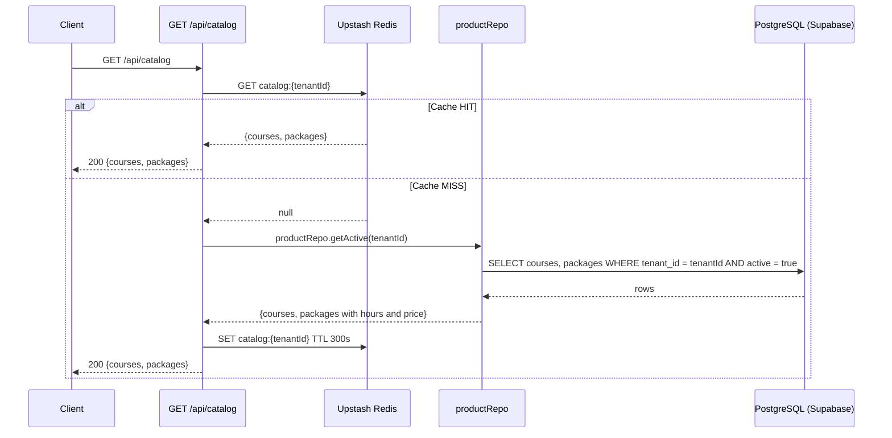
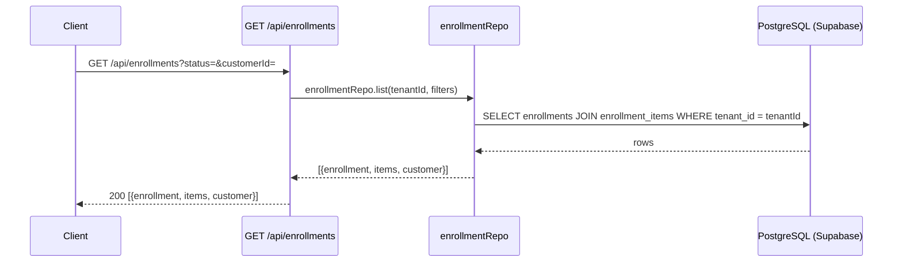
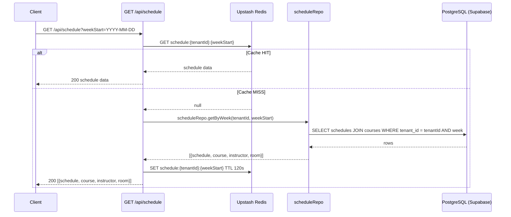
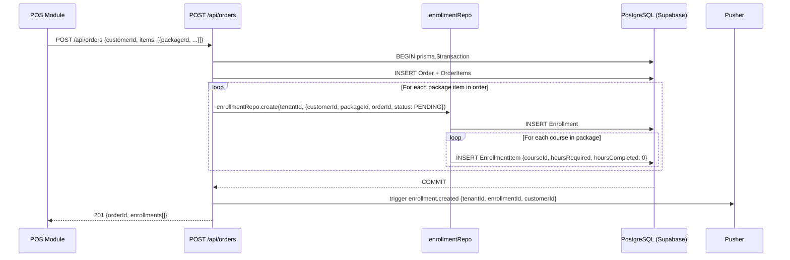
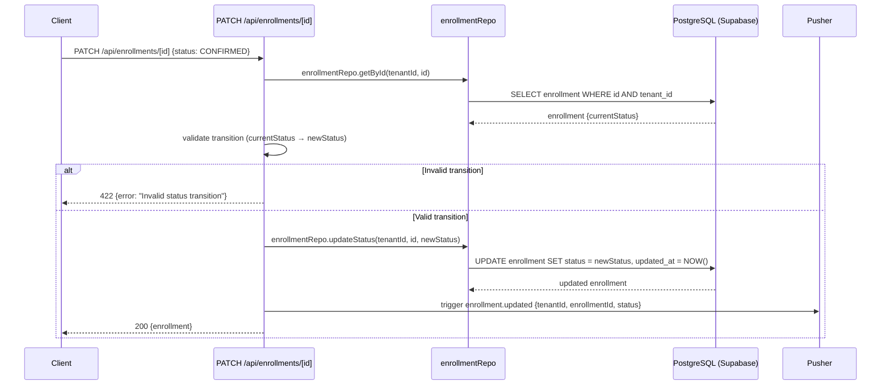
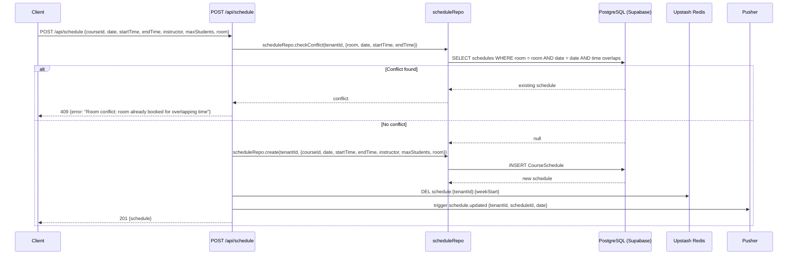
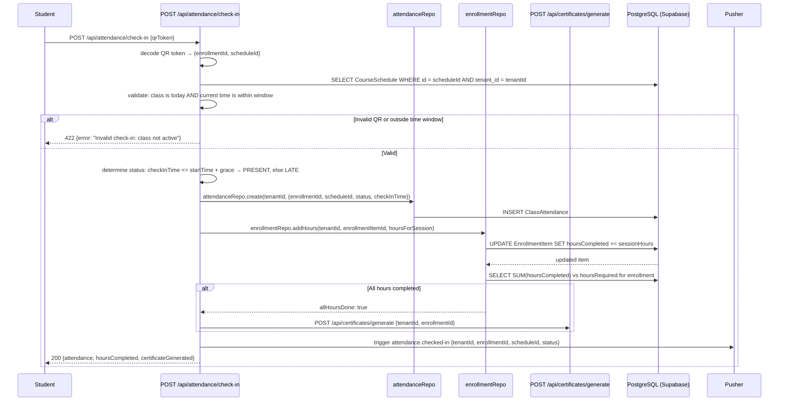
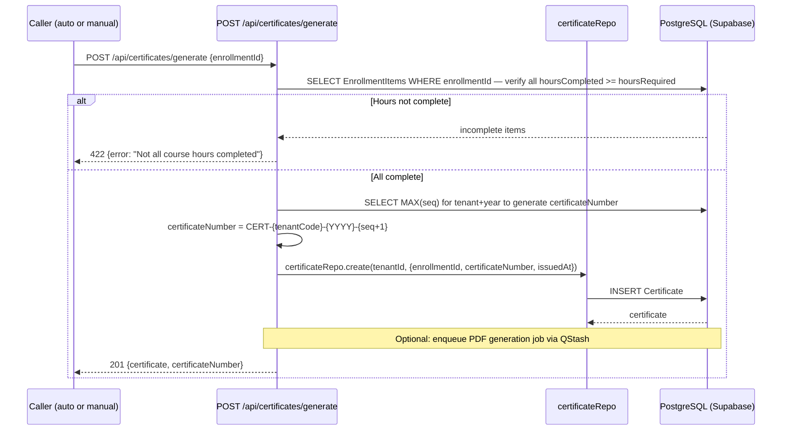
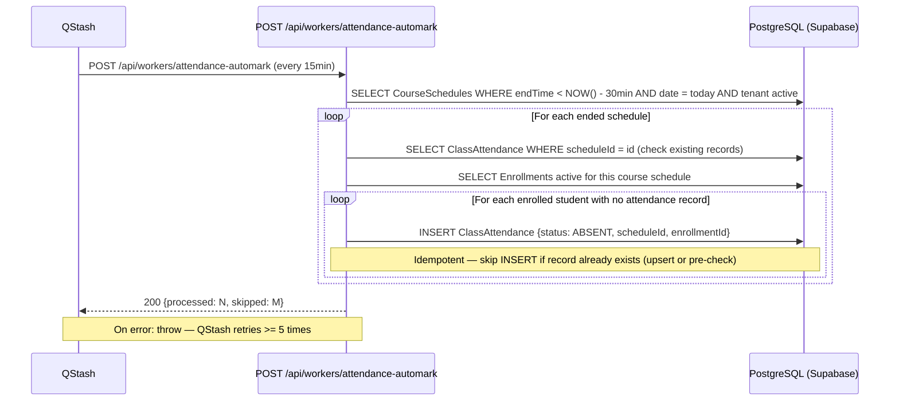

# Data Flow — Enrollment

## 1. Read Flows

### 1.1 Package Catalog

### 1.2 Enrollment List

### 1.3 Class Schedule

---

## 2. Write Flows

### 2.1 Create Enrollment (from POS Order)

### 2.2 Enrollment Status Lifecycle

Valid transitions: `PENDING → CONFIRMED → IN_PROGRESS → COMPLETED` or any state `→ CANCELLED`

### 2.3 Class Schedule Creation

### 2.4 QR Attendance Check-in

### 2.5 Certificate Generation

---

## 3. External Integration Flows (Workers)

### 3.1 Auto-mark Absent Worker

Runs every 15 minutes via QStash cron → `POST /api/workers/attendance-automark`

---

## 4. Realtime Flows

| Event | Trigger | Pusher Channel | Payload |
|---|---|---|---|
| `enrollment.created` | Order confirmed with package items | `tenant-{tenantId}` | `{enrollmentId, customerId, packageId}` |
| `enrollment.updated` | Status transition PATCH | `tenant-{tenantId}` | `{enrollmentId, status}` |
| `schedule.updated` | New class schedule created | `tenant-{tenantId}` | `{scheduleId, date, courseId}` |
| `attendance.checked-in` | QR check-in processed | `tenant-{tenantId}` | `{enrollmentId, scheduleId, status}` |

All Pusher events are tenant-scoped. UI components subscribe to `tenant-{tenantId}` and filter by event name.

---

## 5. Cache Strategy

| Cache Key | TTL | Invalidation Trigger |
|---|---|---|
| `catalog:{tenantId}` | 5 min (300s) | Product/package updated or deactivated |
| `schedule:{tenantId}:{weekStart}` | 2 min (120s) | Schedule created, updated, or deleted |

**Pattern:** All cache reads use `getOrSet(key, fetchFn, ttl)` from the Upstash Redis helper. Cache is invalidated (DEL) on writes before the Pusher trigger fires.

---

## 6. Cross-Module Dependencies

| Dependency | Direction | Detail |
|---|---|---|
| **POS → Enrollment** | POS triggers enrollment | Order creation with package items calls `enrollmentRepo.create` — enrollment lifecycle begins at PENDING |
| **CRM → Enrollment** | Customer identity | `customerId` on Enrollment references CRM `Customer` record — `tenantId` scoped |
| **Enrollment → Kitchen** | Class schedule triggers stock deduction | `CourseSchedule` links to `CourseMenu` → `Recipe` → `RecipeIngredient`; Kitchen worker deducts stock when class starts |
| **Enrollment → Kitchen** | Prep sheet | `scheduleRepo.getByDate` is consumed by the Kitchen prep-sheet flow to aggregate ingredient requirements per class day |
