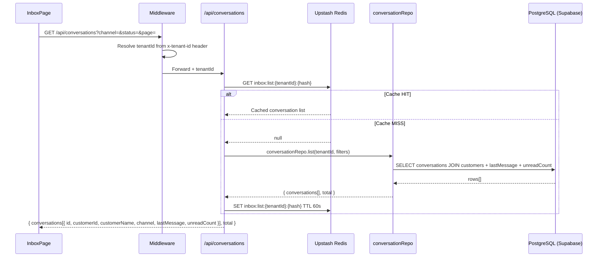
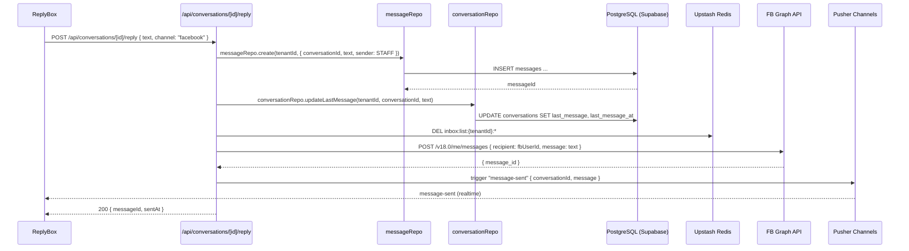
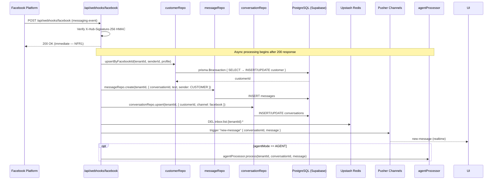
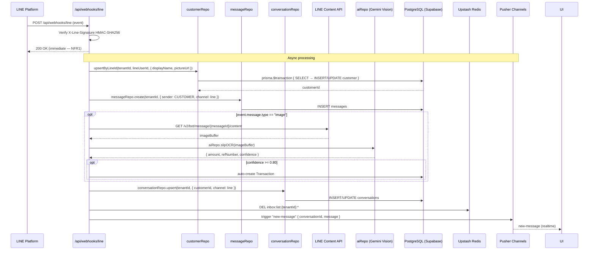
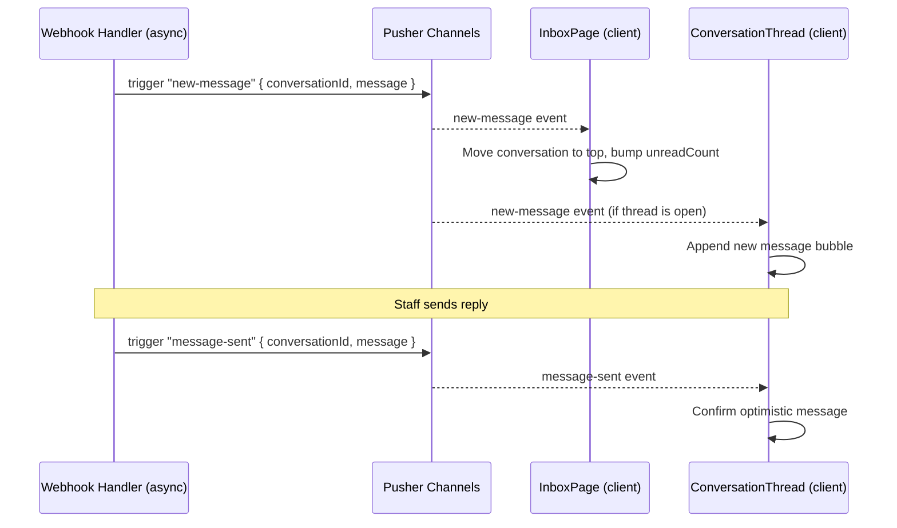

# Data Flow — Unified Inbox
> Module: Inbox | Group: core

---

## 1. Read Flows

### 1.1 Load Conversation List

```
UI (InboxPage)
  → GET /api/conversations?channel=&status=&page=
  → middleware: resolves tenantId
  → api/conversations/route.js
      → Redis.get("inbox:list:{tenantId}:{hash}")
          HIT  → return cached list
          MISS → conversationRepo.list(tenantId, { channel, status, page, limit })
                   → SELECT conversations JOIN customers WHERE tenant_id = ?
                       + last_message snippet, unread_count
               → Redis.set("inbox:list:{tenantId}:{hash}", result, TTL 60s)
               → return { conversations[], total }
```



### 1.2 Load Conversation Messages

```
UI (ConversationThread)
  → GET /api/conversations/[id]/messages?cursor=
  → conversationRepo.getMessages(tenantId, conversationId, cursor)
      → SELECT messages WHERE conversation_id = ? AND tenant_id = ?
          ORDER BY created_at DESC LIMIT 50
      → No Redis cache (messages must be fresh; realtime keeps them current)
  → return { messages[], nextCursor }
```

### 1.3 Load Customer Profile Panel

```
UI (ProfilePanel — side panel in Inbox)
  → GET /api/customers/[customerId]           ← delegates to CRM module
  → customerRepo.getById(tenantId, customerId)
      → Redis "crm:customer:{tenantId}:{id}" (60s TTL)
  → return CustomerDetail { name, phone, tags, conversationCount, orderCount }
```

---

## 2. Write Flows

### 2.1 Send Reply (Facebook)

```
UI (ReplyBox)
  → POST /api/conversations/[id]/reply { text, channel: "facebook" }
  → api/conversations/[id]/reply/route.js
      → messageRepo.create(tenantId, { conversationId, text, sender: "STAFF", channel: "facebook" })
          → INSERT messages ...
      → conversationRepo.updateLastMessage(tenantId, conversationId, text)
          → UPDATE conversations SET last_message = ?, last_message_at = NOW() ...
      → Redis.del("inbox:list:{tenantId}:*")
      → call FB Graph API: POST /v18.0/me/messages { recipient: { id: fbUserId }, message: { text } }
      → Pusher.trigger("private-tenant-{tenantId}", "message-sent", { conversationId, message })
  → return { messageId, sentAt }
```



### 2.2 Send Reply (LINE)

Identical to 2.1 but replaces the FB Graph API call with LINE Messaging API:

```
  → POST https://api.line.me/v2/bot/message/reply
      Headers: Authorization: Bearer {LINE_CHANNEL_ACCESS_TOKEN}
      Body: { replyToken, messages: [{ type: "text", text }] }
```

Note: LINE reply tokens expire after 30 seconds — message must be sent promptly. For delayed sends use `push` endpoint instead of `reply`.

---

## 3. External Integration Flows

### 3.1 Facebook Webhook Inbound (NFR1: < 200ms)

```
Facebook Platform
  → POST /api/webhooks/facebook
  → api/webhooks/facebook/route.js
      1. Verify X-Hub-Signature-256 HMAC (FB_APP_SECRET)
      2. If hub.challenge → return challenge immediately (GET verify)
      3. Respond 200 OK immediately  ← NFR1 boundary
      4. [async — do NOT await before 200]
          → for each messaging event:
              → customerRepo.upsertByFacebookId(tenantId, senderId, { name, profilePic })
                  → prisma.$transaction {
                        SELECT customer WHERE fb_user_id = ? AND tenant_id = ?
                        if not found: INSERT customer (CUST-[ULID])
                        if found: UPDATE profile fields
                    }
              → messageRepo.create(tenantId, { ... sender: "CUSTOMER", channel: "facebook" })
              → conversationRepo.upsert(tenantId, { customerId, channel: "facebook", fbConversationId })
              → Redis.del("inbox:list:{tenantId}:*")
              → Pusher.trigger("private-tenant-{tenantId}", "new-message", { conversationId, message })
              → if conversation.agentMode == "AGENT":
                    agentProcessor.process(tenantId, conversationId, message)
```



### 3.2 LINE Webhook Inbound (NFR1: < 200ms)

```
LINE Platform
  → POST /api/webhooks/line
  → api/webhooks/line/route.js
      1. Verify X-Line-Signature HMAC-SHA256 (LINE_CHANNEL_SECRET)
      2. Respond 200 OK immediately  ← NFR1 boundary
      3. [async]
          → for each event (type == "message"):
              → customerRepo.upsertByLineId(tenantId, userId, { displayName, pictureUrl })
                  → prisma.$transaction { SELECT → INSERT/UPDATE customer }
              → messageRepo.create(tenantId, { ... sender: "CUSTOMER", channel: "line" })
              → if event.message.type == "image":
                    → download image from LINE Content API
                    → aiRepo.slipOCR(imageBuffer)   ← Gemini Vision
                    → if confidence >= 0.80: auto-create Transaction
              → conversationRepo.upsert(...)
              → Redis.del("inbox:list:{tenantId}:*")
              → Pusher.trigger("private-tenant-{tenantId}", "new-message", { ... })
```



---

## 4. Realtime Flows

```
Pusher Channel: "private-tenant-{tenantId}"

Events:
  new-message      ← inbound FB or LINE message
    payload: { conversationId, message: { id, text, sender, createdAt }, customerId }
    → InboxPage: move conversation to top, increment unreadCount
    → ConversationThread (if open): append message

  message-sent     ← outbound staff reply
    payload: { conversationId, message: { id, text, sender: "STAFF", createdAt } }
    → ConversationThread: append sent message (optimistic already shown, confirm)

  customer-updated ← CRM profile change
    payload: { customerId }
    → ProfilePanel: re-fetch customerRepo.getById(tenantId, customerId)
```



---

## 5. Cache Strategy

| Redis Key | TTL | Populated By | Invalidated By |
|---|---|---|---|
| `inbox:list:{tenantId}:{hash}` | 60s | GET /api/conversations | Inbound webhook (async), send reply |

Hash encodes query params: channel, status, assignedTo, page, limit.

Messages are NOT cached — they are always read fresh from DB and kept current via Pusher realtime events.

Customer profile data uses CRM cache keys (`crm:customer:{tenantId}:{id}`) managed by the CRM module.

---

## 6. Cross-Module Dependencies

### Modules Inbox calls

| Target Module | Repo / Service | Purpose |
|---|---|---|
| CRM | `customerRepo.upsertByFacebookId(tenantId, ...)` | Identity resolution on FB inbound |
| CRM | `customerRepo.upsertByLineId(tenantId, ...)` | Identity resolution on LINE inbound |
| CRM | `customerRepo.getById(tenantId, id)` | Profile panel data |
| POS | `orderRepo.create(tenantId, { conversationId, ... })` | Quick Sale from chat |
| AI Assistant | `aiRepo.composeReply(tenantId, conversationId, prompt)` | AI-assisted draft reply |
| AI Assistant | `aiRepo.slipOCR(imageBuffer)` | Auto-detect payment slips in LINE images |

### Modules that call Inbox

| Caller Module | Reason |
|---|---|
| POS | Passes `conversationId` when creating order from chat |
| AI Assistant (Agent) | `agentProcessor.process()` triggered by inbound message when agentMode == AGENT |
