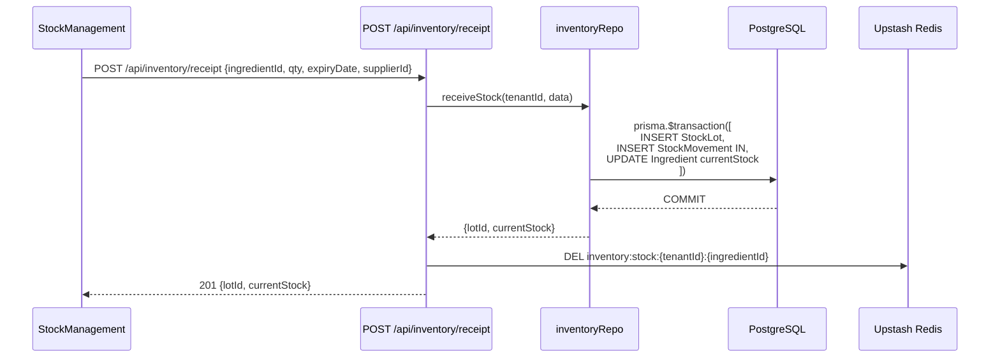
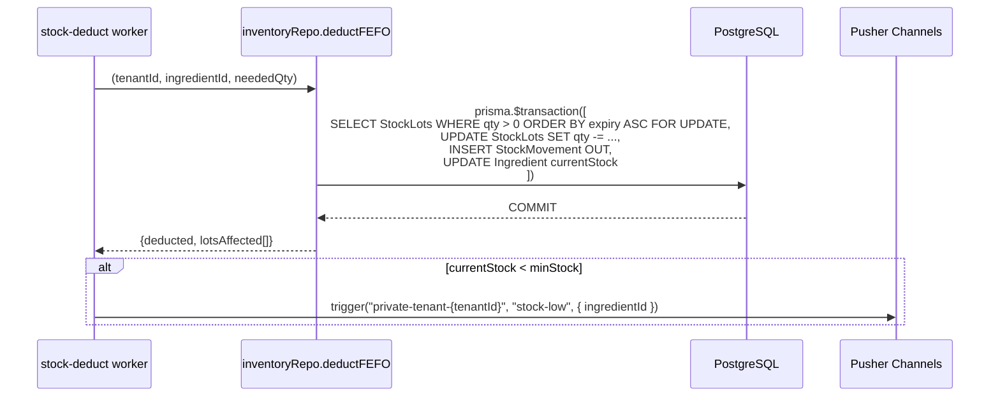
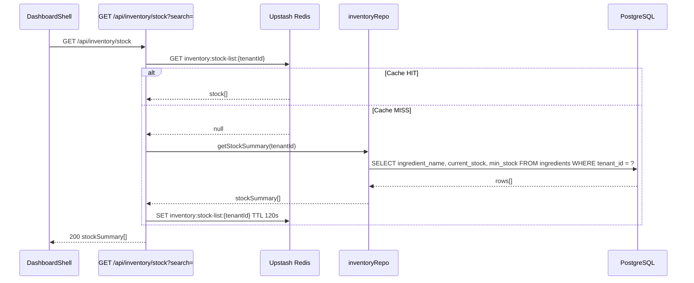

# Data Flow — Inventory (Shared Module)

The Inventory module provides core logic for warehouse management, Generic Stock tracking, and FEFO (First-Expire, First-Out) deduction.

---

## 1. Write Flows

### 1.1 Warehouse Stock Receipt (Inbound)

Used when adding new stock lots to the warehouse.

### 1.2 FEFO Deduction (Outbound)

The standard algorithm for stock removal, picking the oldest expiry lot first (ADR-055).

---

## 2. Read Flows

### 2.1 Stock Status (Realtime)

Used in dashboards and POS to check availability.

---

## 3. Realtime Flows

| Event | Channel | Trigger |
|---|---|---|
| `stock-low` | `private-tenant-{tenantId}` | After deduction if `currentStock < minStock` |
| `stock-updated` | `private-tenant-{tenantId}` | Any receipt or manual adjustment |

---

## 4. Cache Strategy

| Cache Key | TTL | Invalidation |
|---|---|---|
| `inventory:stock-list:{tenantId}` | 120s | Any receipt, deduction, adjustment |
| `inventory:stock:{tenantId}:{id}` | 120s | Any movement for that specific ID |

---

## 5. Security & Isolation

- **FEFO Policy:** The system enforces First-Expire, First-Out unless manually overridden.
- **Tenant Isolation:** All stock and movements are strictly scoped by `tenant_id`.
- **Invariants:** `Ingredient.currentStock` is a denormalized sum of all `StockLot.remainingQty`. Must be updated atomically.
