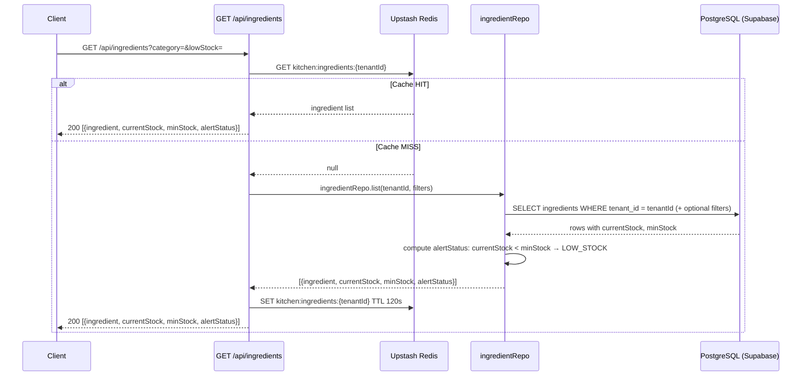
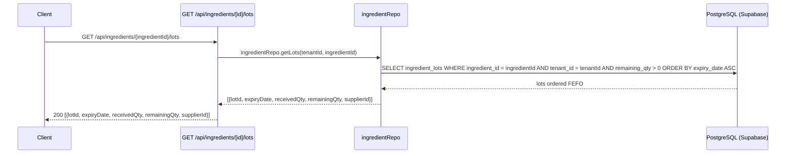
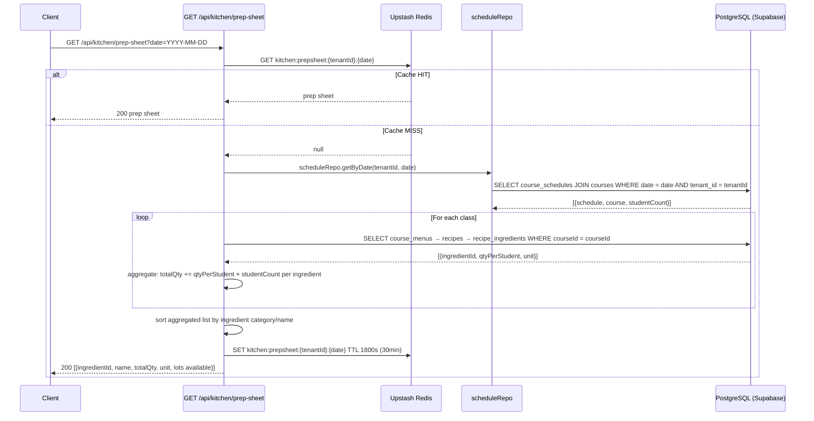
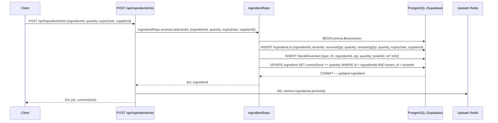
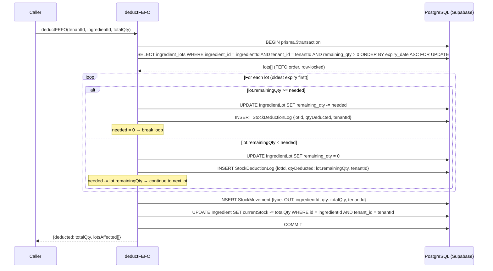
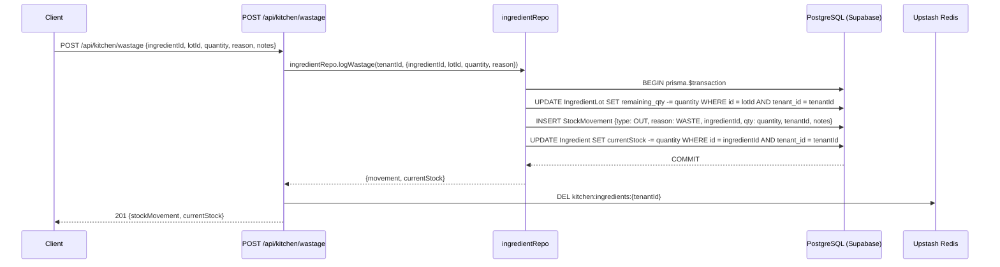
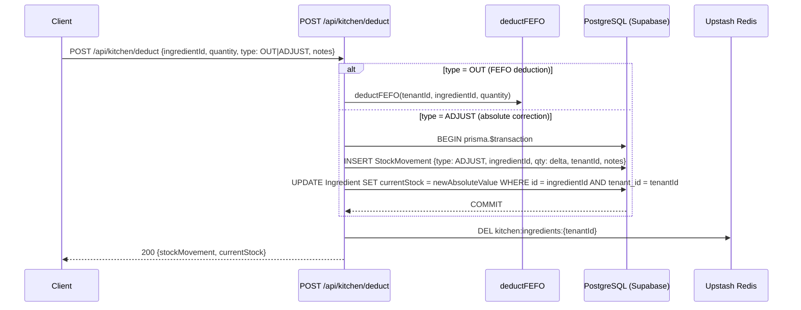
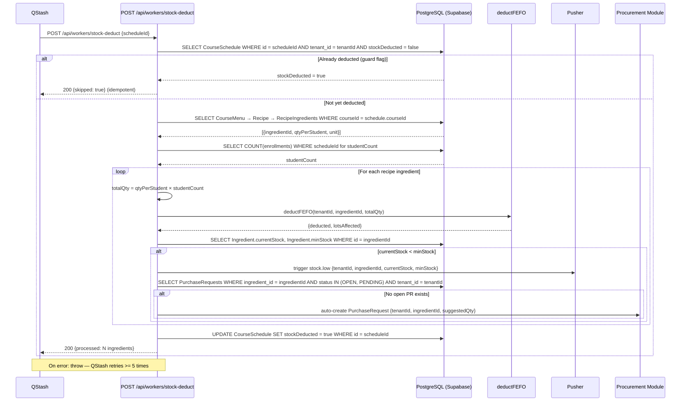
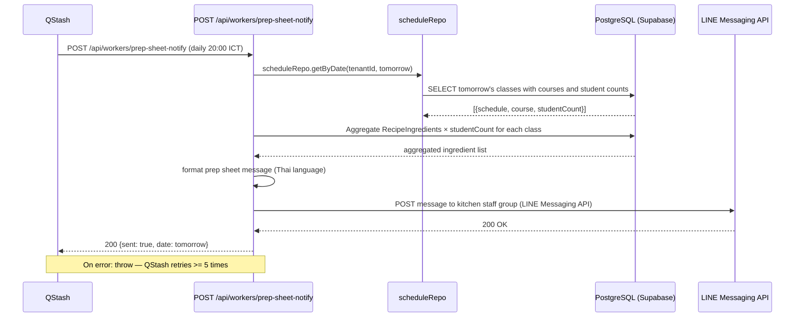

# Data Flow — Kitchen

## 1. Read Flows

### 1.1 Ingredient List

### 1.2 Ingredient Lots (FEFO Order)

### 1.3 Prep Sheet

---

## 2. Write Flows

### 2.1 Receive New Ingredient Lot (Goods Received)

> **CRITICAL:** `currentStock` on `Ingredient` is denormalized. It must always equal `SUM(IngredientLot.remainingQty)`. Every operation touching lots MUST update `currentStock` in the same `prisma.$transaction`.

### 2.2 FEFO Stock Deduction (deductFEFO)

Core algorithm used by the auto-deduction worker and manual deductions.

### 2.3 Wastage Log

### 2.4 Manual Deduction / Stock Adjustment

---

## 3. External Integration Flows (Workers)

### 3.1 Auto Stock Deduction Worker (Class Trigger)

Triggered by QStash when a class is about to start (or on a polling schedule).

### 3.2 Prep Sheet LINE Notification Worker

Runs daily at 20:00 ICT via QStash cron → `POST /api/workers/prep-sheet-notify`

---

## 4. Realtime Flows

| Event | Trigger | Pusher Channel | Payload |
|---|---|---|---|
| `stock.low` | After any deduction when `currentStock < minStock` | `tenant-{tenantId}` | `{ingredientId, name, currentStock, minStock}` |

All Pusher events are tenant-scoped. Kitchen dashboard subscribes to `tenant-{tenantId}` and shows a low-stock banner on `stock.low`.

---

## 5. Cache Strategy

| Cache Key | TTL | Invalidation Trigger |
|---|---|---|
| `kitchen:ingredients:{tenantId}` | 2 min (120s) | Any lot receipt, deduction, wastage, or adjustment |
| `kitchen:prepsheet:{tenantId}:{date}` | 30 min (1800s) | Schedule created/updated for that date |

**Pattern:** All cache reads use `getOrSet(key, fetchFn, ttl)` from the Upstash Redis helper. Cache is invalidated (DEL) immediately after any write before returning the response.

---

## 6. Cross-Module Dependencies

| Dependency | Direction | Detail |
|---|---|---|
| **Enrollment → Kitchen** | Class schedule drives deduction | `CourseSchedule` (from Enrollment module) triggers the `stock-deduct` worker; `CourseMenu` links course to recipes |
| **Enrollment → Kitchen** | Prep sheet | Prep sheet aggregates ingredient needs from tomorrow's `CourseSchedule` records created by the Enrollment module |
| **Kitchen → Procurement** | Low stock auto-PR | After deduction, if `currentStock < minStock`, Kitchen worker checks for open `PurchaseRequest` and auto-creates one if none exists (requires Procurement module) |

### currentStock Invariant

> `Ingredient.currentStock` MUST always equal `SUM(IngredientLot.remainingQty WHERE ingredient_id = id AND tenant_id = tenantId)`.

Every write path that modifies `IngredientLot.remainingQty` — receive, deductFEFO, wastage, adjustment — MUST update `Ingredient.currentStock` in the **same** `prisma.$transaction`. Violating this invariant will cause phantom stock and incorrect low-stock alerts.
