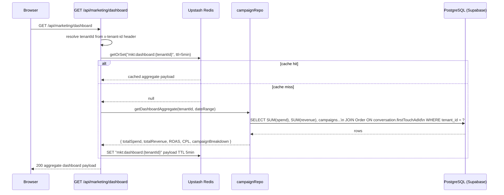
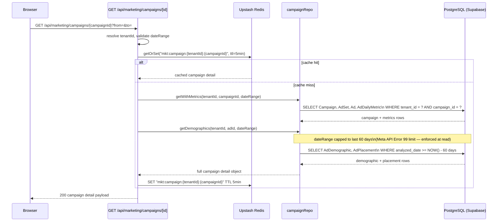
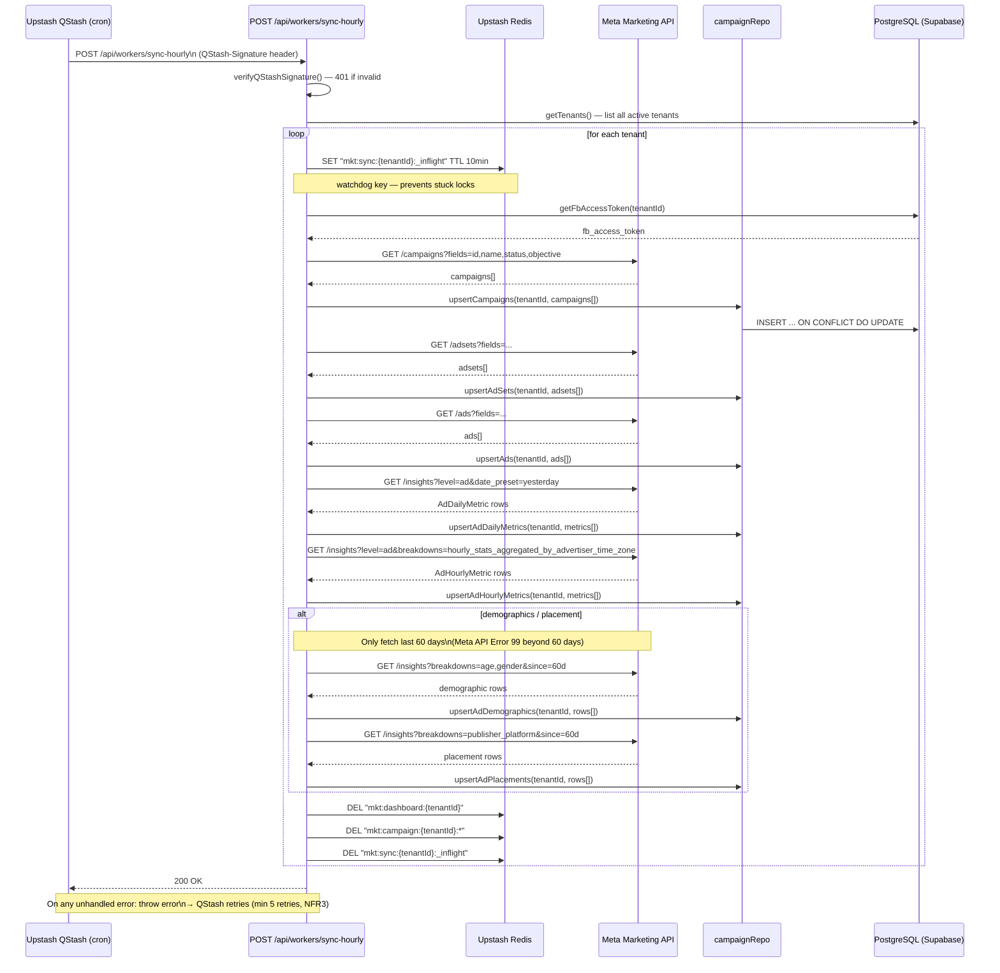

# Data Flow — Marketing / Ads Analytics

## 1. Read Flows

### 1.1 Dashboard Load



### 1.2 Campaign Detail



### 1.3 Revenue Attribution (First-Touch Model — ADR-039)

Revenue for ROAS is computed by joining:

```
Order → Conversation.firstTouchAdId → Ad → AdSet → Campaign
```

- `firstTouchAdId` on `Conversation` is set **once** when the first inbound message arrives and a matching active ad is found.
- It is **never overwritten** — ADR-039 first-touch attribution is immutable.
- The repo query sums `Order.totalAmount` grouped by `Campaign.id` for the selected date range.

---

## 2. Write Flows

### 2.1 QStash Hourly Sync Worker



---

## 3. External Integration Flows

### 3.1 Meta Marketing API

| Endpoint pattern | Data fetched | Constraint |
|---|---|---|
| `/{campaign_id}/insights` | spend, impressions, clicks, reach | date_preset or since/until |
| `/{adset_id}/insights` | adset-level aggregates | — |
| `/{ad_id}/insights` | ad-level daily metrics | — |
| `/{ad_id}/insights?breakdowns=age,gender` | demographic breakdown | max 60-day window (Error 99) |
| `/{ad_id}/insights?breakdowns=publisher_platform` | placement breakdown | max 60-day window (Error 99) |
| `/{ad_id}/insights?…hourly_stats…` | hourly metrics | yesterday only |

- API calls are **outbound from the QStash worker only** — never from UI API routes (architecture rule).
- FB access token is stored per-tenant in `system_config` / tenant credentials table.

---

## 4. Realtime Flows

Marketing/Ads Analytics has **no realtime Pusher events**. Data freshness is governed by:

- Redis cache TTL: 5 minutes for dashboard and campaign detail.
- Cache invalidation triggered by the hourly QStash sync worker after each tenant's upsert completes.

If a user needs fresh data before the next sync, they may trigger a manual cache invalidation via an admin action (clears the Redis keys; next request re-fetches from DB).

---

## 5. Cache Strategy

| Redis key | Content | TTL | Invalidated by |
|---|---|---|---|
| `mkt:dashboard:{tenantId}` | Aggregate totals: spend, revenue, ROAS, CPL, campaign breakdown | 5 min | sync-hourly worker (explicit DEL) |
| `mkt:campaign:{tenantId}:{campaignId}` | Campaign detail + daily metrics + demographics + placements | 5 min | sync-hourly worker (explicit DEL) |
| `mkt:sync:{tenantId}:_inflight` | Watchdog lock — presence means sync is in progress | 10 min | sync-hourly worker (DEL on completion or expiry) |

**Pattern used:** `getOrSet(key, fetchFn, ttl)` — checks Redis first; on miss, runs DB query, populates cache, returns result.

The `_inflight` key uses a 10-minute watchdog TTL. If the worker crashes mid-sync, the key auto-expires and the next QStash retry can proceed without a stuck lock.

---

## 6. Cross-Module Dependencies

| Dependency | Direction | Data used |
|---|---|---|
| **Inbox (Unified Inbox)** | Marketing reads from Inbox | `Conversation.firstTouchAdId` — required for first-touch revenue attribution (ADR-039) |
| **POS** | Marketing reads from POS | `Order.totalAmount` + `Order.conversationId` — used to compute revenue in ROAS calculation |
| **CRM** | No direct dependency | Customer data not needed for ads analytics |
| **Auth / RBAC** | Marketing respects RBAC | Only roles with `marketing:read` permission (MKT, MGR, DEV) can access dashboard APIs |

### Attribution Join (simplified)

```
Campaign
  └── AdSet
        └── Ad
              ← Conversation.firstTouchAdId (set once on first inbound message)
                    └── Order (summed for revenue)
```
