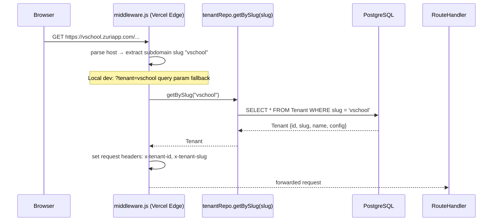
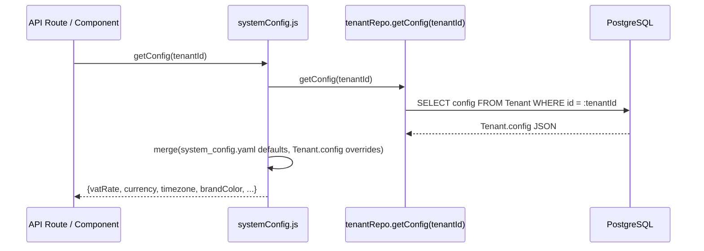
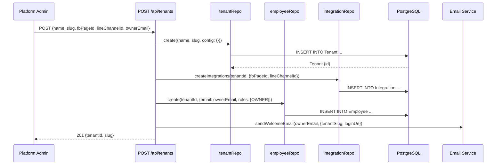
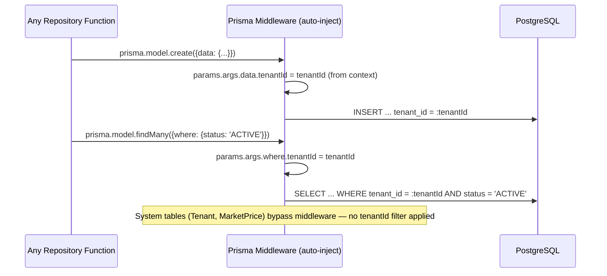
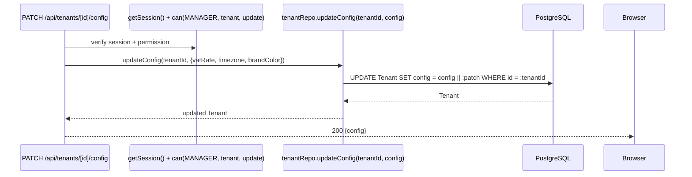
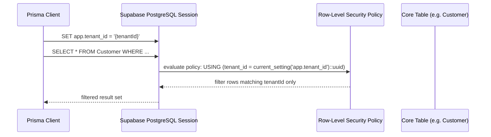
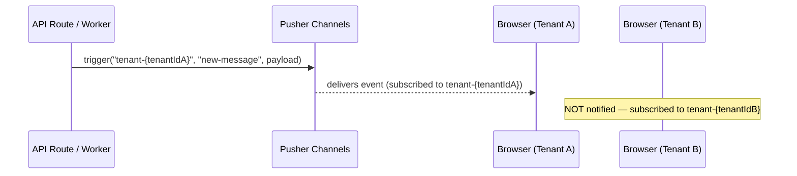

# Data Flow — Multi-Tenant

## 1. Read Flows

### Tenant Slug Resolution



### Tenant Config Read (per-tenant overrides)



## 2. Write Flows

### Tenant Onboarding



### Prisma Middleware — Automatic tenantId Injection

All DB writes and reads pass through Prisma middleware, which enforces tenant isolation transparently:



### Tenant Config Update



## 3. External Integration Flows

### Supabase RLS (Defense in Depth)

Supabase Row-Level Security acts as a backstop in case the application layer (Prisma middleware) fails to inject tenantId.



**Policy definition (example):**
```sql
CREATE POLICY tenant_isolation ON "Customer"
  USING (tenant_id = current_setting('app.tenant_id')::uuid);
```

System tables (`Tenant`, `MarketPrice`) have no RLS policy — accessible by all.

## 4. Realtime Flows

Pusher channels are namespaced by tenant: `tenant-{tenantId}`. Each connected client subscribes only to their tenant's channel. No cross-tenant event leakage is possible.



## 5. Cache Strategy

| Data | Cache | TTL | Notes |
|---|---|---|---|
| Tenant slug → Tenant record | Per-request in-memory | Request lifetime | Resolved once in middleware; tenantId embedded in JWT — no Redis needed |
| Tenant config overrides | Consider Redis | 5 min | Config changes are rare; hot path for VAT/currency rendering |
| Prisma middleware tenantId | Request context | Request lifetime | Passed via AsyncLocalStorage or closure per request |

## 6. Cross-Module Dependencies

Multi-tenant is foundational infrastructure. Every other module depends on it:

| Dependent Module | Dependency |
|---|---|
| **Auth** | Middleware sets tenant headers before NextAuth session check |
| **CRM** | All customerRepo calls receive tenantId as first param |
| **Inbox** | conversationRepo, messageRepo — all scoped by tenantId |
| **POS** | orderRepo, productRepo — scoped by tenantId |
| **Tasks** | taskRepo — scoped by tenantId |
| **Enrollment** | enrollmentRepo — scoped by tenantId |
| **Kitchen Ops** | kitchenRepo — scoped by tenantId |
| **AI** | All context-building repo calls scoped by tenantId |
| **DSB** | All analytics aggregations scoped by tenantId |

**Default tenant (local dev / V School):** `10000000-0000-0000-0000-000000000001`
