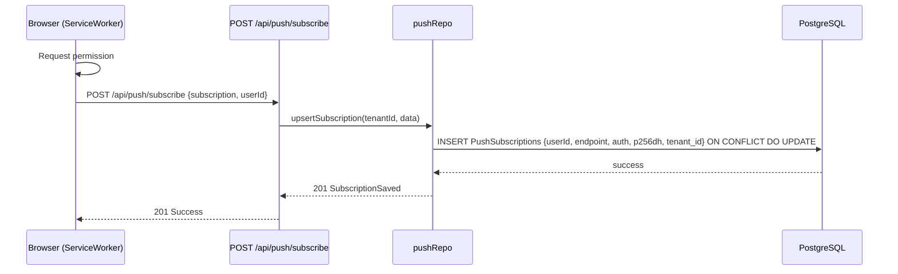
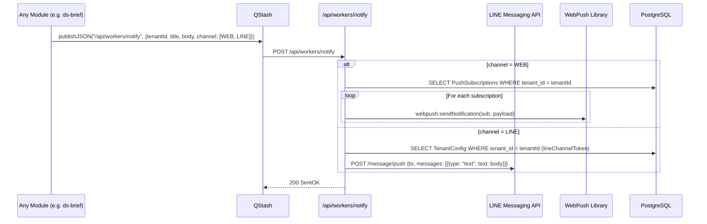
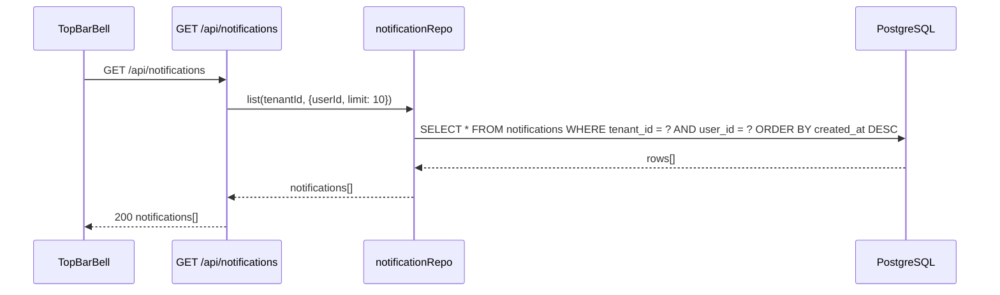

# Data Flow — Notifications (Core Module)

The Notifications module handles multi-channel communication including Web Push (VAPID) and LINE Messaging API (Messaging).

---

## 1. Write Flows

### 1.1 Web Push Subscription

Used by the frontend to register the browser for notifications.

### 1.2 Outbound Multi-Channel Alert (QStash Triggered)

Standard pattern for sending notifications asynchronously to avoid blocking the main thread.

---

## 2. Read Flows

### 2.1 Notification History (Bell Icon)

The "Inbox" style notification dropdown.

---

## 3. Realtime Flows

| Event | Channel | Trigger |
|---|---|---|
| `notification-unread` | `private-tenant-{tenantId}` | Triggered via Pusher before push worker completes |

---

## 4. Cache Strategy

| Cache Key | TTL | Invalidation |
|---|---|---|
| `notify:unread:{tenantId}:{userId}` | 300s | Any new notification creation |

---

## 5. Security & Isolation

- **Tenant Isolation:** VAPID keys may be shared globally (V School), but LINE tokens are strictly per-tenant from `TenantConfig`.
- **User Privacy:** Notifications are scoped to `user_id` and `tenant_id`.
- **Payload Security:** Never include sensitive PII in the push payload (WebPush spec).
