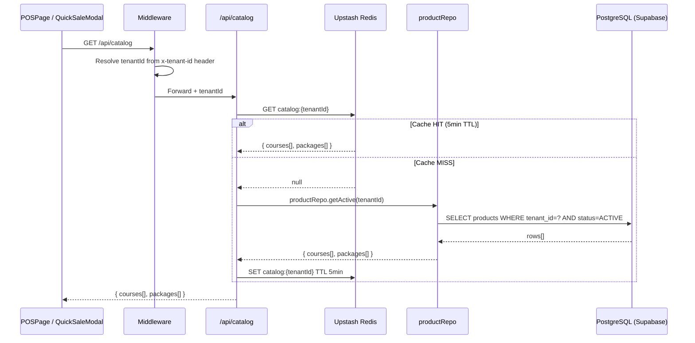
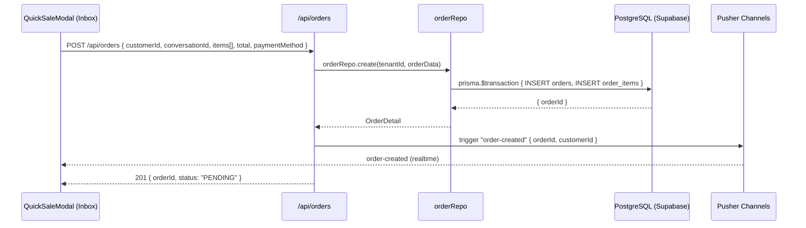
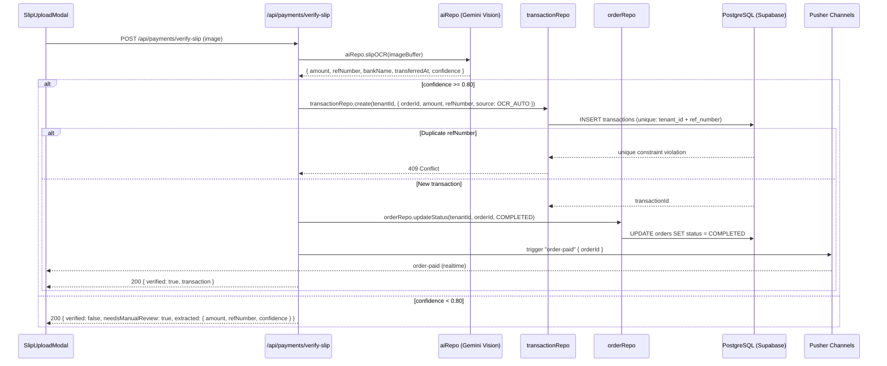
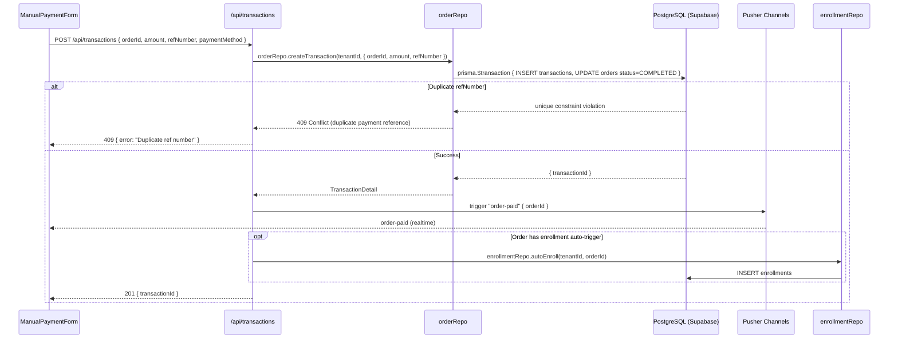
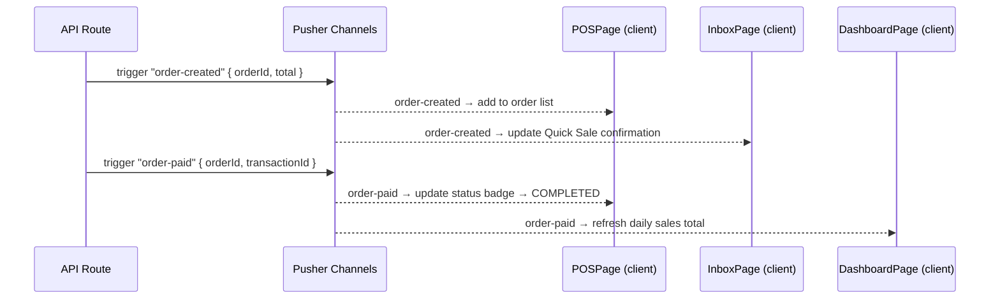

# Data Flow — POS (Point of Sale)
> Module: POS | Group: core

---

## 1. Read Flows

### 1.1 Load Product Catalog

```
UI (POSPage / QuickSaleModal)
  → GET /api/catalog
  → middleware: resolves tenantId
  → api/catalog/route.js
      → Redis.get("catalog:{tenantId}")
          HIT  → return cached { courses[], packages[] }
          MISS → productRepo.getActive(tenantId)
                   → SELECT products WHERE tenant_id = ? AND status = 'ACTIVE'
                       JOIN categories, JOIN pricing_tiers
               → Redis.set("catalog:{tenantId}", result, TTL 5min)
               → return { courses[], packages[] }
```



### 1.2 Load Order History

```
UI (OrderHistoryPage)
  → GET /api/orders?customerId=&status=&page=
  → orderRepo.list(tenantId, filters)
      → SELECT orders WHERE tenant_id = ? + optional filters
          JOIN order_items, JOIN customers
      → No Redis cache (order status changes frequently; stale data causes reconciliation issues)
  → return { orders[], total }
```

### 1.3 Load Order Detail

```
UI (OrderDetailPage)
  → GET /api/orders/[id]
  → orderRepo.getById(tenantId, id)
      → SELECT order + items + transactions + customer WHERE tenant_id = ?
  → return OrderDetail
```

---

## 2. Write Flows

### 2.1 Create Order — Quick Sale (from Inbox chat)

```
UI (QuickSaleModal in ConversationThread)
  → POST /api/orders {
        customerId,
        conversationId,   ← links order back to chat thread
        items: [{ productId, qty, unitPrice }],
        total,
        paymentMethod: "PENDING" | "CASH" | "TRANSFER"
    }
  → api/orders/route.js
      → orderRepo.create(tenantId, orderData)
          → prisma.$transaction {
                INSERT orders (id: ORD-[ULID], tenant_id, customer_id, conversation_id, status: PENDING)
                INSERT order_items (for each item)
            }
      → Pusher.trigger("private-tenant-{tenantId}", "order-created", { orderId, customerId })
  → return { orderId, status: "PENDING" }
```



### 2.2 Create Order — Full POS (from /pos page)

Identical to 2.1 but may include additional fields: `tableId`, `floorId`, `staffId`. The `conversationId` is optional (null if walk-in customer).

```
POST /api/orders {
    customerId,
    conversationId: null,     ← walk-in
    tableId, floorId,         ← floor plan (optional)
    items[], total, paymentMethod, staffId
}
```

### 2.3 Create Invoice

```
UI (InvoiceModal)
  → POST /api/invoices { orderId, notes }
  → api/invoices/route.js
      → invoiceRepo.create(tenantId, {
            orderId,
            invoiceNumber: "INV-{YYYYMMDD}-{NNN}",   ← NNN = daily sequence, zero-padded
            issuedAt: NOW(),
            notes
        })
          → prisma.$transaction {
                SELECT COUNT(*) today's invoices for sequence number
                INSERT invoices
            }
  → return InvoiceDetail { invoiceId, invoiceNumber, pdfUrl }
```

### 2.4 Send Invoice via Chat

```
UI (SendInvoiceButton)
  → POST /api/conversations/[conversationId]/reply {
        text: "ใบเสร็จ/ใบแจ้งหนี้ เลขที่ {invoiceNumber}\n{formatted summary}",
        attachmentUrl: pdfUrl   ← optional
    }
  → delegates to Inbox module send-reply flow
  → FB Graph API or LINE Messaging API
```

### 2.5 Slip OCR — Payment Verification

```
UI (SlipUploadModal)
  → POST /api/payments/verify-slip (multipart image)
  → api/payments/verify-slip/route.js
      → read image buffer
      → aiRepo.slipOCR(imageBuffer)
          → Gemini Vision: extract { amount, refNumber, bankName, transferredAt, confidence }
      → if confidence >= 0.80:
            → transactionRepo.create(tenantId, { orderId?, amount, refNumber, source: "OCR_AUTO" })
                → INSERT transactions (unique constraint on tenant_id + ref_number → 409 on duplicate)
            → orderRepo.updateStatus(tenantId, orderId, "COMPLETED")
            → Pusher.trigger("private-tenant-{tenantId}", "order-paid", { orderId })
            → return { verified: true, transaction }
        else:
            → return { verified: false, needsManualReview: true, extracted: { amount, refNumber, confidence } }
```



### 2.6 Create Transaction (Manual)

```
UI (ManualPaymentForm)
  → POST /api/transactions { orderId, amount, refNumber, paymentMethod, paidAt }
  → api/transactions/route.js
      → orderRepo.createTransaction(tenantId, { orderId, amount, refNumber, paymentMethod, paidAt })
          → prisma.$transaction {
                INSERT transactions
                    ON CONFLICT (tenant_id, ref_number) → throw 409
                UPDATE orders SET status = 'COMPLETED', paid_at = paidAt
            }
      → Pusher.trigger("private-tenant-{tenantId}", "order-paid", { orderId })
      → [if order has enrollment trigger configured]
            → enrollmentRepo.autoEnroll(tenantId, orderId)   ← triggered by completed order
  → return { transactionId }
```



---

## 3. External Integration Flows

### 3.1 Gemini Vision — Slip OCR

```
/api/payments/verify-slip
  → aiRepo.slipOCR(imageBuffer)
      → POST https://generativelanguage.googleapis.com/v1beta/models/gemini-2.0-flash:generateContent
          Body: {
              contents: [{
                  parts: [
                      { text: "Extract payment slip details: amount, reference number, bank, date. Return JSON." },
                      { inline_data: { mime_type: "image/jpeg", data: base64Image } }
                  ]
              }]
          }
      → parse response JSON
      → return { amount, refNumber, bankName, transferredAt, confidence }
```

### 3.2 Accounting Platform (Add-on) — FlowAccount Sync

```
[QStash Worker — /api/workers/sync-flowaccount]
  → runs on cron (hourly or on COMPLETED order event)
  → orderRepo.getUnsynced(tenantId)
      → SELECT orders WHERE status = 'COMPLETED' AND synced_to_flowaccount = false
  → for each order:
      → flowAccountRepo.createReceipt(tenantId, order)
          → POST https://api.flowaccount.com/... (FlowAccount API)
      → orderRepo.markSynced(tenantId, orderId, { flowAccountId })
          → UPDATE orders SET synced_to_flowaccount = true, flow_account_id = ?
```

---

## 4. Realtime Flows

```
Pusher Channel: "private-tenant-{tenantId}"

Events:
  order-created
    payload: { orderId, customerId, total, status: "PENDING" }
    → POSPage order list updates
    → Inbox QuickSaleModal confirms submission

  order-paid
    payload: { orderId, transactionId, paidAt }
    → POSPage: update order status badge to COMPLETED
    → Dashboard: trigger daily sales brief refresh
```



---

## 5. Cache Strategy

| Redis Key | TTL | Populated By | Invalidated By |
|---|---|---|---|
| `catalog:{tenantId}` | 5min | GET /api/catalog | Product create/update/delete (PATCH /api/products/[id]) |

Orders and transactions are not cached — they require real-time accuracy for financial reconciliation.

Pattern: `getOrSet("catalog:{tenantId}", () => productRepo.getActive(tenantId), 300)` (300s = 5min).

Catalog is invalidated explicitly when any product status or price changes, ensuring staff always see current pricing.

---

## 6. Cross-Module Dependencies

### Modules POS calls

| Target Module | Repo / Service | Purpose |
|---|---|---|
| CRM | `customerRepo.getById(tenantId, id)` | Show customer name/profile at checkout |
| Inbox | `conversationRepo.getById(tenantId, id)` | Link order to chat thread (Quick Sale) |
| Enrollment | `enrollmentRepo.autoEnroll(tenantId, orderId)` | Auto-enroll student when course order completes |
| AI Assistant | `aiRepo.slipOCR(imageBuffer)` | Gemini Vision slip verification |
| Accounting (add-on) | `flowAccountRepo.createReceipt(tenantId, order)` | Sync completed orders to FlowAccount |

### Modules that call POS

| Caller Module | Repo Function | Purpose |
|---|---|---|
| Inbox | `orderRepo.create(tenantId, { conversationId, ... })` | Quick Sale order from chat |
| Enrollment | `orderRepo.getById(tenantId, orderId)` | Verify payment before enrollment confirmation |
| Daily Sales Brief (AI) | `orderRepo.getDailySummary(tenantId, date)` | Aggregate sales for AI-generated daily brief |
| Accounting (add-on) | `orderRepo.getUnsynced(tenantId)` | Pull completed orders for FlowAccount sync |

### ID Standards (from id_standards.yaml)

| Entity | Format |
|---|---|
| Order | `ORD-[ULID]` |
| Transaction | `TXN-[ULID]` |
| Invoice | `INV-{YYYYMMDD}-{NNN}` (daily sequence) |
