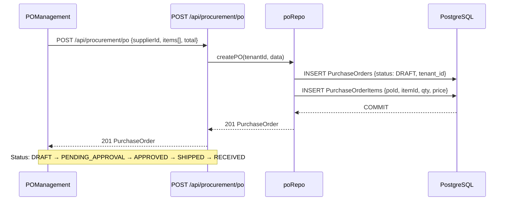
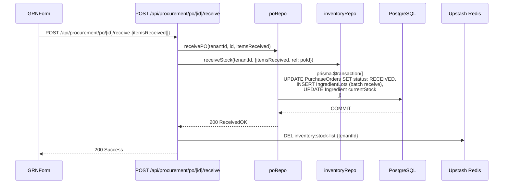
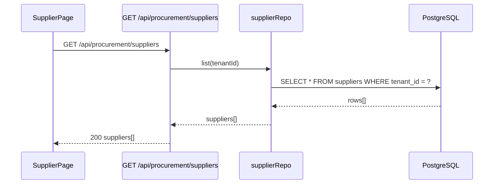

# Data Flow — Procurement (Shared Module)

The Procurement module manages the full lifecycle of purchasing inventory, from Request to Goods Received Note (GRN).

---

## 1. Write Flows

### 1.1 Purchase Order Lifecycle

Used when buying ingredients from suppliers.

### 1.2 Goods Received Note (GRN)

Linking Procurement back to Inventory when items arrive at the warehouse.

---

## 2. Read Flows

### 2.1 Supplier List & Performance

Used when choosing a supplier for a new PO.

---

## 3. Realtime Flows

| Event | Channel | Trigger |
|---|---|---|
| `po-approved` | `private-tenant-{tenantId}` | After PO state change to APPROVED |
| `po-received` | `private-tenant-{tenantId}` | After GRN completion |

---

## 4. Cache Strategy

| Cache Key | TTL | Invalidation |
|---|---|---|
| `procurement:suppliers:{tenantId}` | 300s | Any supplier update |
| `procurement:po:{tenantId}:{id}` | 60s | Any PO state change |

---

## 5. Security & Isolation

- **Approval Workflow:** POs above a certain threshold (config: `procurement.limit`) MUST be approved by `OWNER` or `MANAGER`.
- **Tenant Isolation:** Every PO and supplier linked to `tenant_id`.
- **Audit:** Every status change in the PO lifecycle is logged in `AuditLog`.
