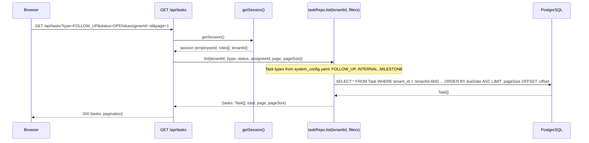
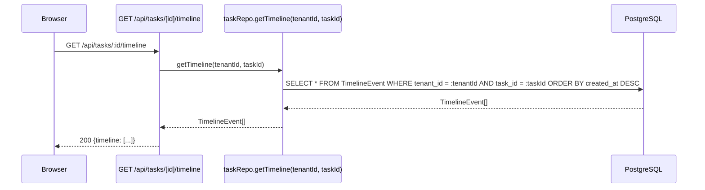
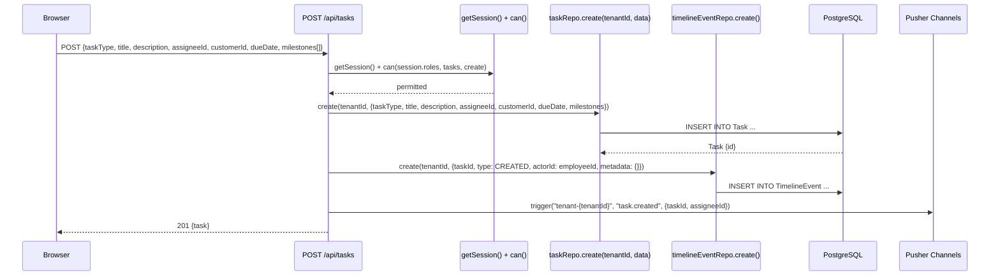
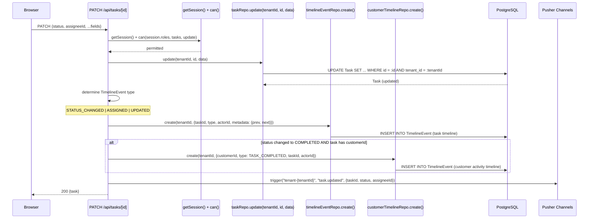
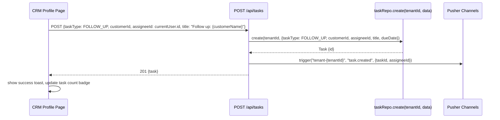
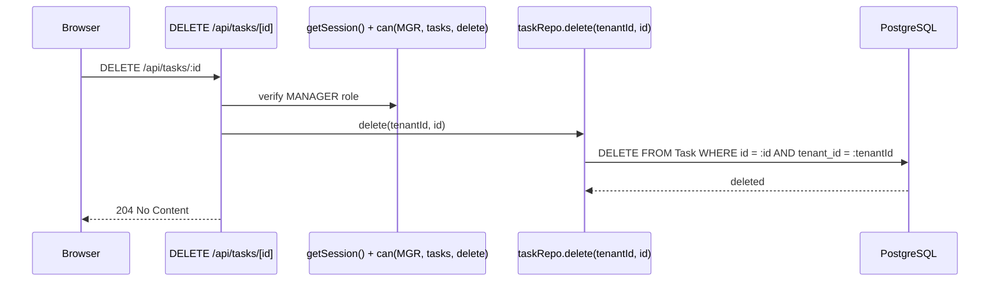
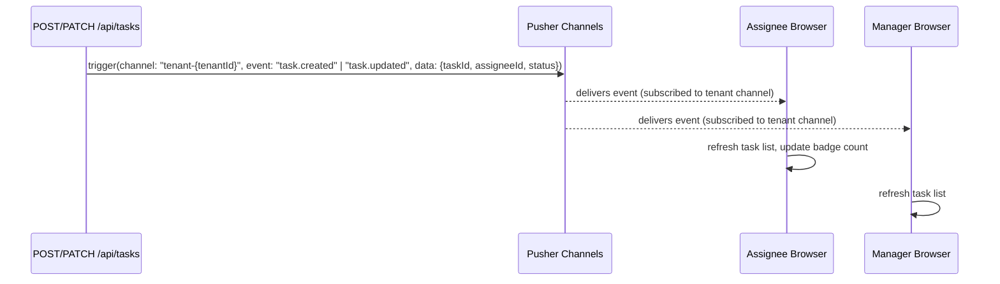

# Data Flow — Tasks

## 1. Read Flows

### Task List

### Task Detail + Timeline

## 2. Write Flows

### Create Task

### Update Task (Status / Assignee / Fields)

### Follow-Up Task from CRM

### Delete Task

## 3. External Integration Flows

Tasks has no direct external integrations (no Meta/LINE API calls). Integration points are internal:

- **QStash** — no scheduled workers for tasks currently (due date reminders are a future roadmap item).
- **Pusher** — realtime task updates (see Section 4).

## 4. Realtime Flows

### Task Created / Updated — Pusher Push

Events pushed:
- `task.created` — on new task creation
- `task.updated` — on status change, reassignment, or field update

## 5. Cache Strategy

| Data | Cache | TTL | Notes |
|---|---|---|---|
| Task list | None | — | Low volume, frequently changing (status updates) — read from DB directly |
| Task detail | None | — | Same rationale |
| Task timeline | None | — | Append-only but low volume; no cache benefit |
| Task type config | Module-level (in-process) | Process lifetime | Types loaded from system_config.yaml at startup |

## 6. Cross-Module Dependencies

| Depends on | Data / Reason |
|---|---|
| **Auth** | `getSession()` + `can(roles, tasks, action)` on every route |
| **Multi-Tenant** | `tenantId` injected by middleware; all repo calls scoped |
| **CRM** | `customerId` foreign key — Follow-Up tasks link to customer records; TASK_COMPLETED event written to customer activity timeline |
| **Employee (Auth)** | `assigneeId` references Employee table; assignee must belong to same tenant |

**Task types (from system_config.yaml):**

| Type | Description |
|---|---|
| `FOLLOW_UP` | Sales/CRM follow-up linked to a customer |
| `INTERNAL` | Internal operational task (no customer link required) |
| `MILESTONE` | Project milestone with nested milestone steps |
