# Database Schema — Full ERD Reference

> **17 models** (core) — จะเพิ่มเป็น ~50 models หลัง Phase 4-6 migration
> **Reference:** `prisma/schema.prisma`
> **อ่านใน Obsidian:** Mermaid diagrams render อัตโนมัติ

---

## 0. Master Relationship Diagram

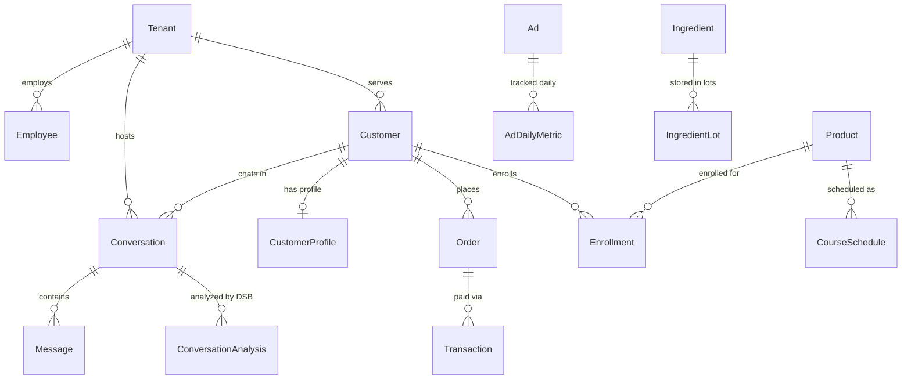

---

## 1. CORE: Multi-Tenant

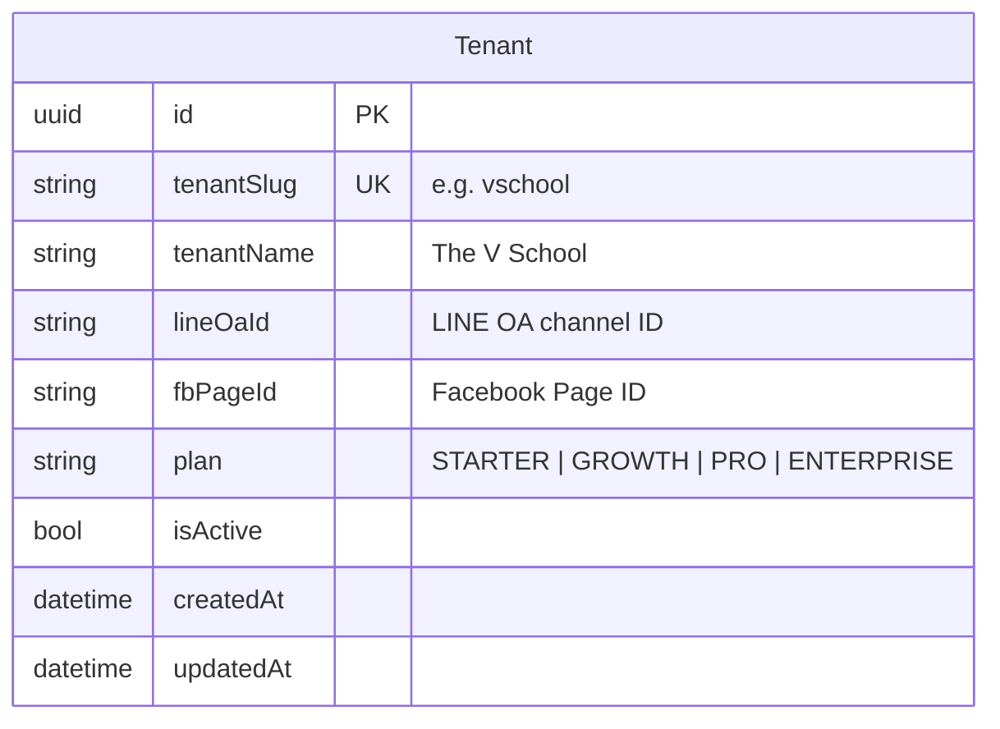

| Field | หมายเหตุ |
|---|---|
| `tenantSlug` | ใช้สำหรับ subdomain routing: `{slug}.zuri.app` |
| `plan` | กำหนด feature limits ตาม pricing tier |
| `lineOaId` / `fbPageId` | Per-tenant channel config (Phase MT-2) |

**V School Seed:**
```sql
id = '10000000-0000-0000-0000-000000000001'
tenantSlug = 'vschool'
```

**ADR:** [[ADR-056]] Multi-Tenant Foundation
**Gotcha:** [[G-MT-01]] Missing tenantId = cross-tenant data leak

---

## 2. CORE: Auth & Employee

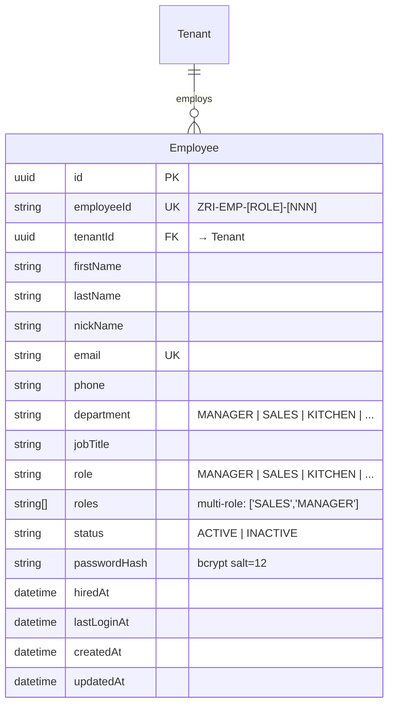

| Field | หมายเหตุ |
|---|---|
| `employeeId` | v3 format: `TVS-[TYPE]-[DEPT]-[NNN]` — TYPE: EMP/FL/CT, DEPT: 12 codes |
| `role` | Single role (backward compat) — always UPPERCASE |
| `roles[]` | Multi-role array — permission = union of all roles |
| `passwordHash` | bcrypt salt=12 via NextAuth CredentialsProvider |

**ADR:** [[ADR-029]] Employee Registry, [[ADR-045]] RBAC Redesign, [[ADR-068]] Persona-Based RBAC, [[ADR-047]] Employee ID v3
**Gotcha:** [[G-DEV-05]] Role must be UPPERCASE, [[G-DEV-06]] Login supports both v2+v3 ID formats

---

## 3. CORE: Customer CRM

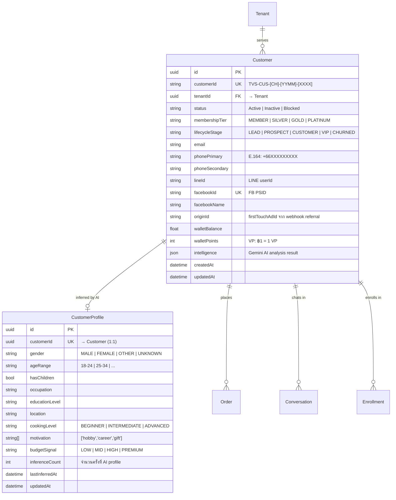

| Relation | Cardinality | หมายเหตุ |
|---|---|---|
| Customer → CustomerProfile | 1:0..1 | AI สร้างเมื่อมีข้อมูลเพียงพอ |
| Customer → Order | 1:N | ลูกค้าสั่งซื้อหลายครั้ง |
| Customer → Conversation | 1:N | แต่ละ channel = 1 conversation |
| Customer → Enrollment | 1:N | ลงทะเบียนหลาย course (industry/culinary) |

**Identity Merge:**
```
Phone (E.164) = merge key
Facebook PSID → facebookId
LINE userId   → lineId
ทุก channel merge เข้า Customer เดียวกันผ่าน phonePrimary
```

**ADR:** [[ADR-025]] Identity Resolution, [[ADR-043]] Fuzzy Thai Name Matching
**Gotcha:** [[G-DB-01]] Phone = merge key, [[G-DB-06]] Thai name false positive, [[G-MT-01]] tenantId every query

---

## 4. CORE: Inbox & Conversations

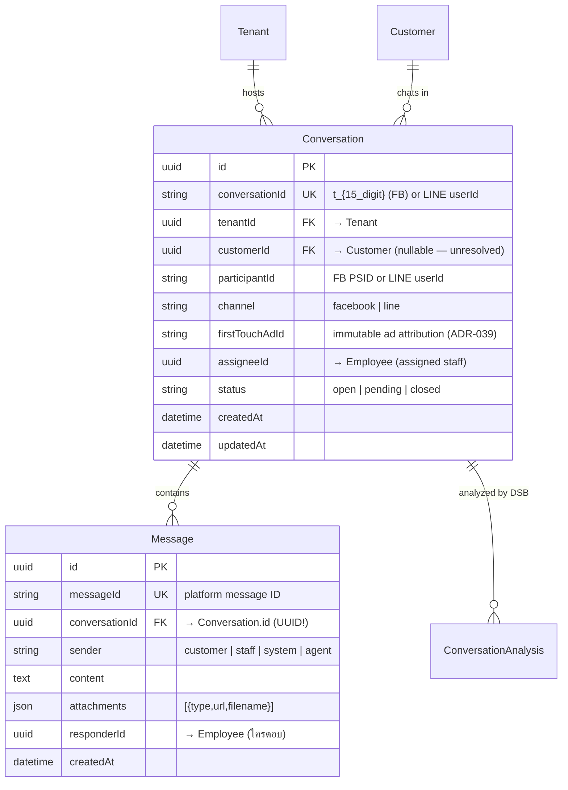

**ID Gotcha (CRITICAL):**
```
Conversation.id               = UUID (internal PK) ← ใช้อันนี้สำหรับ FK
Conversation.conversationId   = t_xxx (FB) or LINE userId ← external ID

Order.conversationId      → ใช้ Conversation.id (UUID)     ✅
ConversationAnalysis      → ใช้ Conversation.id (UUID)     ✅
ห้ามใช้ Conversation.conversationId (t_xxx) เป็น FK        ❌
```

**ADR:** [[ADR-028]] FB Webhook, [[ADR-033]] Unified Inbox, [[ADR-054]] LINE Agent Mode
**Gotcha:** [[G-DB-02]] dbId vs id, [[G-WH-01]] < 200ms response, [[G-WH-02]] P2002 race condition

---

## 5. CORE: Orders & Payments

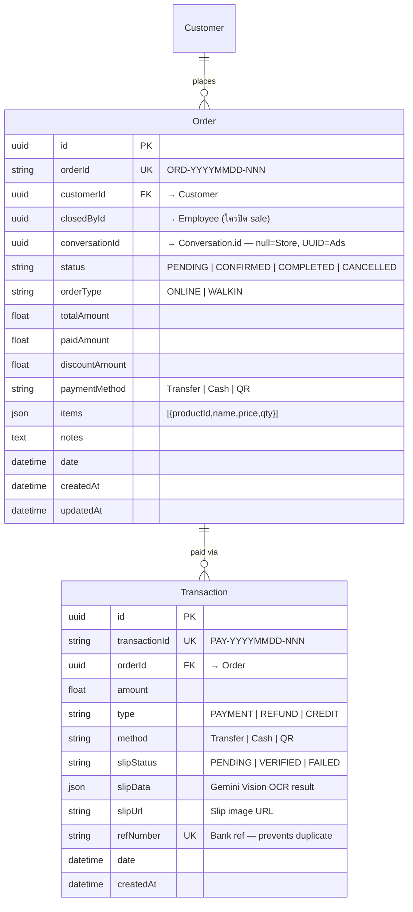

**Revenue Classification:**
```
Order.conversationId = null   → Store Revenue (walk-in via Full POS)
Order.conversationId = UUID   → Ads Revenue (chat-first via Quick Sale)
```

**Slip OCR Flow:**
```
Customer ส่ง slip ใน chat
  → Gemini Vision OCR → { amount, date, refNumber, confidence }
  → confidence ≥ 0.80 → auto Transaction (PENDING)
  → confidence < 0.80 → log warning, manual add
  → Employee verify → VERIFIED → Order CLOSED
  → ROAS คำนวณจาก VERIFIED เท่านั้น
```

**ADR:** [[ADR-030]] Revenue Split, [[ADR-039]] Slip OCR
**Gotcha:** [[G-DB-02]] conversationId ใช้ UUID ไม่ใช่ t_xxx, [[G-MKT-02]] channel classification, [[G-MKT-04]] OCR threshold

---

## 6. CORE: Marketing & Ads

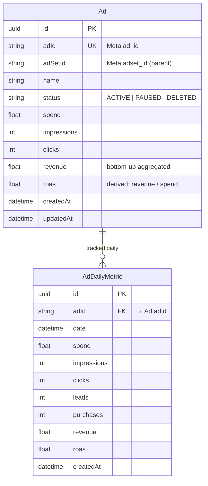

**Data Flow:**
```
Meta Graph API
  → QStash cron (ทุก 1 ชม.) → /api/workers/sync-hourly
    → campaignRepo.upsertDailyMetric()
      → DB (ads, ad_daily_metrics)

UI → /api/marketing/dashboard → campaignRepo → DB → Redis cache (TTL 300s)
UI ห้ามเรียก Graph API โดยตรง
```

**Aggregation (ADR-024):**
```
Ad-level (source of truth)
  → AdSet = SUM(Ads in set)
  → Campaign = SUM(AdSets in campaign)
Derived metrics (ROAS, CPA, CPL) = compute on-the-fly ไม่ store
Checksum: Sum(Ads) vs Campaign total from Meta — tolerance ±1%
```

**Models ที่จะเพิ่มใน Phase 4 (migration จาก ZURI):**
- `AdAccount` (tenantId → per-tenant ads)
- `Campaign`, `AdSet` (hierarchy)
- `AdCreative`, `AdLiveStatus`
- `AdHourlyMetric`, `AdHourlyLedger`
- `AdDailyDemographic`, `AdDailyPlacement`
- `AdActivity`, `AdReviewResult`

**ADR:** [[ADR-024]] Bottom-Up Aggregation, [[ADR-052]] Marketing Sync Infrastructure
**Gotcha:** [[G-META-01]] to [[G-META-06]]

---

## 7. CORE: Tasks

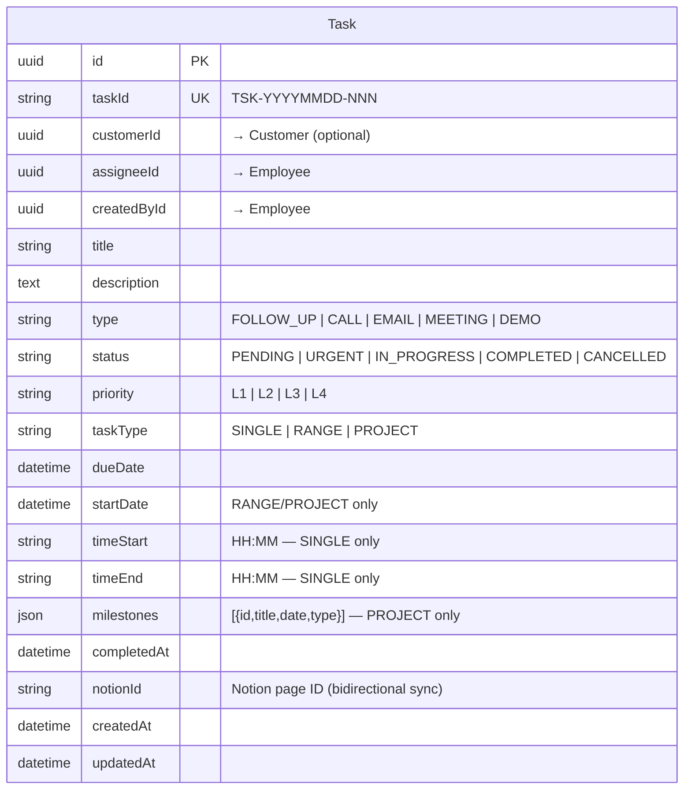

**Task Type Rules:**
```
SINGLE:  timeStart + timeEnd → single-day card with time badge
RANGE:   startDate + dueDate → spanning bar (purple) in calendar
PROJECT: startDate + dueDate + milestones[] → spanning bar (gold) + ◆ markers
```

---

## 8. CORE: DSB (Daily Sales Brief)

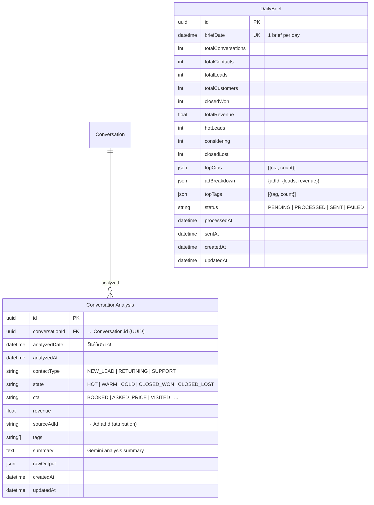

**Pipeline:**
```
QStash 00:05 ICT → /api/workers/daily-brief/process
  → Gemini analyze each conversation → ConversationAnalysis
  → Aggregate → DailyBrief

QStash 08:00 ICT → /api/workers/daily-brief/notify
  → Read DailyBrief → Format → LINE push to Boss/Manager
```

**Gotcha:** [[G-DB-04]] Array mutation ก่อน DB operation

---

## 9. CORE: Products & Catalog

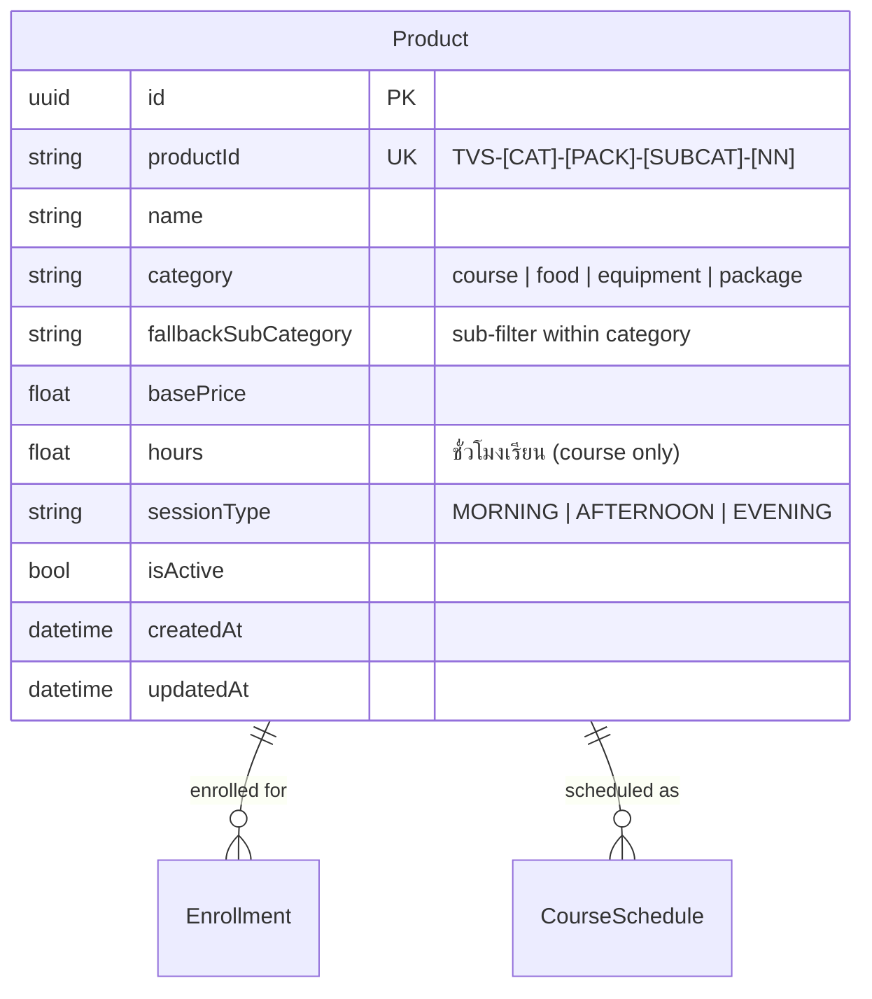

**ADR:** [[ADR-037]] Reuse Product as Course Catalog, [[ADR-042]] Product ID Generation

---

## 10. INDUSTRY/CULINARY: Enrollment & Schedule

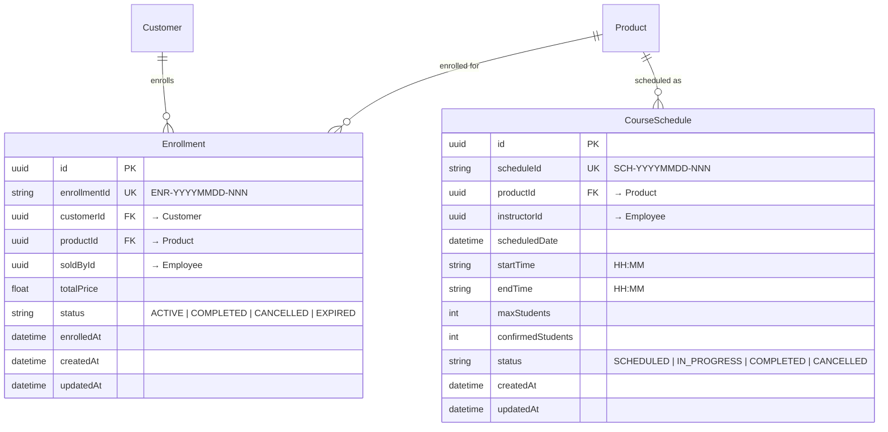

**Models ที่จะเพิ่มใน Phase 6 (migration จาก ZURI):**
- `EnrollmentItem` (per-course tracking within enrollment)
- `ClassAttendance` (QR check-in)
- `Package`, `PackageCourse`, `PackageGift`
- `PackageEnrollment`, `PackageEnrollmentCourse`
- `Certificate` (auto-issue: ≥30h L1, ≥111h, ≥201h)

---

## 11. INDUSTRY/CULINARY: Kitchen Ops

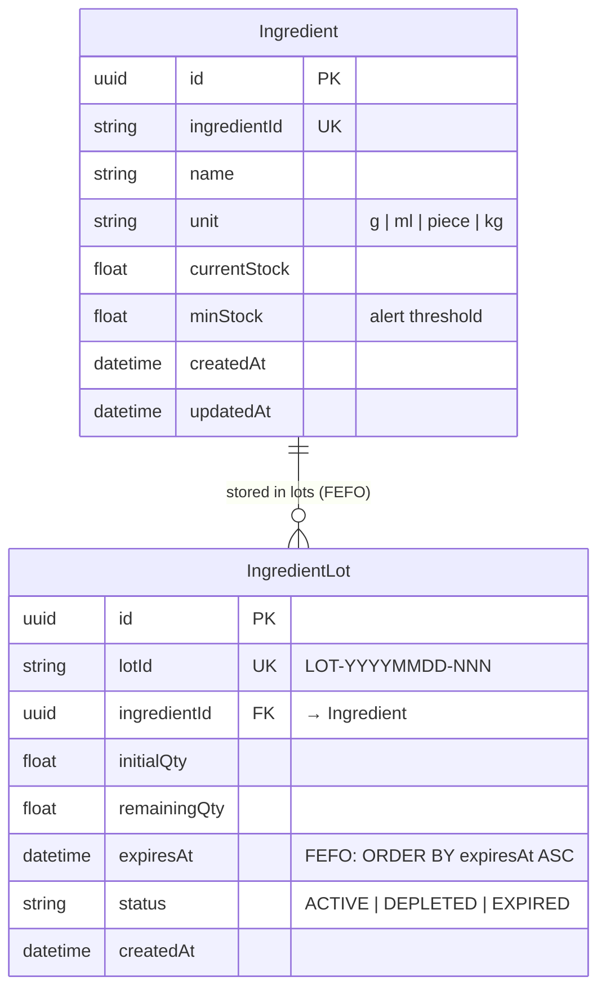

**FEFO (First Expire First Out):**
```sql
SELECT * FROM ingredient_lots
WHERE ingredient_id = ? AND status = 'ACTIVE' AND remaining_qty > 0
ORDER BY expires_at ASC  -- ← หมดอายุก่อน ตัดก่อน
```

**Stock Deduction (ADR-038):**
```
Ingredient: qtyPerPerson × confirmedStudents  (คูณจำนวนคน)
Equipment:  qtyRequired per session            (คงที่ ไม่คูณ)
ทั้งหมดใน prisma.$transaction — atomic
```

**Models ที่จะเพิ่มใน Phase 6:**
- `Recipe`, `RecipeIngredient`, `RecipeEquipment`
- `CourseMenu` (junction: Product → Recipe)
- `MarketPrice` (Makro, Lotus)
- `StockDeductionLog`
- `PurchaseRequest`, `PurchaseRequestItem`

**ADR:** [[ADR-038]] Recipe-Package-Stock
**Gotcha:** [[G-DB-07]] Ingredient vs Equipment deduction logic

---

## 12. SHARED: Audit

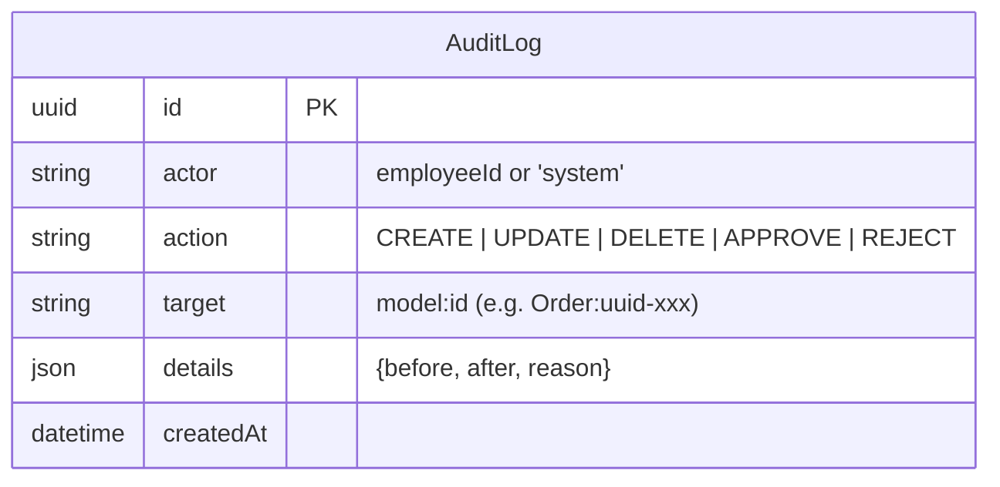

**Usage:** ทุก gate action + PO workflow + stock movement + role change

---

## 13. Models ที่จะเพิ่ม (Phase 4-6 Migration)

### Phase 4: Core Module Migration (+15 models)

| Module | Models | จาก ZURI |
|---|---|---|
| core/inbox | ConversationLog, ChatEpisode, ConversationIntelligence | ADR-054 Agent Mode |
| core/marketing | AdAccount, Campaign, AdSet, AdCreative, AdLiveStatus | ADR-024, ADR-052 |
| core/marketing | AdHourlyMetric, AdHourlyLedger, AdDailyDemographic, AdDailyPlacement | ADR-024 |
| core/marketing | AdActivity, AdReviewResult | ADR-052 |
| core/notifications | PushSubscription, NotificationRule, BroadcastCampaign | ADR-044, ADR-055 |

### Phase 5: Shared Module Migration (+12 models)

| Module | Models | ADR |
|---|---|---|
| shared/inventory | Warehouse, WarehouseStock, StockMovement | ADR-048 |
| shared/inventory | StockCount, StockCountItem, ProductBarcode | ADR-048 |
| shared/procurement | Supplier, PurchaseOrderV2, POItem, POApproval | ADR-049 |
| shared/procurement | POAcceptance, POTracking, GoodsReceivedNote, GRNItem | ADR-049 |
| shared/procurement | POReturn, CreditNote, POIssue, Advance | ADR-049 |
| shared/audit | AdsOptimizeRequest | ADR-045 |

### Phase 6: Industry Culinary Migration (+13 models)

| Module | Models | ADR |
|---|---|---|
| industry/culinary/courses | EnrollmentItem, ClassAttendance | ADR-038 |
| industry/culinary/packages | Package, PackageCourse, PackageGift | ADR-038 |
| industry/culinary/packages | PackageEnrollment, PackageEnrollmentCourse | ADR-038 |
| industry/culinary/recipes | Recipe, RecipeIngredient, RecipeEquipment, CourseMenu | ADR-038 |
| industry/culinary/kitchen | MarketPrice, PurchaseRequest, PurchaseRequestItem | ADR-049 |
| industry/culinary/kitchen | StockDeductionLog | ADR-038 |
| industry/culinary/certificates | Certificate | — |

### Total After Migration: ~57 models

---

## 14. Key Data Flows

### 14.1 Chat-First Revenue Attribution

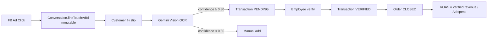

### 14.2 Identity Resolution

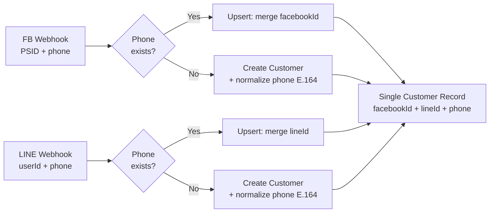

### 14.3 FEFO Stock Deduction

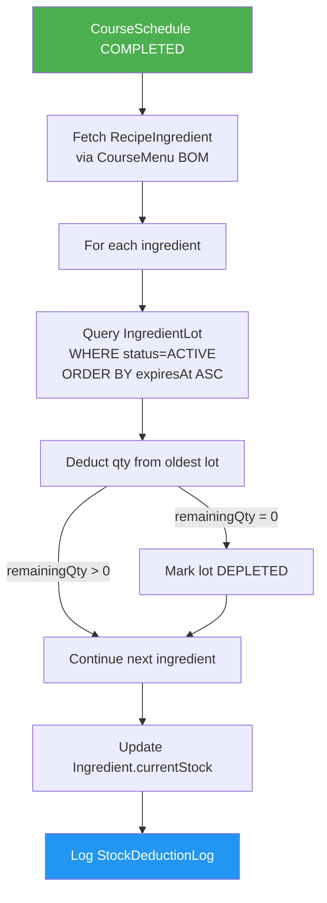

---

## 15. Index Strategy

| Table | Index | Purpose |
|---|---|---|
| customers | `(tenantId)` | Multi-tenant filter |
| customers | `(phonePrimary)` | Identity merge lookup |
| conversations | `(tenantId)` | Multi-tenant filter |
| conversations | `(customerId)` | Customer conversations |
| messages | `(conversationId)` | Messages in conversation |
| ad_daily_metrics | `(adId, date)` UNIQUE | One metric per ad per day |
| ingredient_lots | `(ingredientId, expiresAt)` | FEFO query |
| conversation_analyses | `(analyzedDate)` | DSB date range |
| conversation_analyses | `(contactType)` | DSB filter by type |
| conversation_analyses | `(state)` | DSB filter by state |
| daily_briefs | `(briefDate)` | Quick lookup |
| audit_logs | `(actor)` | Who did what |
| audit_logs | `(action)` | What happened |

---

## 16. Naming Conventions

| Convention | Example | Rule |
|---|---|---|
| Table name | `customers` | lowercase, plural, snake_case |
| Column name | `tenant_id` | snake_case |
| PK | `id` | UUID, always `@id @default(uuid())` |
| Business ID | `customerId` | Unique, format ตาม `id_standards.yaml` |
| FK column | `tenant_id`, `customer_id` | snake_case, maps to parent PK |
| Timestamps | `created_at`, `updated_at` | ทุก table ต้องมี |
| Boolean | `is_active` | prefix `is_` |
| JSON | `items`, `slipData`, `milestones` | camelCase in Prisma, snake_case in DB |
