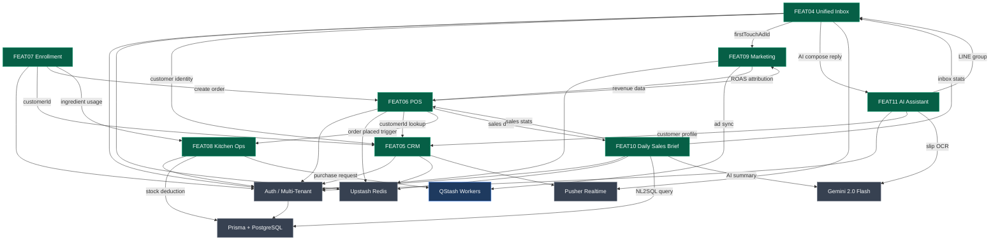

# Zuri Module Dependencies

> Updated: 2026-04-04
> Source: สร้างจาก feature specs FEAT04–FEAT11 + CLAUDE.md

## Dependency Map

## Cross-Module Dependency Summary

| Module | Depends On | Depended By |
|--------|-----------|-------------|
| **FEAT04 Inbox** | CRM, Marketing, AI | DSB, AI |
| **FEAT05 CRM** | — | Inbox, POS, Enrollment, AI, DSB |
| **FEAT06 POS** | CRM | Enrollment, Kitchen, Marketing, DSB |
| **FEAT07 Enrollment** | CRM, POS, Kitchen | — |
| **FEAT08 Kitchen** | POS | Enrollment |
| **FEAT09 Marketing** | Inbox, POS, QStash | — |
| **FEAT10 DSB** | Inbox, POS, Prisma, Gemini | — |
| **FEAT11 AI** | CRM, Inbox, Gemini | Inbox |

## Key Dependency Rules

- **CRM เป็น central hub** — ทุก module ที่เกี่ยวกับ customer ต้องผ่าน CRM
- **POS เป็น revenue source** — Marketing (ROAS) และ DSB (sales stats) ดึงข้อมูลจาก POS
- **Enrollment ต้องสร้าง POS order ก่อน** — ลูกค้าต้องชำระเงินผ่าน POS ก่อน enrollment จะ activate
- **Kitchen เป็น passive consumer** — รับ trigger จาก POS และ Enrollment เท่านั้น ไม่มีใคร depend on Kitchen
- **Shared infra (Auth, Prisma, Redis)** — ทุก module ต้องผ่าน Auth และ tenantId

## PNG Export

ไฟล์ภาพ: `module-dependencies-diagram.png` (root)
