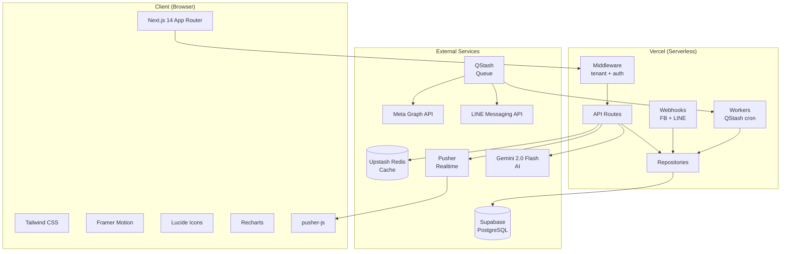
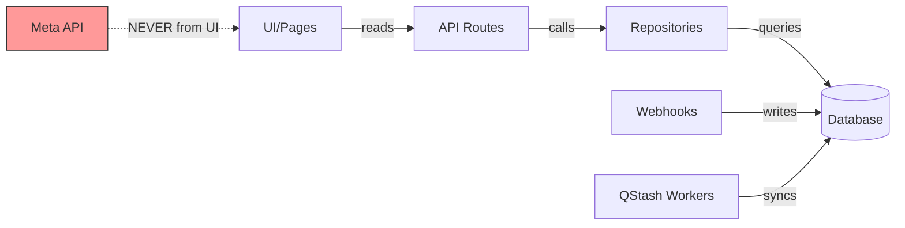
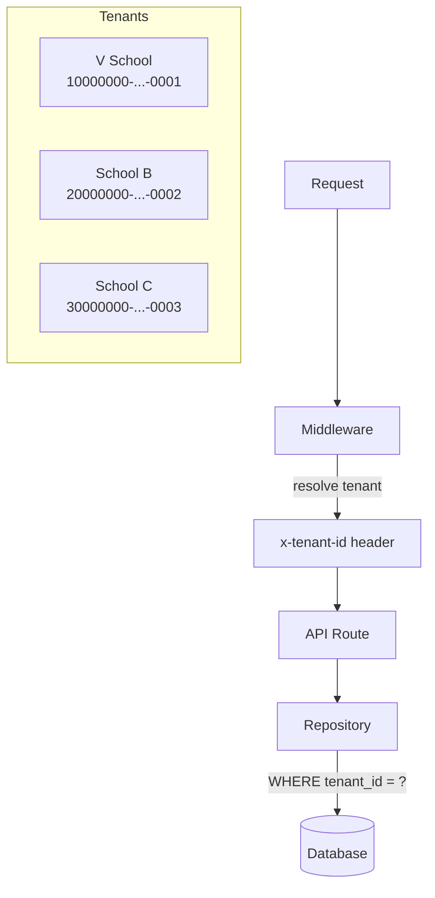
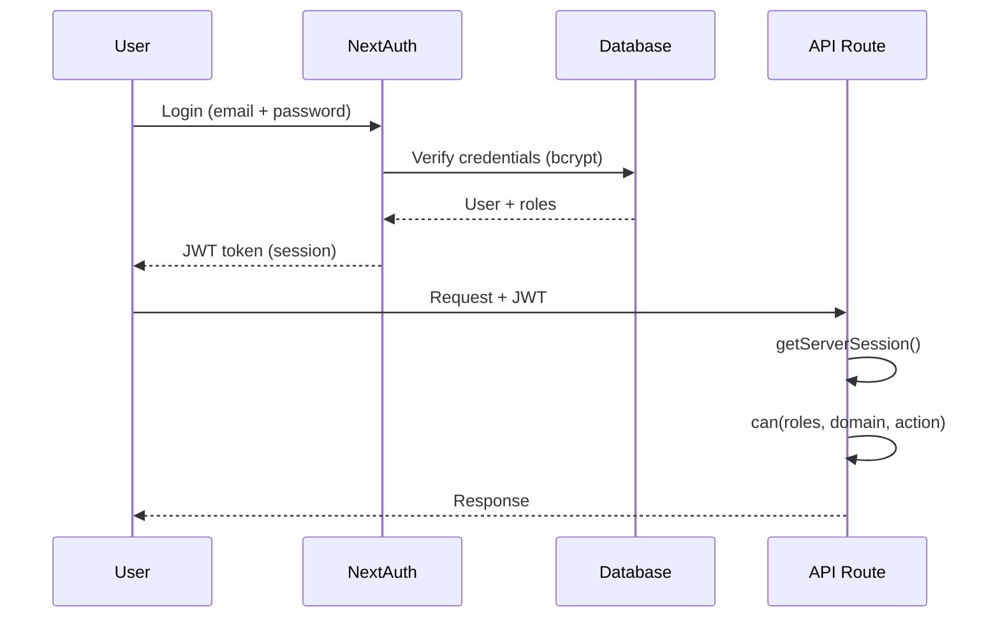

# System Overview

> Zuri Platform — Tech stack + data flow

## Tech Stack

## Critical Data Flow Rules

### Rules
1. **UI reads from DB only** — never call Meta/LINE API from UI or API routes
2. **QStash workers** sync external data to DB every 1 hour
3. **Webhooks** write inbound messages, respond 200 in < 200ms
4. **Pusher** triggers realtime updates to connected clients

## Multi-Tenant Architecture

## Auth Flow

## NFR Summary

| NFR | Target | How |
|-----|--------|-----|
| NFR1 | Webhook < 200ms | Respond 200 first, process async via QStash |
| NFR2 | Dashboard < 500ms | Upstash Redis cache (TTL 300s) |
| NFR3 | Worker retry >= 5x | throw error, let QStash retry |
| NFR5 | No P2002 race | prisma.$transaction for identity upsert |

---

Related: [[database-erd/full-schema|Database ERD]] | [[../gotchas/README|Gotchas]] | [[../product/PRD|PRD]]

#architecture #system #overview
