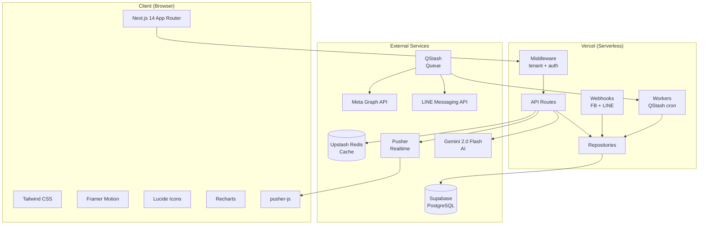
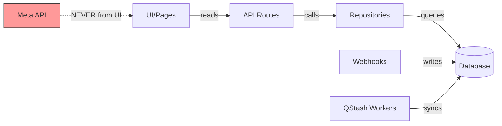
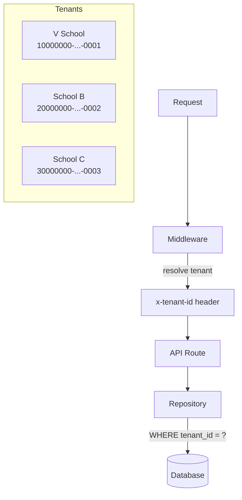
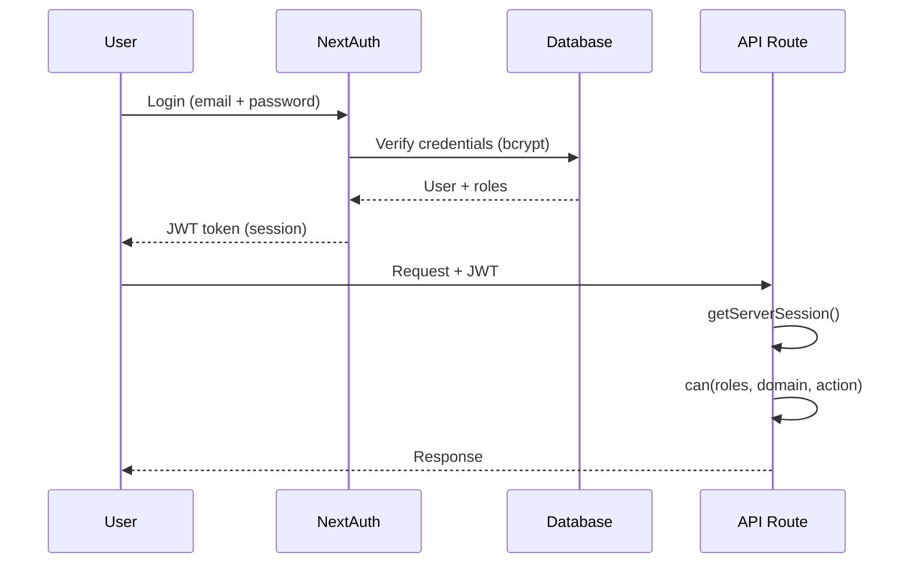

# Zuri Platform — Technical Specification

> Version: 1.1.0
> Date: 2026-04-04
> Owner: Claude (Lead Architect)
> Companion: docs/product/PRD.md (product requirements)

---

## 0. System Diagram



## 0.1 Critical Data Flow



**กฎ:** UI reads from DB only — ห้าม call Meta/LINE API จาก UI หรือ API routes โดยตรง

## 0.2 Multi-Tenant Flow



## 0.3 Auth Flow



## 0.4 NFR Summary

| NFR | Target | How |
|---|---|---|
| NFR1 | Webhook < 200ms | Respond 200 first, process async via QStash |
| NFR2 | Dashboard < 500ms | Upstash Redis cache (TTL 300s) |
| NFR3 | Worker retry >= 5x | throw error, let QStash retry |
| NFR5 | No P2002 race | prisma.$transaction for identity upsert |

---

## 1. Tech Stack

| Layer | Technology | หมายเหตุ |
|---|---|---|
| **Framework** | Next.js 14 (App Router) | SSR + API routes in one repo |
| **Language** | JavaScript (JSX) | ไม่ใช่ TypeScript ยกเว้น `db.ts` |
| **Database** | PostgreSQL via Supabase | Prisma ORM |
| **Cache / Queue** | Upstash Redis + QStash | Serverless-friendly |
| **Realtime** | Pusher (Channels) | inbox new-message events |
| **Auth** | NextAuth.js v4 | JWT session, bcrypt password |
| **Styling** | Tailwind CSS | + Framer Motion animations |
| **Charts** | Recharts | marketing dashboard |
| **Deployment** | Vercel | Edge + Serverless Functions |
| **AI / LLM** | Gemini 2.0 Flash | compose reply, ask AI, daily brief |

---

## 2. Repository Structure

```
zuri/
├── src/
│   ├── app/                    # Next.js App Router pages + API routes
│   │   ├── api/                # All backend endpoints
│   │   │   ├── auth/           # NextAuth handlers
│   │   │   ├── conversations/  # Inbox + reply
│   │   │   ├── customers/      # CRM
│   │   │   ├── employees/      # MANAGER
│   │   │   ├── marketing/      # Ads sync + dashboard
│   │   │   ├── orders/         # POS + billing
│   │   │   ├── tasks/          # Task management
│   │   │   ├── webhooks/       # FB + LINE webhooks
│   │   │   ├── workers/        # QStash workers
│   │   │   └── ai/             # Gemini AI endpoints
│   │   └── (pages)/            # Frontend pages
│   ├── components/             # React components
│   ├── lib/
│   │   ├── repositories/       # DB access layer (ONLY way to touch DB)
│   │   ├── permissionMatrix.js # RBAC: roles × domains × actions
│   │   ├── rbac.js             # Role hierarchy + validation
│   │   ├── systemConfig.js     # Import from system_config.yaml
│   │   ├── redis.js            # Upstash Redis client
│   │   └── db.ts               # Prisma client singleton
├── prisma/
│   └── schema.prisma           # Single source of truth for DB schema
├── system_config.yaml          # Config SSOT (roles, VAT, thresholds)
├── system_requirements.yaml    # Functional requirements SSOT
└── id_standards.yaml           # ID format SSOT
```

---

## 3. Database

### 3.1 Connection

```
Provider: Supabase (PostgreSQL)
ORM: Prisma
Connection string: DATABASE_URL (env)
Direct connection: DIRECT_URL (env, สำหรับ migrations)
```

### 3.2 Access Pattern

**กฎเหล็ก:** ทุก DB operation ต้องผ่าน `src/lib/repositories/` เท่านั้น
- ห้าม call `getPrisma()` โดยตรงจาก API route หรือ Component
- ห้าม `readFileSync/writeFileSync` — ใช้ `fs.promises` เสมอ

### 3.3 Core Models

| Model | หน้าที่ | Key Fields |
|---|---|---|
| `Employee` | ผู้ใช้ระบบ | id, roles[], email, tenantId |
| `Customer` | ลูกค้า / lead | id, phone (E.164), status, tags[] |
| `Conversation` | chat thread | id, channel, customerId, assigneeId |
| `Message` | ข้อความแต่ละอัน | id, conversationId, sender, content |
| `Order` | คำสั่งซื้อ | id, customerId, items[], total, status |
| `Transaction` | บันทึกชำระ | id, orderId, refNumber, amount, slipUrl |
| `Package` | คอร์ส/สินค้าที่ขาย | id, name, price, category, hours |
| `Enrollment` | นักเรียนลงทะเบียน | id, customerId, packageId, status |

### 3.4 ID Standards

ดูครบที่ `id_standards.yaml`

---

## 4. API Design

### 4.1 Convention

```
Base:     /api/
Auth:     NextAuth session (JWT)
Format:   JSON
Errors:   { error: string, code?: string }
Success:  { data } หรือ { items, total, page }
```

### 4.2 Key Endpoints

| Method | Path | หน้าที่ |
|---|---|---|
| GET | `/api/conversations` | list inbox |
| POST | `/api/conversations/[id]/reply` | ส่งข้อความ |
| GET | `/api/customers/[id]` | customer profile |
| PATCH | `/api/customers/[id]` | update customer |
| POST | `/api/orders` | สร้าง order |
| POST | `/api/invoices` | ออกใบแจ้งหนี้ |
| POST | `/api/payments/verify-slip` | OCR slip |
| GET | `/api/marketing/dashboard` | ads metrics |
| POST | `/api/webhooks/facebook` | FB webhook |
| POST | `/api/webhooks/line` | LINE webhook |
| POST | `/api/workers/sync-hourly` | QStash sync |
| POST | `/api/ai/compose-reply` | AI draft reply |
| POST | `/api/ai/ask` | AI ask (streaming) |

---

## 5. Authentication & RBAC

### 5.1 Auth Flow

```
Login → NextAuth (credentials provider)
     → bcrypt verify password
     → JWT session { employeeId, roles[], tenantId }
     → session ใน cookie (httpOnly, secure)
```

### 5.2 Roles (6 + 1)

```
DEV · OWNER · MANAGER · SALES · KITCHEN · FINANCE · STAFF
```

### 5.3 Permission Check

```javascript
import { can } from '@/lib/permissionMatrix'

const allowed = can(session.roles, 'orders', 'create')
if (!allowed) return NextResponse.json({ error: 'Forbidden' }, { status: 403 })
```

Permission levels: `F` (Full) · `A` (Approve) · `R` (Read) · `N` (None)

---

## 6. External Integrations

| Integration | Token/Config | Webhook |
|---|---|---|
| **FB Messenger** | `FB_ACCESS_TOKEN` (System User) | `/api/webhooks/facebook` |
| **LINE OA** | `LINE_CHANNEL_ACCESS_TOKEN` | `/api/webhooks/line` |
| **Meta Ads API** | Same System User token | via `sync-hourly` worker |
| **Pusher** | `PUSHER_APP_ID` + secret | events: new-message, customer-updated |
| **Upstash Redis** | `UPSTASH_REDIS_REST_URL` | cache: 60s–5min TTL |
| **Upstash QStash** | `QSTASH_TOKEN` | retry >= 5, exponential backoff |
| **Gemini AI** | `GEMINI_API_KEY` | compose-reply, ask-AI, daily brief |

---

## 7. Error Handling

```javascript
// กฎเหล็ก — ห้าม catch เงียบ
try {
  // ...
} catch (error) {
  console.error('[ModuleName] message', error)
  return NextResponse.json({ error: 'message' }, { status: 500 })
}

// Workers: throw เพื่อให้ QStash retry
catch (error) {
  console.error('[worker/sync-hourly]', error)
  throw error
}
```

---

## 8. Deployment

```
Platform:   Vercel
Branch:     main → auto-deploy
Node:       18.x (LTS)
```

---

## 9. Related Documents

| Document | Path |
|---|---|
| Product Requirements | `docs/product/PRD.md` |
| Feature Specs | `docs/product/specs/FEAT-*.md` |
| DB Schema | `prisma/schema.prisma` |
| Config SSOT | `system_config.yaml` |
| ID Standards | `id_standards.yaml` |
| Project Map | `docs/PROJECT_MAP.md` |
