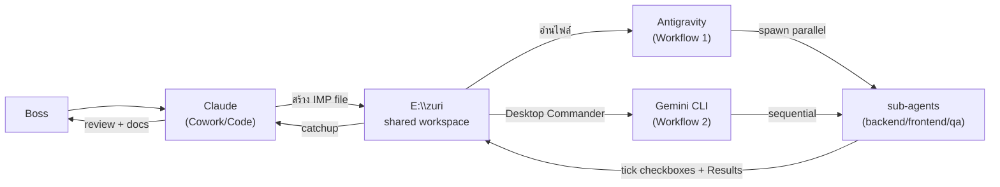
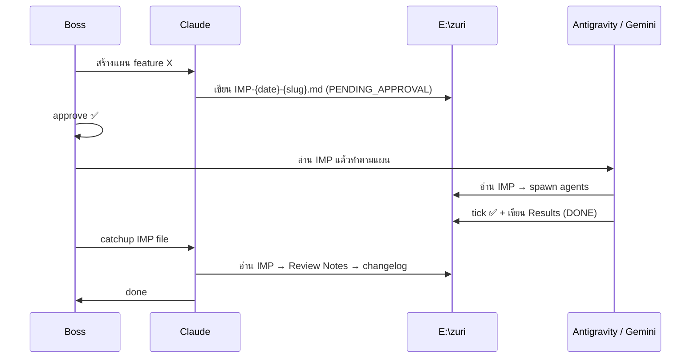

# Co-Dev Workflow

ระบบทำงานร่วมกันระหว่าง Claude และ Antigravity โดยใช้ `E:\zuri` เป็น shared workspace — ทุก platform อ่าน/เขียนไฟล์เดียวกัน Boss เป็น human gate ที่ approve ก่อน execute ทุกครั้ง

---

## Architecture





---

## เครื่องมือที่มี

| Tool | Platform | ใช้ทำอะไร |
|---|---|---|
| Claude **Cowork** | Claude Desktop | จัดการไฟล์ + Desktop Commander + วางแผน |
| Claude **Code** | Claude Desktop | เขียนโค้ด + bash ใน project |
| Claude **Chat** | Claude Desktop | คุย ถามตอบ (ไม่มี file access) |
| **Antigravity** | แยกต่างหาก | Gemini-based orchestrator + native parallel agents |

**Shared workspace:** `E:\zuri` — Claude เขียนไฟล์ที่นี่ Antigravity อ่านได้เลย ไม่มีการ copy

---

## Workflow 1 — Antigravity Orchestrate (งานใหญ่ / parallel)

```
Boss → Claude (Cowork/Code)
           │
           ▼
    วางแผน → สร้าง docs/handoff/IMP-{date}-{slug}.md
    status: DRAFT → PENDING_APPROVAL
           │
Boss: "Antigravity อ่าน IMP-20260404-crm แล้วทำตามแผน"
           │  (Antigravity อ่านไฟล์จาก E:\zuri ได้เลย)
           ▼
    Antigravity อ่าน IMP → spawn sub-agents parallel (native)
    ├── backend agent
    ├── frontend agent
    └── qa agent
           │
    tick checkboxes ✅ + เขียน Results
    status: IN_PROGRESS → DONE
           │
Boss: "Claude catchup IMP-20260404-crm"
           │
           ▼
    Claude อ่าน IMP → เขียน Review Notes → update changelog + docs
```

**เหมาะกับ:** งานใหญ่ที่ต้องการ parallel จริงๆ เพื่อลด latency

---

## Workflow 2 — Claude Orchestrate (งานเล็ก-กลาง / ไม่สลับ platform)

```
Boss → Claude (Cowork)
           │
           ▼
    วางแผน → สร้าง docs/handoff/IMP-{date}-{slug}.md
    status: DRAFT → PENDING_APPROVAL
           │
Boss approve ✅
           │
           ▼
    Claude ใช้ Desktop Commander
    → start_process("gemini")
    → inject context จาก config/prompts/*.md + agents.yaml
    → รับผล → tick IMP checkboxes → เขียน Results
    status: IN_PROGRESS → DONE
           │
           ▼
    Claude เขียน Review Notes → update changelog + docs
```

**เหมาะกับ:** งานเล็ก-กลาง Boss ไม่อยากสลับไป Antigravity
**หมายเหตุ:** Claude เรียก gemini CLI ผ่าน Desktop Commander ใช้ auth เดียวกับ Boss (Gemini Advanced ฝัง Google account) ไม่มีค่าใช้จ่ายเพิ่ม

---

## เปรียบเทียบสองแบบ

| | Workflow 1 | Workflow 2 |
|---|---|---|
| Executor | Antigravity | Claude + Desktop Commander |
| Parallel | ✅ native | ❌ sequential |
| Boss ต้องทำ | สั่ง Antigravity อ่านไฟล์ | แค่ approve |
| สลับ platform | ใช่ (ไปหา Antigravity) | ไม่ (อยู่ใน Claude) |
| Gemini quota | Gemini Advanced (Boss) | Gemini Advanced (Boss) |
| เหมาะกับ | งานใหญ่ หลาย agent | งานเล็ก-กลาง |

---

## Implementation Plan (IMP)

ไฟล์กลางที่ทุก platform อ่าน/เขียนร่วมกัน

**ที่เก็บ:** `docs/handoff/IMP-{YYYYMMDD}-{slug}.md`
**Template:** `docs/handoff/TEMPLATE.md` (Claude อ่านก่อนสร้างทุกครั้ง)

### Status Flow

```
DRAFT → PENDING_APPROVAL → IN_PROGRESS → DONE
  │            │                │           │
Claude       Boss             Antigravity  Antigravity
สร้าง       approve          / Claude      update results
```

---

## Context Injection

`config/agents.yaml` กำหนด `context_files` ต่อ agent — ใช้ได้ทั้งสองแบบ:

- **Workflow 1:** Antigravity อ่าน agents.yaml → inject context → spawn sub-agent
- **Workflow 2:** Claude อ่าน agents.yaml + prompts/*.md → ส่งเป็น prompt เข้า gemini CLI

```
agents.yaml → context_files list
llm.py / Desktop Commander → อ่านไฟล์ → ต่อเป็น <context> block → ส่ง subprocess
```

---

## Gemini Auth

Gemini CLI ใช้ Google account ที่ cache บน machine เดียวกับที่ Boss ใช้งาน — ไม่ต้องตั้งค่า API key เพิ่ม Boss ใช้ **Gemini Advanced** (Google One AI Premium) ดังนั้น rate limit สูงกว่า free tier มาก parallel agents ชน quota น้อย

---

## Config Files

| ไฟล์ | หน้าที่ |
|---|---|
| `.dev/co-dev/config/agents.yaml` | role + context_files + rules + model ต่อ agent |
| `.dev/co-dev/config/router.yaml` | task_type → model routing (cost_mode) |
| `.dev/co-dev/config/prompts/*.md` | system prompt สำเร็จรูปต่อ agent (9 roles) |
| `docs/handoff/TEMPLATE.md` | format ของ IMP file |

---

## Audit Trail

ทุกอย่าง track ผ่าน Git — ไม่มี output folder แยก

| หลักฐาน | ที่อยู่ |
|---|---|
| Implementation plan + results | `docs/handoff/IMP-*.md` |
| Session log | `docs/devlog/YYYY-MM-DD.md` |
| Code changes | `changelog/CL-*.md` |
| Architecture decisions | `docs/decisions/adrs/` |
| Gemini raw output (temp) | `.dev/co-dev/outputs/` (gitignored) |
