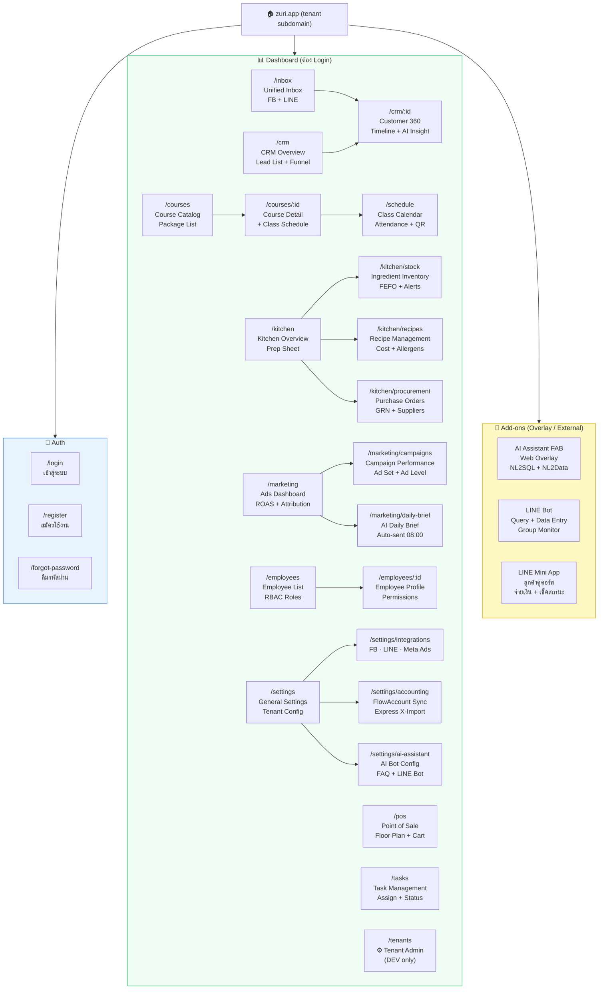

# Zuri Platform — Site Map
> **Version:** 1.1.0 · **Date:** 2026-04-04 · **Author:** Boss + Claude
> **RBAC:** ADR-068 Persona-Based 6 Roles (OWNER · MANAGER · SALES · KITCHEN · FINANCE · STAFF)

URL base: `https://{tenant}.zuri.app`

---

## 🔐 Auth (Public — ไม่ต้อง Login)

| URL | ชื่อหน้า | หมายเหตุ |
|---|---|---|
| `/login` | เข้าสู่ระบบ | Email + Password (NextAuth credentials) |
| `/register` | สมัครใช้งาน | สำหรับ Tenant ใหม่ (เชื่อมต่อ Billing) |
| `/forgot-password` | ลืมรหัสผ่าน | Reset via email token |

---

## 📨 Inbox — Unified Omni-Channel

| URL | ชื่อหน้า | Module | Roles |
|---|---|---|---|
| `/inbox` | Unified Inbox | FEAT04 | SALES, MANAGER, STAFF, OWNER |

**Layout 3 Panel:**
- Left — Conversation List (FB badge / LINE badge, filter, search)
- Center — Chat View (send, compose-reply AI, Slip OCR)
- Right — Customer Card + Quick Sale (POS mini) + Billing Tab

---

## 👥 CRM — Customer Relationship Management

| URL | ชื่อหน้า | Module | Roles |
|---|---|---|---|
| `/crm` | CRM Overview | FEAT05 | SALES, MANAGER, OWNER |
| `/crm/:id` | Customer 360 Profile | FEAT02 | SALES, MANAGER, OWNER |

**`/crm` tabs:** All · Lead · Interested · Enrolled · Paid · Churned

**`/crm/:id` sections:**
- Mini Header (ชื่อ, สถานะ, platform badges)
- Activity Timeline (Inbox, POS, Enrollment)
- Enrollment History + V Points
- AI Insight (ซื้อแบบไหน, ความเสี่ยง churn)
- Quick Actions (ส่งข้อความ, สร้าง Invoice)

---

## 🛒 POS — Point of Sale

| URL | ชื่อหน้า | Module | Roles |
|---|---|---|---|
| `/pos` | POS หลัก | FEAT06 | SALES, MANAGER, OWNER |

**Order Types (Tab):** Onsite · Takeaway · Online Queue

**Sections:**
- Floor Plan (เลือกโต๊ะ/โซน)
- Product Catalog (search + category filter)
- Cart + Discount + VAT
- Payment (QR Promptpay, เงินสด, บัตร)
- Invoice / ใบกำกับภาษี
- V Points Redeem

---

## 📚 Courses & Enrollment

| URL | ชื่อหน้า | Module | Roles |
|---|---|---|---|
| `/courses` | Course & Package Catalog | FEAT07 | SALES, MANAGER, OWNER |
| `/courses/new` | สร้าง Course ใหม่ | FEAT07 | MANAGER, OWNER |
| `/courses/:id` | Course Detail + Edit | FEAT07 | MANAGER, OWNER |
| `/courses/:id/enrollments` | รายชื่อผู้ลงทะเบียน | FEAT07 | SALES, MANAGER, OWNER |

---

## 📅 Schedule — Class Calendar & Attendance

| URL | ชื่อหน้า | Module | Roles |
|---|---|---|---|
| `/schedule` | Class Calendar (Month/Week/Day) | FEAT07 | STAFF, SALES, MANAGER, OWNER |
| `/schedule/:classId` | Class Detail | FEAT07 | STAFF, SALES, MANAGER |
| `/schedule/:classId/attendance` | Attendance Check (QR Scan) | FEAT07 | STAFF, SALES |

---

## 🍳 Kitchen Operations

| URL | ชื่อหน้า | Module | Roles |
|---|---|---|---|
| `/kitchen` | Kitchen Overview + Prep Sheet | FEAT08 | KITCHEN, MANAGER, OWNER |
| `/kitchen/stock` | Ingredient Inventory (FEFO) | FEAT08 | KITCHEN, MANAGER |
| `/kitchen/stock/adjust` | ปรับสต๊อก Manual | FEAT08 | KITCHEN, MANAGER |
| `/kitchen/recipes` | Recipe Management | FEAT08 | KITCHEN, MANAGER |
| `/kitchen/recipes/new` | สร้าง Recipe ใหม่ | FEAT08 | KITCHEN, MANAGER |
| `/kitchen/recipes/:id` | Recipe Detail + Cost Calc | FEAT08 | KITCHEN, MANAGER |
| `/kitchen/procurement` | Purchase Request & PO List | FEAT08 | KITCHEN, MANAGER, OWNER |
| `/kitchen/procurement/:id` | PO Detail + GRN | FEAT08 | KITCHEN, MANAGER |
| `/kitchen/procurement/suppliers` | Supplier Directory | FEAT08 | KITCHEN, MANAGER |

---

## 📣 Marketing & Ads Analytics

| URL | ชื่อหน้า | Module | Roles |
|---|---|---|---|
| `/marketing` | Ads Dashboard (ROAS, Spend, Revenue) | FEAT09 | SALES, MANAGER, OWNER |
| `/marketing/campaigns` | Campaign Performance Table | FEAT09 | SALES, MANAGER, OWNER |
| `/marketing/campaigns/:id` | Campaign Detail (AdSet → Ad Level) | FEAT09 | SALES, MANAGER |
| `/marketing/daily-brief` | AI Daily Brief Archive | FEAT10 | MANAGER, OWNER |
| `/marketing/daily-brief/:date` | Daily Brief ของวันที่ระบุ | FEAT10 | MANAGER, OWNER |

---

## ✅ Tasks

| URL | ชื่อหน้า | Module | Roles |
|---|---|---|---|
| `/tasks` | Task Board (All / My Tasks) | Core | STAFF, SALES, KITCHEN, MANAGER, OWNER |

---

## 👨‍💼 Employees

| URL | ชื่อหน้า | Roles |
|---|---|---|
| `/employees` | Employee List | MANAGER, OWNER |
| `/employees/new` | เพิ่มพนักงานใหม่ | MANAGER, OWNER |
| `/employees/:id` | Employee Profile + Role | MANAGER, OWNER |

---

## ⚙️ Settings & Admin

| URL | ชื่อหน้า | Roles |
|---|---|---|
| `/settings` | General Settings (Tenant Profile, Logo, Colors) | MANAGER, OWNER |
| `/settings/integrations` | Integrations Hub (FB Page, LINE OA, Meta Ads) | MANAGER, OWNER |
| `/settings/integrations/facebook` | Facebook Page Connect | MANAGER, OWNER |
| `/settings/integrations/line` | LINE OA Connect | MANAGER, OWNER |
| `/settings/integrations/meta-ads` | Meta Ads Token | MANAGER, OWNER |
| `/settings/accounting` | Accounting Integration *(Add-on)* | FINANCE, OWNER |
| `/settings/accounting/flowaccount` | FlowAccount API Sync Config | FINANCE, OWNER |
| `/settings/accounting/express` | Express X-Import Config | FINANCE, OWNER |
| `/settings/ai-assistant` | AI Assistant Config *(Add-on)* | MANAGER, OWNER |
| `/settings/ai-assistant/faq` | FAQ Knowledge Base | MANAGER, OWNER |
| `/settings/ai-assistant/line-bot` | LINE Bot + Group Monitor | MANAGER, OWNER |
| `/settings/billing` | Subscription & Billing (Zuri) | OWNER |
| `/settings/roles` | Role Assignment | MANAGER, OWNER |

---

## 🏗️ Platform Admin (DEV Only)

| URL | ชื่อหน้า | Roles |
|---|---|---|
| `/tenants` | Tenant Management List | DEV |
| `/tenants/new` | สร้าง Tenant ใหม่ | DEV |
| `/tenants/:id` | Tenant Config + DB Provisioning | DEV |

---

## 🤖 Add-ons (Non-Page Surfaces)

| Surface | Entry Point | ใครใช้ |
|---|---|---|
| **AI Assistant FAB** | Web Overlay (ทุกหน้า) — bubble button มุมขวาล่าง | MANAGER, OWNER |
| **LINE Bot (1:1)** | LINE OA → ถามยอด/สต๊อค/สรุป | MANAGER, OWNER |
| **LINE Group Monitor** | LINE Group → detect slip + auto-record | SALES, MANAGER |
| **LINE Mini App** | LIFF v2 ใน LINE — ลูกค้าดูคอร์ส, จ่ายเงิน | ลูกค้า |

---

## 📋 Role Reference (ADR-068)

| Role | ระดับ | เข้าถึง | รวมจาก (เดิม) |
|---|---|---|---|
| `OWNER` | 5 | Read-only ทุกอย่าง | OWNER |
| `MANAGER` | 4 | Full ops + พนักงาน | MGR + ADM + HR |
| `SALES` | 3 | Inbox + CRM + POS + Marketing | SLS + AGT + MKT |
| `KITCHEN` | 2 | Kitchen + Stock + Procurement | TEC + PUR + PD |
| `FINANCE` | 2 | Accounting + Billing | ACC |
| `STAFF` | 1 | View-only + Tasks + Schedule | STF |
| `DEV` | 6 | ทุกอย่าง (hidden in UI) | DEV |

---

## 🗺️ Mermaid Diagram

---

*Generated by Claude · Zuri AI Business Platform · 2026-04-04*
