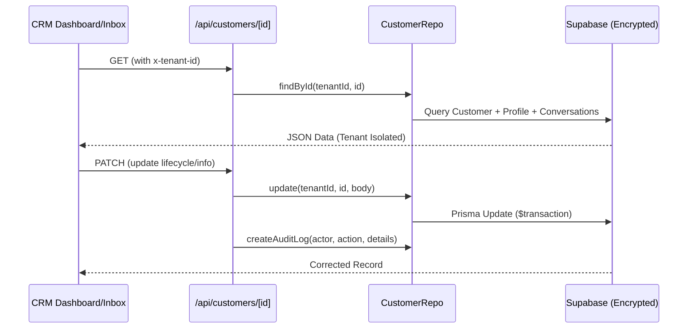

# FEAT02 — Customer 360 & Profile

**Status:** APPROVED
**Version:** 2.0.0
**Date:** 2026-04-02
**Author:** Boss (Product Owner)
**Reviewer:** Claude (Architect)

---

## 1. Overview

Customer Profile คือศูนย์กลางข้อมูลของลูกค้า (Single Customer View) ที่เชื่อมต่อข้อมูลจากทุก Touchpoint (Inbox, POS, Enrollment) แบ่งออกเป็น 2 ส่วนหลัก:

1.  **Mini-Profile (Inbox Right Panel)**: แสดงข้อมูลเบื้องต้นเพื่อให้ทีมขายรู้ context ทันทีขณะสนทนา
2.  **Full Profile Dashboard (CRM Page)**: แสดงข้อมูล 360 องศาเชิงลึก (ประวัติการซื้อ, กิจกรรม, บทวิเคราะห์ AI) สำหรับการวิเคราะห์และวางแผนการตลาดรายบุคคล

---

## 2. Terminology

| คำ | นิยาม |
|---|---|
| **Ads ID** | Meta Ad ID ที่ลูกค้า click มา (attribution) |
| **Intent** | ความสนใจที่ระบบหรือ staff tag ไว้ เช่น "คอร์สญี่ปุ่น", "ราคา" |
| **Status** | สถานะ lead: `NEW` → `CONTACTED` → `INTERESTED` → `ENROLLED` → `PAID` |
| **Customer 360** | มุมมองข้อมูลลูกค้าครบทุกมิติในหน้าเดียว |
| **V Points** | คะแนนสะสมจากการซื้อ (Loyalty System) |

---

## 3. Interfaces

### 3.1 Mini-Profile (Inbox Panel)
แสดงในหน้า `/inbox` ฝั่งขวา:
- **Ads Attribution**: ดู Campaign ที่มา
- **Quick Info**: ชื่อ, เบอร์, อีเมล
- **Lifecycle Dropdown**: เปลี่ยนสถานะ lead ได้ทันที
- **CTAs**: ปุ่มลัด "ลงเรียน", "ส่ง Invoice", "Mark Paid"

### 3.2 Full Dashboard (CRM/[id])
หน้าหลัก `/crm/[id]` สำหรับเจาะลึกรายบุคคล:
- **Header**: Avatar, Name, Lifecycle Stage, Total Spend, V Points Balance.
- **Tab - Overview**: ข้อมูลติดต่อ และ Personal Info (Editable).
- **Tab - Activity**: Vertical Timeline แสดงทุกการเปลี่ยนแปลง (Audit Logs).
- **Tab - History**: รายการสั่งซื้อ (Orders) และประวัติการเรียน (Enrollments).
- **Tab - Intelligence**: บทวิเคราะห์ AI (Intent Score, Pain Points, Next Action).

---

## 4. Features & Logic

### 4.1 Identity Resolution
ลูกค้ายิ่งมีหลายช่องทาง ยิ่งต้องรวมเป็นคนเดียว (Identity Merge):
- **Auto-merge**: ใช้เบอร์โทรศัพท์ (E.164) เป็น Key
- **Manual merge**: Staff สามารถเลือกคู่ค้าเพื่อรวมข้อมูลได้
- ช่องทางที่รองรับ: Facebook Messenger, LINE OA, Walk-in POS.

### 4.2 Lifecycle Management
Staff หรือระบบสามารถอัปเดตสถานะของลูกค้าได้:
`NEW` (ทักใหม่) → `CONTACTED` (ตอบแล้ว) → `INTERESTED` (สนใจ) → `ENROLLED` (จอง/จดชื่อ) → `PAID` (จ่ายจริง)

### 4.3 Activity Log (Audit Trail)
ระบบบันทึก Log อัตโนมัติทุกครั้งที่มีการเปลี่ยนแปลง:
- "Staff A เปลี่ยนสถานะลูกค้าเป็น INTERESTED"
- "System AI วิเคราะห์ Intent เป็น 'สนใจคอร์สระยะสั้น'"
- "ลูกค้าสมัครเรียน 'Intro to Sushi' (Order ORD-xxx)"

---

## 5. Data Flow

---

## 6. Roles & Permissions

| Role | สิทธิ์ |
|---|---|
| SLS, AGT | ดู + แก้ข้อมูลลูกค้าที่ตัวเองดูแล |
| MGR, ADM | ดู + แก้ ทุก customer / ย้าย Lifecycle |
| MKT | ดู ads attribution + ประวัติการซื้อทั้งหมด |
| OWNER | ดูภาพรวมและรายบุคคลได้ทั้งหมด |

---

## 7. Known Gotchas
- **Tenant Isolation**: ห้ามลืมส่ง `tenantId` ในทุก query มิฉะนั้นข้อมูลจะปนกัน
- **Real-time**: การเปลี่ยนสถานะในหน้าหนึ่ง ควรสะท้อนในอีกหน้า (ใช้ Pusher ถ้าเป็นไปได้)
- **Data Privacy**: ข้อมูลลูกค้าเป็นความลับสูง (PDPA Compliance) ห้าม Export โดยไม่มีสิทธิ์ MGR ขึ้นไป

---

## 8. Related Documents
- ADR-025: Cross-Platform Identity Resolution
- ADR-056: Multi-Tenant Architecture
- FEAT01-MULTI-TENANT.md
- FEAT05-CRM.md

